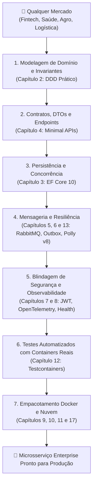

# 🏭 O Motor Universal: Construindo Qualquer Microsserviço com Este Livro e IA

> "Com a arquitetura certa e a engenharia de contexto adequada, você não precisa reaprender a programar para cada novo mercado. Seja para criar um sistema de **Pix e Saldos (Fintech)**, um motor de **Prontuário e Telemedicina (Healthtech)**, uma plataforma de **Rastreamento de Frotas (Logística)** ou um **Marketplace**, as leis fundamentais de resiliência, concorrência, consistência e observabilidade são exatamente as mesmas."

Este guia é o **manual de operações do livro**: ele ensina você a transformar este repositório no seu **"Ground Truth" (Base de Conhecimento Absoluta)** para que, junto com uma Inteligência Artificial, você consiga gerar do zero uma aplicação completa para qualquer segmento de mercado em minutos.

---

## 🧭 O Ciclo de Geração Universal (Pipeline em 7 Passos)

Ao criar um microsserviço para um mercado novo, siga rigorosamente esta sequência. Cada etapa se ancora em um capítulo específico deste livro:



---

## 🤖 Os Meta-Prompts Mestres (Copie, Preencha e Envie para a IA)

Abaixo estão os prompts padronizados para alimentar a sua IA (Antigravity, Copilot, ChatGPT, Claude) utilizando as regras deste livro.

---

### Prompt 1: Modelagem do Núcleo de Domínio (DDD)
> Use este prompt para criar o coração do negócio, garantindo que o modelo seja rico e encapsulado.

```text
Atue como Engenheiro de Software Principal em .NET 10 e DDD.
Quero construir o Domínio para um microsserviço do mercado de [INSERIR MERCADO: ex. Fintech de Pix / Telemedicina / Logística].

Regras Arquiteturais Obrigatórias (conforme nosso livro):
1. Use C# 14 (.NET 10) com Clean Architecture pura (projeto .Domain sem dependências externas de EF Core ou ASP.NET).
2. Entidade Raiz de Agregado [NOME DO AGREGADO: ex. PixTransfer / MedicalAppointment / DeliveryShipment] herdando de AggregateRoot.
3. Construtor privado e criação exclusivamente através de Factory Method estático 'Create(...)'.
4. Encapsulamento estrito: propriedades com { get; private set; } e coleções filhas expostas apenas como IReadOnlyCollection<T>.
5. Invariantes de Negócio a proteger:
   - [REGRA 1: ex. O valor da transferência não pode ser negativo nem ultrapassar o limite diário]
   - [REGRA 2: ex. Não é possível cancelar uma consulta com menos de 2 horas de antecedência]
6. Value Objects imutáveis usando 'readonly record struct' para: [ex. Money(Amount, Currency) / GeoCoordinate(Lat, Long) / Cpf(Value)].
7. Disparar Eventos de Domínio imutáveis via RaiseDomainEvent(...) quando o estado transicionar.

Gere o código completo das classes de domínio prontas para produção.
```

---

### Prompt 2: Casos de Uso e Persistência Concorrente (Application + EF Core 10)
> Use este prompt para criar a camada de aplicação e a persistência protegida contra condições de corrida.

```text
Atue como Engenheiro de Software Principal em .NET 10.
Com base no Domínio gerado anteriormente, construa o Caso de Uso e a Persistência no EF Core 10.

Requisitos Arquiteturais (conforme nosso livro):
1. Application Layer:
   - DTOs de entrada e saída usando 'readonly record struct'.
   - Handler de negócio com Primary Constructor injetando IRepository e IUnitOfWork.
   - Validação de entrada usando FluentValidation com tratamento de campos obrigatórios e formatos.
2. Infrastructure Layer:
   - DbContext do EF Core 10 configurado com Fluent API (IEntityTypeConfiguration<T>).
   - Proteger contra concorrência concorrente adicionando token de concorrência otimista via RowVersion (.IsRowVersion()).
   - Mapear Value Objects como ComplexProperty ou OwnsOne.
   - Consultas de leitura implementadas com .AsNoTracking() e projeções diretas (.Select()).

Gere o Command, o Validator, o Handler e a classe de configuração do Entity Framework Core.
```

---

### Prompt 3: Minimal APIs, Erros RFC 7807 e Resiliência
> Use este prompt para expor a API de alta velocidade com tratamento padronizado e tolerância a falhas.

```text
Atue como Engenheiro Sênior em ASP.NET Core (.NET 10).
Exponha o caso de uso construído através de Minimal APIs modernas de alto desempenho.

Requisitos Técnicos (conforme nosso livro):
1. Crie uma classe de módulo de rotas usando IEndpoint e app.MapGroup("/api/v1/...").
2. Adicione um Endpoint Filter de validação que intercepte erros do FluentValidation e responda com RFC 7807 (ProblemDetails / Status 422).
3. Integre o ResiliencePipeline do Polly v8 para chamadas a serviços externos (Timeout de 2s, Retry com Exponential Backoff + Jitter de 3 tentativas e Circuit Breaker que abre com 50% de falha).
4. Configure o Correlation ID Middleware e a injeção do CancellationToken em todo o pipeline.

Gere o código dos endpoints e o registro de serviços no Program.cs.
```

---

### Prompt 4: Mensageria Assíncrona e Outbox Pattern
> Use este prompt para conectar seu microsserviço ao ecossistema de eventos sem risco de escrita dupla.

```text
Atue como Arquiteto de Sistemas Distribuídos em .NET 10.
Conecte este microsserviço ao RabbitMQ utilizando MassTransit.

Requisitos Distribuídos (conforme nosso livro):
1. Implemente o Transactional Outbox Pattern com Entity Framework Core para garantir que o evento de integração seja salvo na MESMA transação ACID do banco SQL.
2. Crie o contrato de evento de integração como um record imutável.
3. Crie um Consumidor com MassTransit que implemente Idempotência usando verificação de chave de mensagem para evitar processamentos duplicados.
4. Configure políticas de Retry com backoff e Dead Letter Queue (DLQ) para mensagens corrompidas (Poison Messages).

Gere a configuração do MassTransit e a implementação do Consumidor Idempotente.
```

---

### Prompt 5: Testes Reais com Testcontainers
> Use este prompt para validar a solução contra um banco e mensageria reais.

```text
Atue como Engenheiro de Qualidade e Testes em .NET 10.
Crie a suíte de testes de integração automatizados para este microsserviço.

Requisitos de Teste (conforme nosso livro):
1. Utilize xUnit, FluentAssertions e Testcontainers para .NET.
2. Crie uma WebApplicationFactory customizada que inicialize containers Docker reais do SQL Server e do RabbitMQ sob demanda com portas dinâmicas.
3. Escreva um teste de ponta a ponta que execute o endpoint POST da Minimal API, persista no banco real e valide que o status HTTP retornado é 201 Created com ProblemDetails em caso de erro 422.
4. Escreva um teste unitário puro para verificar as invariantes do agregado sem uso de mocks.

Gere o código dos testes completo e executável.
```

---

## 🌍 Matriz de Aplicação em Qualquer Mercado

Veja como o mesmo ecossistema arquitetural se adapta com perfeição a qualquer indústria:

| Mercado / Indústria | Agregado Principal (Cap. 2) | Regra de Concorrência Crítica (Cap. 3 & 18) | Evento de Integração (Cap. 5 & 13) | Degradação Graciosa / Fallback (Cap. 6) |
| :--- | :--- | :--- | :--- | :--- |
| **Fintech (Pix / Banking)** | `AccountBalance` | `RowVersion` + RedLock (evitar saque duplo simultâneo) | `PixTransferCompletedIntegrationEvent` | Se o BACEN estiver instável, aceita agendamento em fila offline. |
| **Healthtech (Telemedicina)** | `MedicalAppointment` | Lock por horário de médico (evitar agendamento duplo) | `PatientCheckedInIntegrationEvent` | Se o prontuário eletrônico demorar, exibe dados essenciais cacheados no Redis. |
| **Logística / Rastreio** | `ShipmentTrack` | Ordem estrita de eventos de passagem por GPS | `PackageDeliveredIntegrationEvent` | Se a operadora de GPS falhar, armazena posições no disco local do container. |
| **E-commerce / Marketplace** | `Order` & `Product` | Concorrência otimista no estoque disponível | `OrderPaidIntegrationEvent` | Se o cálculo de frete cair, usa tabela fixa de contingência. |
| **EdTech / Cursos** | `Enrollment` | Limite de vagas por turma em tempo real | `CertificateIssuedIntegrationEvent` | Se o gerador de PDF de certificados falhar, enfileira na DLQ para reprocessamento. |

---

## 🏆 O Segredo: O Livro é o Guardião da Qualidade

Quando você usa uma IA sem referências arquiteturais sólidas, ela tende a gerar código mediano: controllers gigantes, entidades anêmicas, chamadas síncronas bloqueantes (`.Result`) e ausência de resiliência.

**Ao utilizar este livro como base:**
1. Você restringe o espaço de busca da IA para padrões de **nível Sênior / Especialista**.
2. O código gerado já nasce aderente a **Clean Architecture, .NET 10, C# 14, Polly v8, OpenTelemetry, Testcontainers e Chiseled Dockerfiles**.
3. O resultado final é um microsserviço com nível de maturidade empresarial que você pode defender com propriedade em qualquer comitê de arquitetura.

---

## 🔗 Conexões do Grafo (Obsidian)
- [Clean Architecture em Camadas](../01-fundamentos-arquitetura/01-clean-architecture.md)
- [Entidades e Regras de Negócio](../02-dominio-ddd-pratico/01-entidades-e-regras-de-dominio.md)
- [Cache e HybridCache](../03-dados-persistencia/04-cache-distribuido-redis-e-hybridcache.md)
- [Minimal APIs vs Controllers](../04-apis-e-http/02-minimal-apis-vs-controllers.md)
- [Outbox Pattern e Transações](../05-comunicacao-microsservicos/03-outbox-inbox-patterns.md)
- [Polly v8 e Resiliência](../06-resiliencia/02-polly-v8-pipelines-na-pratica.md)
- [IA como Ferramenta de Engenharia](../21-ia-engenharia/01-ia-como-ferramenta-de-engenharia.md)
