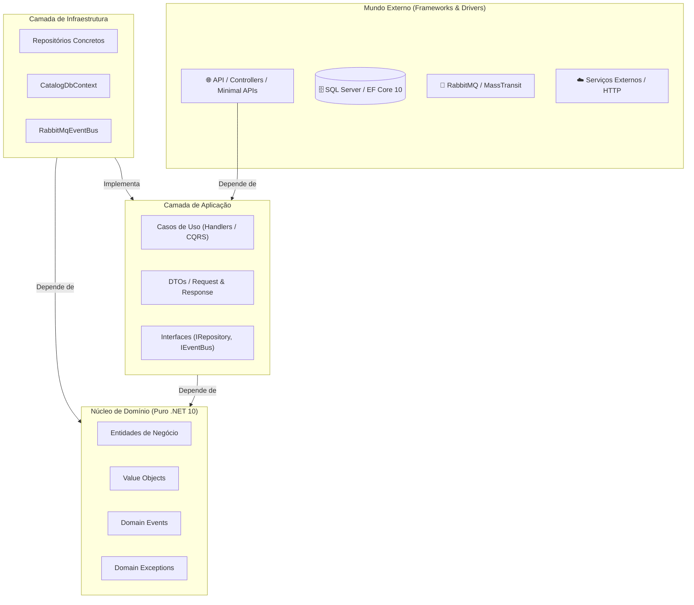

# 🧱 Clean Architecture em Camadas Modernas (.NET 10)

> "Arquitetura não é sobre frameworks ou bancos de dados; arquitetura é sobre intenção e isolamento do domínio de negócio." — Robert C. Martin

Ao projetar microsserviços em .NET 10, a **Clean Architecture** (ou Arquitetura Cebola / Hexagonal) garante que as regras de negócio permaneçam puras, isoladas e fáceis de testar, independentemente de mudanças em bancos de dados, mensageria ou frameworks web.

---

## 🎯 Por que usamos Clean Architecture?

Em sistemas legados ou construídos com acoplamento prematuro, a lógica de negócio costuma ficar espalhada em controllers, procedures SQL ou classes de entidade amarradas ao Entity Framework.

Os principais sintomas de um design acoplado são:
1. **Dificuldade de Testes Unitários**: Não é possível testar uma regra de cálculo sem subir um banco de dados real.
2. **Efeito Cascata**: Mudar uma coluna no banco de dados quebra o controller da API e a serialização JSON.
3. **Aprisionamento Tecnológico**: Migrar do SQL Server para PostgreSQL ou de RabbitMQ para Kafka exige reescrever a lógica de negócio.

A **Clean Architecture** resolve isso aplicando o **Princípio da Inversão de Dependência (DIP)**: o núcleo do sistema desconhece qualquer detalhe externo.

---

## 🧭 Diagrama de Camadas e Regra de Dependência

A regra de ouro: **as dependências de código-fonte sempre apontam para dentro** (na direção do Domínio).



---

## 📂 Divisão das Camadas no .NET 10

### 1. `Domain` (Núcleo Puro)
* **O que contém:** Entidades, Value Objects, Enums, Interfaces de Repositório (ou de Domínio), Eventos de Domínio e Exceções de Domínio.
* **O que NÃO contém:** Dependências de ASP.NET Core, EF Core, Newtonsoft, HttpClient, etc.
* **Depende de:** Absolutamente ninguém. Apenas do runtime C# e BCL pura.

### 2. `Application` (Casos de Uso e Orquestração)
* **O que contém:** Comandos e Consultas (CQRS / MediatR se aplicável), DTOs de entrada e saída, Validadores (FluentValidation), Interfaces de Infraestrutura (ex: `IEmailService`, `IEventBus`, `IUnitOfWork`).
* **O que faz:** Coordena a execução de uma operação de negócio. Busca a entidade pelo repositório, invoca o método do domínio, persiste o resultado e despacha eventos.
* **Depende de:** Somente do `Domain`.

### 3. `Infrastructure` (Acesso a Dados e Adaptadores Externos)
* **O que contém:** `DbContext` do EF Core, Migrations, Repositórios concretos, clientes de mensageria (RabbitMQ), clientes HTTP externos, serviços de cache (Redis/HybridCache).
* **Depende de:** `Application` (para implementar as interfaces definidas lá) e `Domain`.

### 4. `API` (Ponto de Entrada e Apresentação)
* **O que contém:** Minimal APIs, Controllers, Middlewares, Filtros, Program.cs, Injeção de Dependências, Configurações de Swagger/OpenAPI.
* **Depende de:** `Application` (para despachar comandos) e `Infrastructure` (apenas para configurar o DI container na inicialização).

---

## 💻 Implementação Prática em C# (.NET 10)

Vamos ver a implementação real de um caso de uso de criação de pedido (`Order`) demonstrando a inversão de dependência.

### 1. Camada de Domínio: `Order.cs`

```csharp
namespace EShop.Domain.Orders;

public sealed class Order
{
    public Guid Id { get; private set; }
    public Guid CustomerId { get; private set; }
    public decimal TotalAmount { get; private set; }
    public OrderStatus Status { get; private set; }
    public DateTime CreatedAtUtc { get; private set; }

    // Construtor privado para garantir o encapsulamento
    private Order() { }

    public static Order Create(Guid customerId, decimal totalAmount)
    {
        if (totalAmount <= 0)
            throw new InvalidOperationException("O valor do pedido deve ser maior que zero.");

        return new Order
        {
            Id = Guid.NewGuid(),
            CustomerId = customerId,
            TotalAmount = totalAmount,
            Status = OrderStatus.PendingPayment,
            CreatedAtUtc = DateTime.UtcNow
        };
    }

    public void MarkAsPaid()
    {
        if (Status != OrderStatus.PendingPayment)
            throw new InvalidOperationException($"Não é possível pagar um pedido com status {Status}.");

        Status = OrderStatus.Paid;
    }
}

public enum OrderStatus
{
    PendingPayment = 1,
    Paid = 2,
    Cancelled = 3
}
```

### 2. Camada de Aplicação: Interface e Caso de Uso

```csharp
namespace EShop.Application.Orders.Common;

// Interface definida na Application, implementada na Infraestrutura
public interface IOrderRepository
{
    Task<Order?> GetByIdAsync(Guid id, CancellationToken cancellationToken = default);
    Task AddAsync(Order order, CancellationToken cancellationToken = default);
}

public interface IUnitOfWork
{
    Task<int> CommitAsync(CancellationToken cancellationToken = default);
}
```

```csharp
namespace EShop.Application.Orders.CreateOrder;

// DTO de entrada usando Primary Constructor do C# 14
public readonly record struct CreateOrderCommand(Guid CustomerId, decimal Amount);

// DTO de resposta
public readonly record struct CreateOrderResponse(Guid OrderId, string Status);

public sealed class CreateOrderHandler(IOrderRepository orderRepository, IUnitOfWork unitOfWork)
{
    public async Task<CreateOrderResponse> HandleAsync(CreateOrderCommand command, CancellationToken ct)
    {
        // 1. Executa a regra pura no domínio
        var order = Order.Create(command.CustomerId, command.Amount);

        // 2. Persiste através da abstração
        await orderRepository.AddAsync(order, ct);
        await unitOfWork.CommitAsync(ct);

        // 3. Retorna o DTO de resposta
        return new CreateOrderResponse(order.Id, order.Status.ToString());
    }
}
```

### 3. Camada de Infraestrutura: Implementação do Repositório

```csharp
namespace EShop.Infrastructure.Persistence.Repositories;

using EShop.Application.Orders.Common;
using EShop.Domain.Orders;
using Microsoft.EntityFrameworkCore;

public sealed class OrderRepository(ApplicationDbContext context) : IOrderRepository
{
    public async Task<Order?> GetByIdAsync(Guid id, CancellationToken cancellationToken = default)
    {
        return await context.Orders.FirstOrDefaultAsync(o => o.Id == id, cancellationToken);
    }

    public async Task AddAsync(Order order, CancellationToken cancellationToken = default)
    {
        await context.Orders.AddAsync(order, cancellationToken);
    }
}
```

### 4. Camada de API: Endpoint Minimal API (.NET 10)

```csharp
var builder = WebApplication.CreateBuilder(args);

// Registra serviços
builder.Services.AddScoped<IOrderRepository, OrderRepository>();
builder.Services.AddScoped<IUnitOfWork, UnitOfWork>();
builder.Services.AddScoped<CreateOrderHandler>();

var app = builder.Build();

app.MapPost("/api/v1/orders", async (CreateOrderCommand command, CreateOrderHandler handler, CancellationToken ct) =>
{
    var response = await handler.HandleAsync(command, ct);
    return Results.Created($"/api/v1/orders/{response.OrderId}", response);
});

app.Run();
```

---

## ⚖️ Trade-offs e Armadilhas

| Vantagem | Desvantagem / Custo |
| :--- | :--- |
| **Testabilidade Absoluta**: O domínio e os handlers são testáveis sem mocks complexos de banco. | **Mais Código Inicial**: Criação de interfaces, DTOs e mapeamentos. |
| **Isolamento de Mudanças**: O banco pode ser trocado sem tocar na regra de negócio. | **Curva de Aprendizado**: Desenvolvedores júnior podem se perder na separação de camadas. |
| **Legibilidade Arquitetural**: Fica evidente onde cada responsabilidade reside. | **Risco de Abstrações Excessivas**: Criar repositórios genéricos inúteis sobre o EF Core. |

> [!WARNING]
> **Armadilha Frequente: Repositório Genérico Inútil**
> Não crie `IRepository<T>` com métodos genéricos como `GetAll()`, `FilterBy(Expression<Func<T, bool>>)`. O EF Core já é uma abstração excelente. Faça interfaces de repositório orientadas à necessidade do negócio (`GetPendingOrdersByCustomerAsync`).

---

## 🎙️ Perguntas de Entrevista Sênior

### 1. "Por que colocar a interface do Repositório na camada de Application ou Domain, e não na Infrastructure?"
**Resposta Esperada**: *Para garantir a Inversão de Dependência (DIP do SOLID). A camada de Aplicação define o contrato do que precisa para cumprir o caso de uso. A Infraestrutura é um detalhe de implementação que se acopla a essa necessidade, e não o inverso.*

### 2. "Como a Clean Architecture previne vazamento de abstração do EF Core para o Domínio?"
**Resposta Esperada**: *Mantendo o projeto Domain sem nenhuma referência a pacotes NuGet do EF Core. As entidades são POCOs puros com construtores protegidos/privados e métodos de negócio. A configuração de tabelas e colunas é feita na Infrastructure via `IEntityTypeConfiguration<T>` com Fluent API.*

---

## 🔗 Conexões do Grafo (Obsidian)
- [Injeção de Dependência e IoC](02-injecao-dependencia-e-ioc.md)
- [SOLID e Princípios de POO em C# Moderno](03-solid-e-oop-moderno.md)
- [Entidades e Regras de Negócio no DDD](../02-dominio-ddd-pratico/01-entidades-e-regras-de-dominio.md)
- [EF Core e SQL Server](../03-dados-persistencia/01-ef-core-e-sql-server.md)
- [Minimal APIs vs Controllers](../04-apis-e-http/02-minimal-apis-vs-controllers.md)
