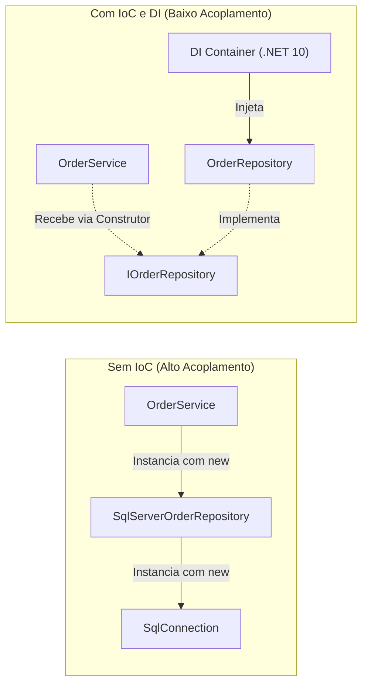
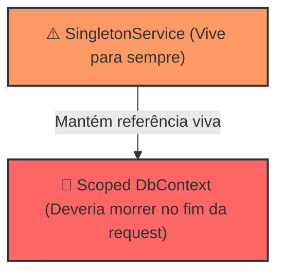

# 💉 Injeção de Dependência e Inversão de Controle (IoC) no .NET 10

> "Não crie suas dependências; solicite-as para que alguém de fora as forneça." — Princípio de Hollywood ("Don't call us, we'll call you")

A **Inversão de Controle (IoC)** é um princípio de design arquitetural, e a **Injeção de Dependência (DI)** é o padrão de projeto mais comum para implementá-la. No .NET 10, o container nativo (`Microsoft.Extensions.DependencyInjection`) é o coração de qualquer aplicação modular e de alto desempenho.

---

## 🧭 Inversão de Controle vs Injeção de Dependência



Quando uma classe usa a palavra-chave `new` para instanciar seus colaboradores internos:
1. Ela se acopla rigidamente àquela implementação concreta.
2. Torna-se impossível testá-la isoladamente com mocks ou fakes.
3. Não permite alternar implementações com base em ambiente (ex: Local, Homologação, Produção).

---

## ⚙️ Os Três Ciclos de Vida (Lifetimes) do .NET 10

Compreender os ciclos de vida é crucial para evitar **memory leaks** e falhas de concorrência:

| Ciclo de Vida | Método de Registro | Instanciação e Reuso | Caso de Uso Típico |
| :--- | :--- | :--- | :--- |
| **Transient** | `AddTransient<T>()` | Uma **nova instância** a cada vez que o serviço é solicitado. | Serviços leves, sem estado interno (`IOrderValidator`). |
| **Scoped** | `AddScoped<T>()` | Uma **única instância por requisição HTTP** (ou por Scope manual). | `DbContext`, Repositórios, Handlers de negócio. |
| **Singleton** | `AddSingleton<T>()` | Uma **única instância para toda a vida do processo** (compartilhada globalmente). | Caches em memória, Clientes de mensageria (`IConnectionMultiplexer`), Métricas. |

---

## 🚨 A Armadilha Mais Perigosa: Captive Dependency (Dependência Cativa)

Ocorre quando um serviço com ciclo de vida **mais longo** consome um serviço com ciclo de vida **mais curto**.



### O que acontece?
O `SingletonService` captura a instância do `DbContext`. Esse `DbContext` nunca é destruído pelo Garbage Collector:
1. O `ChangeTracker` do EF Core acumula milhares de entidades em memória (Memory Leak).
2. Múltiplas threads concorrentes acessam a mesma instância do `DbContext`, causando a clássica exceção:
   `InvalidOperationException: A second operation was started on this context instance before a previous operation completed.`

### Como evitar?
O .NET ativa por padrão em desenvolvimento a validação de escopo (`ValidateScopes = true`). Em produção, se um Singleton realmente precisar de um serviço Scoped, use `IServiceScopeFactory`:

```csharp
public sealed class BackgroundOrderProcessor(IServiceScopeFactory scopeFactory, ILogger<BackgroundOrderProcessor> logger) 
    : BackgroundService
{
    protected override async Task ExecuteAsync(CancellationToken stoppingToken)
    {
        while (!stoppingToken.IsCancellationRequested)
        {
            // Cria um escopo sob demanda para resolver serviços Scoped com segurança
            using (var scope = scopeFactory.CreateScope())
            {
                var dbContext = scope.ServiceProvider.GetRequiredService<CatalogDbContext>();
                var pendingOrders = await dbContext.Orders
                    .Where(o => o.Status == OrderStatus.PendingPayment)
                    .ToListAsync(stoppingToken);

                logger.LogInformation("Processando {Count} pedidos pendentes...", pendingOrders.Count);
            }

            await Task.Delay(TimeSpan.FromSeconds(30), stoppingToken);
        }
    }
}
```

---

## 🆕 Recursos Modernos no .NET 10: Keyed Services

A partir do .NET 8 e consolidado no **.NET 10**, você pode registrar múltiplas implementações da mesma interface usando chaves (`Keyed Services`), eliminando a necessidade de factories complexas:

```csharp
// Registro no Program.cs
builder.Services.AddKeyedScoped<IPaymentGateway, StripePaymentGateway>("stripe");
builder.Services.AddKeyedScoped<IPaymentGateway, PayPalPaymentGateway>("paypal");

// Resolução no Controller ou Endpoint usando Primary Constructor
public sealed class CheckoutService(
    [FromKeyedServices("stripe")] IPaymentGateway stripeGateway,
    [FromKeyedServices("paypal")] IPaymentGateway paypalGateway)
{
    public async Task ProcessAsync(PaymentRequest request, CancellationToken ct)
    {
        var gateway = request.Method == PaymentMethod.Stripe 
            ? stripeGateway 
            : paypalGateway;

        await gateway.ChargeAsync(request.Amount, ct);
    }
}
```

---

## ⚖️ Trade-offs

| Prática Recomendada | Antipadrão a Evitar |
| :--- | :--- |
| Injeção explícita via **Primary Constructor** em classes seladas (`sealed`). | **Service Locator Pattern**: Chamar `serviceProvider.GetService<T>()` dentro das classes de negócio. |
| Registrar serviços com interfaces específicas e focadas. | Injetar dezenas de serviços no mesmo construtor (sintoma de violação do SRP). |
| Usar `IServiceScopeFactory` em `IHostedService` e consumidores de fila. | Injetar `DbContext` diretamente em Singleton. |

---

## 🎙️ Perguntas de Entrevista Sênior

### 1. "O que é o Service Locator e por que ele é considerado um antipadrão na maioria dos cenários?"
**Resposta Esperada**: *O Service Locator oculta as dependências de uma classe. Ao invés de o construtor declarar explicitamente tudo o que a classe precisa para funcionar, a classe busca serviços em tempo de execução via `IServiceProvider`. Isso quebra o encapsulamento, mascara falhas de configuração até o momento da execução e impede testes unitários limpos.*

### 2. "Qual a diferença entre `AddScoped` e `AddTransient` sob o ponto de vista de alocação de memória?"
**Resposta Esperada**: *O Transient aloca um objeto novo a cada injeção; se 5 classes na mesma requisição injetam `ITransientService`, teremos 5 instâncias distintas criadas e coletadas pelo GC. O Scoped cria apenas uma única instância compartilhada por todas as 5 classes durante o ciclo de vida daquela requisição HTTP, sendo descartada ao final do request.*

---

## 🔗 Conexões do Grafo (Obsidian)
- [Clean Architecture em Camadas](01-clean-architecture.md)
- [SOLID e Princípios de POO em C# Moderno](03-solid-e-oop-moderno.md)
- [Configuração, Options Pattern e Validação](04-configuracao-options-e-contratos.md)
- [EF Core e SQL Server](../03-dados-persistencia/01-ef-core-e-sql-server.md)
