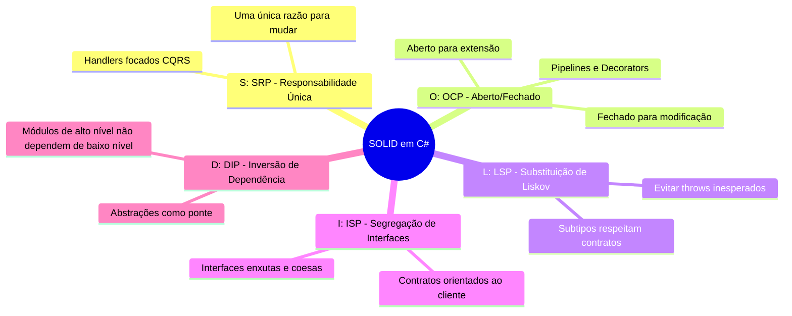

# 💎 SOLID e Princípios de POO em C# Moderno (.NET 10)

> "Código limpo não é aquele que usa todos os recursos da linguagem, mas aquele que expressa a intenção do autor sem rodeios e resiste ao tempo."

Os princípios **SOLID** continuam sendo os alicerces do design de software orientado a objetos, mas com as evoluções do **C# moderno (.NET 10)** (records, imutabilidade por padrão, pattern matching, structs de alta performance), a forma como aplicamos esses princípios se tornou muito mais concisa e elegante.

---

## 🏛️ O Acrônimo SOLID no .NET 10



---

### 1. SRP — Single Responsibility Principle (Princípio da Responsabilidade Única)
*Uma classe ou módulo deve ter apenas uma única razão para mudar.*

❌ **Violação clássica (God Class):**
```csharp
public class OrderService
{
    public void ProcessOrder(Order order)
    {
        // 1. Validação de dados
        // 2. Regra de desconto de negócio
        // 3. Salvamento no banco via SQL
        // 4. Envio de e-mail ao cliente
        // 5. Publicação no RabbitMQ
    }
}
```

✅ **Design Limpo com CQRS Handlers:**
Divida o serviço em componentes coesos onde cada classe tem um único objetivo de negócio:
- `CreateOrderHandler`: orquestra a criação do pedido.
- `Order`: aplica as regras de negócio e validação interna.
- `IOrderNotificationService`: cuida da notificação externa.

---

### 2. OCP — Open/Closed Principle (Princípio Aberto/Fechado)
*Entidades de software devem estar abertas para extensão, mas fechadas para modificação.*

No C# moderno, em vez de herança pesada, usamos **Polimorfismo por Interface** ou **Pattern Matching**:

```csharp
// Abstração limpa
public interface IDiscountStrategy
{
    bool IsApplicable(Customer customer);
    decimal CalculateDiscount(decimal totalAmount);
}

// Implementações extensíveis sem mexer no código existente
public sealed class VipDiscountStrategy : IDiscountStrategy
{
    public bool IsApplicable(Customer customer) => customer.IsVip;
    public decimal CalculateDiscount(decimal totalAmount) => totalAmount * 0.15m;
}

public sealed class BlackFridayDiscountStrategy : IDiscountStrategy
{
    public bool IsApplicable(Customer customer) => DateTime.UtcNow.Month == 11;
    public decimal CalculateDiscount(decimal totalAmount) => totalAmount * 0.25m;
}

// Calculador fechado para modificações
public sealed class DiscountCalculator(IEnumerable<IDiscountStrategy> strategies)
{
    public decimal ApplyDiscount(Customer customer, decimal totalAmount)
    {
        var strategy = strategies.FirstOrDefault(s => s.IsApplicable(customer));
        return strategy != null ? strategy.CalculateDiscount(totalAmount) : 0m;
    }
}
```

---

### 3. LSP — Liskov Substitution Principle (Princípio da Substituição de Liskov)
*Objetos de uma classe derivada devem ser capazes de substituir objetos da classe base sem quebrar o comportamento do sistema.*

Se `ClasseFilha` herda de `ClassePai`, qualquer código que use `ClassePai` não deve ter surpresas (como exceções inesperadas `NotSupportedException`).

❌ **Violação Comum:**
```csharp
public class ReadOnlyRepository : IRepository
{
    public void Save(Entity entity) => throw new NotSupportedException("Apenas leitura!");
}
```
*Solução*: Segregar as interfaces em `IReadRepository` e `IWriteRepository` (conforme o ISP).

---

### 4. ISP — Interface Segregation Principle (Segregação de Interfaces)
*Nenhum cliente deve ser forçado a depender de métodos que não utiliza.*

Prefira múltiplas interfaces pequenas e focadas a uma interface volumosa:

```csharp
// ❌ Interface inchada (Fat Interface)
public interface IOrderManagement
{
    Task CreateOrderAsync(Order order);
    Task CancelOrderAsync(Guid orderId);
    Task GenerateInvoicePdfAsync(Guid orderId);
    Task SendShippingNotificationAsync(Guid orderId);
}

// ✅ Interfaces segregadas e precisas
public interface IOrderCreationService
{
    Task CreateOrderAsync(Order order, CancellationToken ct);
}

public interface IInvoiceGenerator
{
    Task<byte[]> GenerateInvoicePdfAsync(Guid orderId, CancellationToken ct);
}
```

---

### 5. DIP — Dependency Inversion Principle (Inversão de Dependência)
1. *Módulos de alto nível não devem depender de módulos de baixo nível. Ambos devem depender de abstrações.*
2. *Abstrações não devem depender de detalhes. Detalhes devem depender de abstrações.*

(Veja os detalhes e implementação completa em [Clean Architecture](01-clean-architecture.md) e [Injeção de Dependência](02-injecao-dependencia-e-ioc.md)).

---

## 🛡️ Encapsulamento e Abstrações no C# 14

O encapsulamento garante que o estado interno do objeto não seja corrompido por código externo.

```mermaid
flowchart LR
    ExternalCode["Cliente Externo"]
    
    subgraph EncapsulatedEntity ["Entidade Encapsulada"]
        PrivateProps["Propriedades Privadas<br/>(Id, Status, Balance)"]
        PublicMethods["Métodos de Negócio Públicos<br/>(Deposit, Withdraw)"]
    end
    
    ExternalCode -.->|❌ Modificar Balance diretamente| PrivateProps
    ExternalCode -->|✅ Executar Withdraw(valor)| PublicMethods
    PublicMethods -->|Valida e altera com segurança| PrivateProps
```

### Regras de ouro para classes ricas em .NET 10:
1. **Marque classes como `sealed` por padrão**: Impede herança acidental e permite otimizações de devirtualização pelo compilador e JIT.
2. **Elimine setters públicos**: Propriedades com `{ get; private set; }` ou `{ get; init; }`.
3. **Use Records para dados imutáveis**: Para DTOs, Eventos e Value Objects, use `readonly record struct` ou `record`.

```csharp
// Value Object imutável e seguro com C# 14
public readonly record struct Money
{
    public decimal Amount { get; }
    public string Currency { get; }

    public Money(decimal amount, string currency)
    {
        if (amount < 0)
            throw new ArgumentException("O valor monetário não pode ser negativo.", nameof(amount));

        Amount = amount;
        Currency = string.IsNullOrWhiteSpace(currency) ? "BRL" : currency.ToUpperInvariant();
    }
}
```

---

## 🧩 Composition over Inheritance (Composição sobre Herança)

> "Favoreça a composição de objetos em vez da herança de classes." — Design Patterns (GoF)

A herança cria o acoplamento mais rígido da orientação a objetos: qualquer alteração na classe base afeta todas as derivadas. A composição permite montar comportamentos dinâmicos através de interfaces injetadas.

```csharp
// Em vez de herdar de BaseLoggerService ou BaseNotificationService:
public sealed class OrderNotifier(
    IEmailSender emailSender, 
    ISmsSender smsSender, 
    ILogger<OrderNotifier> logger)
{
    public async Task NotifyCustomerAsync(Guid customerId, string message, CancellationToken ct)
    {
        logger.LogInformation("Enviando notificações para o cliente {CustomerId}", customerId);
        await Task.WhenAll(
            emailSender.SendEmailAsync(customerId, message, ct),
            smsSender.SendSmsAsync(customerId, message, ct)
        );
    }
}
```

---

## 🎙️ Perguntas de Entrevista Sênior

### 1. "Qual a diferença entre uma classe abstrata e uma interface no C# moderno com Default Interface Methods?"
**Resposta Esperada**: *Uma classe abstrata pode definir estado interno (campos de instância), construtores e modificadores de acesso variados, participando de uma hierarquia de herança única. Uma interface define contratos de comportamento que podem ser implementados por múltiplas classes/structs independentes. Embora interfaces agora suportem Default Methods e métodos estáticos abstratos (`static abstract`), elas ainda não mantêm estado de instância.*

### 2. "Por que declarar classes de serviço como `sealed` é uma boa prática arquitetural e de performance?"
**Resposta Esperada**: *Arquiteturalmente, impede herança indevida e incentiva a composição. Sob a ótica de performance no runtime do .NET 10, o compilador e o JIT eliminam o custo da chamada virtual (vtable dispatch), podendo fazer o inlining de métodos diretamente, resultando em maior throughput e menor sobrecarga de CPU.*

---

## 🔗 Conexões do Grafo (Obsidian)
- [Clean Architecture em Camadas](01-clean-architecture.md)
- [Injeção de Dependência e IoC](02-injecao-dependencia-e-ioc.md)
- [Value Objects e Imutabilidade](../02-dominio-ddd-pratico/02-value-objects-e-imutabilidade.md)
- [Performance e Profiling em .NET 10](../15-performance/01-profiling-e-otimizacoes-dotnet.md)
