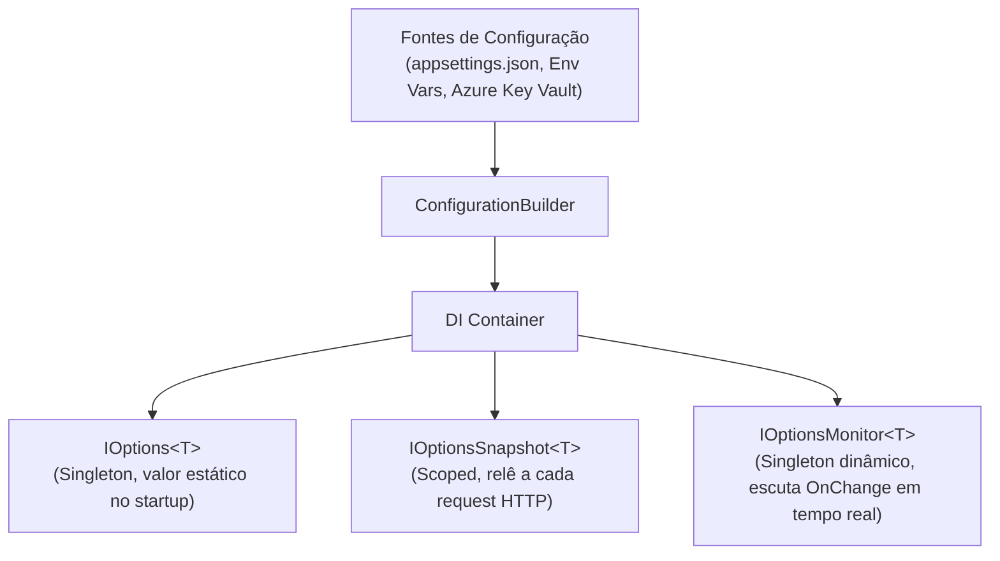

# ⚙️ Configuração, Options Pattern, Contratos e DTOs no .NET 10

> "Falhe cedo, falhe rápido. Uma aplicação que sobe com configurações ausentes é uma bomba-relógio esperando para explodir em produção na primeira chamada de usuário."

Em arquiteturas de microsserviços, a gestão de configurações e a definição clara de contratos entre fronteiras (APIs, mensageria, serviços externos) são vitais para a estabilidade e manutenibilidade do sistema.

---

## 🧭 Options Pattern: IOptions vs IOptionsSnapshot vs IOptionsMonitor

No .NET 10, o **Options Pattern** utiliza classes com tipagem forte para representar configurações do `appsettings.json` ou de variáveis de ambiente.



### Comparativo Técnico dos Três Tipos:

| Interface | Ciclo de Vida | Recarregamento em Tempo Real (Reload on Change) | Onde Utilizar |
| :--- | :--- | :--- | :--- |
| `IOptions<T>` | **Singleton** | ❌ Não (lê apenas uma vez na inicialização) | Configurações estáticas que nunca mudam sem reiniciar a aplicação. |
| `IOptionsSnapshot<T>` | **Scoped** | ✅ Sim (reavalia a cada requisição HTTP) | Endpoints de API e controllers que precisam refletir alterações de arquivo sem restart. |
| `IOptionsMonitor<T>` | **Singleton** | ✅ Sim (dispara evento `OnChange` e fornece `CurrentValue`) | Serviços Singleton, background workers (`IHostedService`) ou conexões de mensageria. |

---

## 🛡️ Fail-Fast com `ValidateOnStart()` e `DataAnnotations`

Nunca permita que uma aplicação inicie se uma connection string ou URL de serviço externo estiver ausente ou malformatada:

```csharp
// Classe de opções fortemente tipada
public sealed class RabbitMqSettings
{
    public const string SectionName = "RabbitMq";

    [Required(ErrorMessage = "O HostName do RabbitMQ é obrigatório.")]
    public string HostName { get; init; } = string.Empty;

    [Range(1, 65535, ErrorMessage = "A porta deve estar entre 1 e 65535.")]
    public int Port { get; init; } = 5672;

    [Required]
    public string UserName { get; init; } = string.Empty;

    [Required]
    public string Password { get; init; } = string.Empty;
}
```

### Registro no `Program.cs` com Validação Imediata:

```csharp
var builder = WebApplication.CreateBuilder(args);

// Registra com validação estrita no startup (Fail-Fast)
builder.Services.AddOptions<RabbitMqSettings>()
    .Bind(builder.Configuration.GetSection(RabbitMqSettings.SectionName))
    .ValidateDataAnnotations()
    .ValidateOnStart(); // 🚀 Se a configuração estiver errada, o app nem sobe!
```

---

## 📦 Contratos, DTOs e Request / Response

Entidades de domínio **nunca** devem ser expostas diretamente em endpoints de API ou filas externas.

### Por que usar DTOs separados?
1. **Evitar Over-Posting / Mass Assignment**: Impedir que usuários mal-intencionados alterem propriedades como `IsAdmin` ou `Balance`.
2. **Desacoplamento de Schema**: O banco de dados pode mudar suas colunas sem quebrar os clientes que consomem a API.
3. **Serialização Otimizada**: DTOs contêm apenas o que o cliente precisa, reduzindo a carga do payload HTTP.

```csharp
// Contrato de Entrada (Request) usando C# 14 record struct
public readonly record struct UpdateProductPriceRequest(
    [Range(0.01, 1_000_000)] decimal NewPrice
);

// Contrato de Saída (Response)
public readonly record struct ProductResponse(
    Guid Id,
    string Name,
    decimal Price,
    string Sku,
    bool InStock
);
```

---

## ⚡ Estratégias de Mapeamento: Manual vs Source Generator (Mapperly) vs AutoMapper

Historicamente, bibliotecas como AutoMapper eram muito populares, mas dependem de **Reflection** em tempo de execução, o que gera overhead de CPU e dificulta compilação com AOT (Ahead-of-Time).

No ecossistema moderno do .NET 10, a melhor prática é:
1. **Mapeamento Manual Direto**: Para casos simples, claro e sem dependências.
2. **Source Generators (ex: Riok.Mapperly)**: Gera código de mapeamento estático durante a compilação, com **zero alocação extra** e 100% compatível com Native AOT.

### Exemplo com Riok.Mapperly (Source Generator):

```csharp
using Riok.Mapperly.Abstractions;

[Mapper]
public static partial class ProductMapper
{
    // O compilador gera o método estático sem usar reflexão!
    public static partial ProductResponse ToResponse(this Product product);
    
    public static partial IQueryable<ProductResponse> ProjectToResponse(this IQueryable<Product> query);
}
```

### Comparativo de Performance de Mapeamento:

| Abordagem | Tempo Médio (Benchmark) | Alocações de Memória | Compatível com Native AOT? |
| :--- | :--- | :--- | :--- |
| **Mapeamento Manual** | ~1.2 ns | 0 B | ✅ Sim |
| **Riok.Mapperly (Source Generator)** | ~1.2 ns | 0 B | ✅ Sim |
| **AutoMapper (Reflection)** | ~45.0 ns | ~120 B | ⚠️ Complexo / Requer configurações |

---

## 🎙️ Perguntas de Entrevista Sênior

### 1. "Por que você usaria `IOptionsMonitor<T>` em um `BackgroundService` em vez de `IOptionsSnapshot<T>`?"
**Resposta Esperada**: *Porque o `BackgroundService` é um Singleton de longa duração. O `IOptionsSnapshot<T>` é Scoped e não pode ser injetado diretamente em um Singleton (causaria o erro de Captive Dependency). O `IOptionsMonitor<T>` é um Singleton thread-safe que permite ler o valor atualizado (`CurrentValue`) e assinar eventos de notificação quando o arquivo de configuração ou secret mudar em tempo real.*

### 2. "Quais os riscos de expor diretamente Entidades do EF Core em responses de Controllers?"
**Resposta Esperada**: *Exposição de dados sensíveis, risco de ataques de mass-assignment em bindings de retorno, quebra de contratos externos ao refatorar o banco de dados e problemas graves de serialização cíclica (loop infinito de navegação entre entidades pai e filhas no JSON).*

---

## 🔗 Conexões do Grafo (Obsidian)
- [Clean Architecture em Camadas](01-clean-architecture.md)
- [Injeção de Dependência e IoC](02-injecao-dependencia-e-ioc.md)
- [API Versioning e ADRs](05-versionamento-e-adrs.md)
- [Minimal APIs vs Controllers](../04-apis-e-http/02-minimal-apis-vs-controllers.md)
- [Performance e Profiling](../15-performance/01-profiling-e-otimizacoes-dotnet.md)
