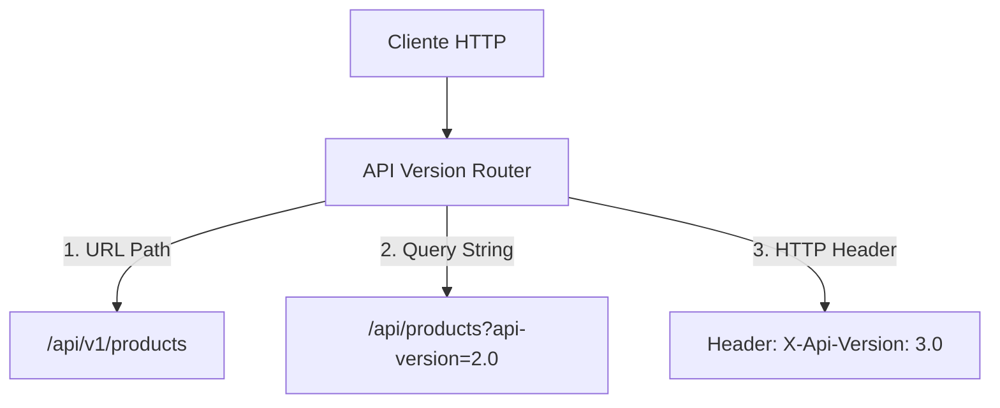
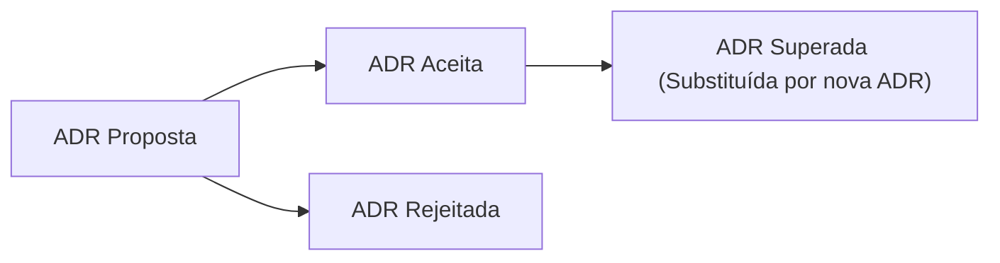

# 📜 Versionamento de APIs e Architecture Decision Records (ADR)

> "A única certeza no software é a mudança. Se sua API não tem estratégia de versionamento, qualquer melhoria futura será uma quebra de contrato para seus clientes."

Em ecossistemas de microsserviços, múltiplos times e sistemas clientes consomem suas APIs. Manter **compatibilidade retroativa (backward compatibility)** e documentar o **porquê das decisões técnicas** é o que distingue um time sênior de um time amador.

---

## 🌐 Estratégias de Versionamento de APIs no .NET 10

Com a biblioteca moderna `Asp.Versioning.Http`, o .NET 10 oferece suporte nativo e performático tanto para Minimal APIs quanto para Controllers.

### As 3 Principais Estratégias:



| Estratégia | Exemplo | Vantagens | Desvantagens |
| :--- | :--- | :--- | :--- |
| **URL Path (Mais popular)** | `/api/v1/orders` | Extremamente explícito, fácil de inspecionar em logs e testar em navegadores. | Altera a URI canônica do recurso REST. |
| **Query String** | `/api/orders?api-version=2.0` | Mantém a mesma URI; simples de usar em clientes web. | Pode conflitar com cache de CDN se a query string for ignorada. |
| **Header Customizado** | `X-Api-Version: 1.0` | Preserva a pureza do endpoint REST sem poluir a URL. | Mais difícil de testar no navegador sem extensões/Postman. |

---

## 💻 Configuração Prática de Versionamento em Minimal APIs (.NET 10)

```csharp
using Asp.Versioning;

var builder = WebApplication.CreateBuilder(args);

// Configuração do serviço de versionamento
builder.Services.AddApiVersioning(options =>
{
    options.DefaultApiVersion = new ApiVersion(1, 0);
    options.AssumeDefaultVersionWhenUnspecified = true;
    options.ReportApiVersions = true; // Retorna headers 'api-supported-versions' e 'api-deprecated-versions'
    options.ApiVersionReader = ApiVersionReader.Combine(
        new UrlSegmentApiVersionReader(),
        new HeaderApiVersionReader("X-Api-Version")
    );
}).AddApiExplorer(options =>
{
    options.GroupNameFormat = "'v'VVV";
    options.SubstituteApiVersionInUrl = true;
});

var app = builder.Build();

// Agrupamento de versão com NewVersionedApi
var versionSet = app.NewApiVersionSet()
    .HasApiVersion(new ApiVersion(1, 0))
    .HasApiVersion(new ApiVersion(2, 0))
    .ReportApiVersions()
    .Build();

// Endpoint V1
app.MapGet("/api/v{version:apiVersion}/orders", () => 
    Results.Ok(new[] { new { Id = 1, Description = "Ordem V1 (Legada)" } }))
    .WithApiVersionSet(versionSet)
    .MapToApiVersion(new ApiVersion(1, 0));

// Endpoint V2 (com novo campo enriquecido)
app.MapGet("/api/v{version:apiVersion}/orders", () => 
    Results.Ok(new[] { new { Id = 1, Description = "Ordem V2", Total = 150.00m, Currency = "BRL" } }))
    .WithApiVersionSet(versionSet)
    .MapToApiVersion(new ApiVersion(2, 0));

app.Run();
```

---

## 🛡️ O que é Breaking Change (Mudança Quebrantável)?

| ✅ NÃO Quebra Compatibilidade (Não exige nova versão maior) | ❌ QUEBRA Compatibilidade (Exige V2, V3...) |
| :--- | :--- |
| Adicionar um novo campo opcional no JSON de resposta. | Remover ou renomear um campo existente no payload. |
| Adicionar um novo endpoint HTTP independente. | Mudar o tipo de dado de um campo (ex: de `int` para `string`). |
| Adicionar um parâmetro de query opcional. | Tornar um parâmetro de entrada opcional em **obrigatório**. |
| Melhorar a performance interna da consulta. | Alterar códigos de status HTTP padrão (ex: de `200 OK` para `204 No Content`). |

---

## 📝 Architecture Decision Records (ADR)

> "Código mostra O QUE foi feito. Testes mostram O QUE ELE FAZ. ADRs explicam POR QUE foi feito assim e quais alternativas foram descartadas."

Um **ADR** é um documento curto em Markdown mantido junto ao repositório para registrar decisões arquiteturais significativas, seu contexto e suas consequências.



### Template Oficial de ADR (Formato Michael Nygard):

```markdown
# ADR 001: Adoção do RabbitMQ com MassTransit para Mensageria

## Status
Aceito (Accepted) - 2026-09-11

## Contexto
Nosso ecossistema de microsserviços precisa desacoplar a criação de pedidos da emissão de notas fiscais e processamento de pagamentos. Avaliamos comunicação síncrona HTTP direta versus mensageria assíncrona orientada a eventos.

## Decisão
Decidimos adotar o **RabbitMQ** orquestrado pela biblioteca **MassTransit** no .NET 10.
Motivos:
1. Suporte nativo ao Outbox Pattern e Inbox Pattern para consistência transacional.
2. Tratamento automático de retries com backoff e Dead Letter Queues (DLQ).
3. Baixa latência e menor custo de infraestrutura comparado a soluções gerenciadas de nuvem no estágio atual.

## Consequências
- **Positivas**: 
  - O microsserviço de pedidos não cai quando o gateway de pagamento estiver fora do ar.
  - O throughput de pedidos aumentou em 4x.
- **Negativas**: 
  - Complexidade operacional adicional para gerenciar o cluster RabbitMQ.
  - Necessidade de lidar com consistência eventual e idempotência de mensagens duplicadas.
```

---

## 🎙️ Perguntas de Entrevista Sênior

### 1. "Como você descontinua um endpoint sem quebrar os clientes legados de surpresa?"
**Resposta Esperada**: *Implemento um plano de deprecation: 1) Marcamos a versão como obsoleta nos headers de resposta (`Deprecation: true` e `Sunset: Wed, 11 Nov 2026 00:00:00 GMT` da RFC 8594); 2) Documentamos no OpenAPI/Swagger com avisos visuais; 3) Monitoramos métricas de telemetria para ver quais clientes ainda batem na V1; 4) Comunicamos diretamente os consumidores antes de desligar o endpoint.*

### 2. "Qual o valor prático de manter ADRs no mesmo repositório do código em vez de no Confluence ou Notion?"
**Resposta Esperada**: *O código e a arquitetura evoluem juntos. Manter ADRs no Git garante versionamento histórico, revisão via Pull Requests, visibilidade imediata para qualquer desenvolvedor que clona o projeto e evita documentações obsoletas e abandonadas em wikis corporativas.*

---

## 🔗 Conexões do Grafo (Obsidian)
- [Clean Architecture em Camadas](01-clean-architecture.md)
- [Monólito vs Modular vs Microsserviços](06-monolito-vs-modular-vs-microsservicos.md)
- [Comunicação Assíncrona e Eventos](../05-comunicacao-microsservicos/02-comunicacao-assincrona-eventos.md)
- [Guia Completo de ADRs](../19-arquitetura-decisoes/01-adrs-e-tradeoffs.md)
