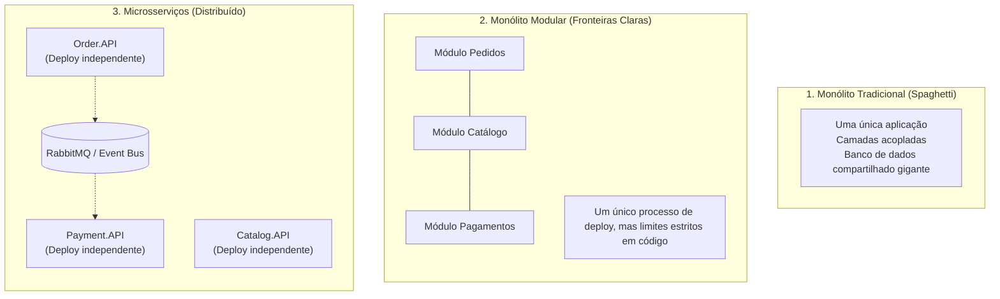
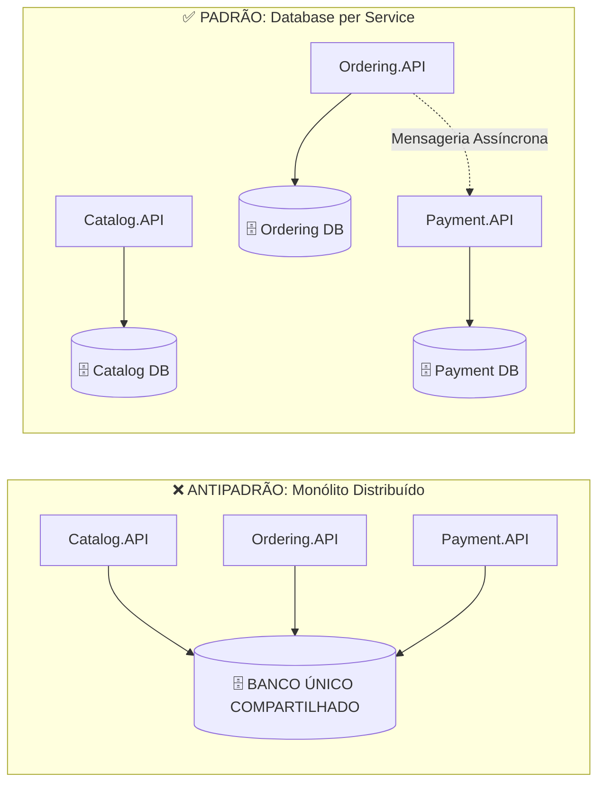

# 🏢 Monólito vs Monólito Modular vs Microsserviços e Twelve-Factor

> "Não distribua seus sistemas até que a dor da complexidade organizacional e operacional supere a dor de manter uma base de código unificada." — Martin Fowler

A decisão de adotar microsserviços não deve ser uma questão de moda ou preferência pessoal, mas sim uma resposta a desafios concretos de escala, governança de times e requisitos de negócio.

---

## ⚖️ Comparativo: Monólito Tradicional vs Monólito Modular vs Microsserviços

### Matriz Comparativa Detalhada:

| Dimensão | Monólito Tradicional | Monólito Modular | Microsserviços (.NET 10) |
| :--- | :--- | :--- | :--- |
| **Complexidade Operacional** | Baixa (1 deploy, 1 banco) | Baixa/Média (1 deploy) | **Alta** (múltiplos deploys, rede, containers) |
| **Fronteiras de Domínio** | Frequentemente violadas | Rígidas (definidas via assemblies C#) | Físicas (processos e redes separadas) |
| **Escalabilidade** | Apenas vertical ou do app todo | Apenas da aplicação inteira | **Cirúrgica** (escala apenas o serviço crítico) |
| **Transações e Consistência** | Transações ACID simples | Transações ACID simples ou outbox | **Consistência Eventual** e Sagas |
| **Independência de Times** | Baixa (conflitos de merge) | Média | **Total** (cada squad tem seu microsserviço) |

---

## 🗄️ Database per Service: A Regra de Ouro Inviolável

> [!CAUTION]
> **A Maior Armadilha dos Falsos Microsserviços:**
> Dividir o código em 10 APIs distintas, mas conectar todas elas ao **mesmo banco de dados relacional** com tabelas compartilhadas e Foreign Keys diretas. Isso é um **Monólito Distribuído** — você herda todos os problemas dos microsserviços (latência de rede, falhas de infraestrutura) sem ganhar nenhum dos benefícios!

### Por que cada microsserviço DEVE ter seu próprio banco de dados?
1. **Autonomia de Schema**: O time do Catálogo pode alterar o modelo de dados sem medo de quebrar queries do time de Pedidos.
2. **Poliglotismo de Persistência**: O Catálogo pode usar MongoDB para consultas rápidas, enquanto Pedidos usa SQL Server para conformidade relacional e o Carrinho usa Redis.
3. **Isolamento de Falhas**: Se o banco de pagamentos ficar lento ou travar por lock, o catálogo continua no ar respondendo aos clientes.

---

## ☁️ Serviços Stateless (Sem Estado)

Para que um microsserviço escale horizontalmente (de 1 para 50 réplicas em segundos via Kubernetes ou Docker Swarm), ele **deve ser stateless**:
- **Nunca guarde sessões de usuário na memória do servidor** (`HttpContext.Session` local).
- Qualquer estado necessário para processar uma requisição deve vir no payload (ex: Claims do token JWT) ou ser recuperado de um armazenamento externo rápido (ex: Redis).
- Qualquer instância de uma réplica deve ser capaz de atender qualquer requisição do usuário de forma idêntica.

---

## 📜 Princípios dos Twelve-Factor Apps no .NET 10

Os **12 Fatores** são as diretrizes essenciais para construir aplicações modernas que rodam na nuvem com previsibilidade:

1. **Codebase**: Um único repositório Git por serviço, mapeado para múltiplos deploys (dev, staging, prod).
2. **Dependencies**: Dependências explícitas declaradas em arquivos `.csproj` (NuGet) sem pacotes implícitos do sistema.
3. **Config**: Configurações sensíveis e variáveis injetadas via **variáveis de ambiente** ou segredos de nuvem, nunca em hardcode.
4. **Backing Services**: Bancos de dados, filas e caches tratados como recursos anexados via connection strings.
5. **Build, Release, Run**: Separação estrita dos estágios de compilação, empacotamento e execução em produção.
6. **Processes**: Aplicações executadas como um ou mais processos **stateless** e isolados.
7. **Port Binding**: A aplicação exporta serviços associando-se diretamente a uma porta TCP (`builder.WebHost.UseUrls("http://+:5000")`).
8. **Concurrency**: Escale adicionando instâncias de processos (escala horizontal), não threads infinitas em um servidor único.
9. **Disposability**: Inicialização rápida e encerramento gracioso (`Graceful Shutdown` no .NET 10 ao receber `SIGTERM`).
10. **Dev/Prod Parity**: Mantenha desenvolvimento, homologação e produção o mais semelhantes possível (utilizando Docker).
11. **Logs**: Trate logs como fluxos de eventos em tempo real (`stdout`/`stderr`), direcionados para coletores (Elastic, Seq, Grafana Loki).
12. **Admin Processes**: Tarefas administrativas e migrations executadas como processos pontuais isolados.

---

## 🎙️ Perguntas de Entrevista Sênior

### 1. "Quando você recomendaria começar com um Monólito Modular em vez de Microsserviços?"
**Resposta Esperada**: *Sempre que o domínio de negócio ainda for incerto ou o time for pequeno. No início de um produto, os limites dos Bounded Contexts mudam com frequência. Mudar fronteiras dentro de um Monólito Modular requer apenas refatoração de código C# e interfaces. Em microsserviços, mover regras envolve migração de bancos de dados, criação de novos tópicos de mensageria e alteração de redes, gerando um custo proibitivo sem necessidade real de escala.*

### 2. "Como implementar a regra de negócio 'Não permitir compra se o cliente estiver bloqueado' sem fazer um JOIN entre tabelas de microsserviços diferentes?"
**Resposta Esperada**: *Usando replicação assíncrona orientada a eventos. Quando um cliente é bloqueado no microsserviço de Clientes, um evento `CustomerBlockedIntegrationEvent` é publicado no RabbitMQ. O microsserviço de Pedidos escuta esse evento e atualiza uma tabela local de consulta (`BlockedCustomersCache`). Ao receber um pedido, a validação é feita localmente no banco do pedido, sem queries síncronas remotas e sem violar o isolamento de dados.*

---

## 🔗 Conexões do Grafo (Obsidian)
- [Clean Architecture em Camadas](01-clean-architecture.md)
- [Entidades e Regras de Negócio](../02-dominio-ddd-pratico/01-entidades-e-regras-de-dominio.md)
- [Comunicação Assíncrona e Eventos](../05-comunicacao-microsservicos/02-comunicacao-assincrona-eventos.md)
- [Escalabilidade Horizontal e Gargalos](../10-escalabilidade/01-escalabilidade-horizontal-e-gargalos.md)
- [Teorema CAP e Falhas de Rede](../18-arquitetura-distribuida/01-teorema-cap-e-falhas-rede.md)
