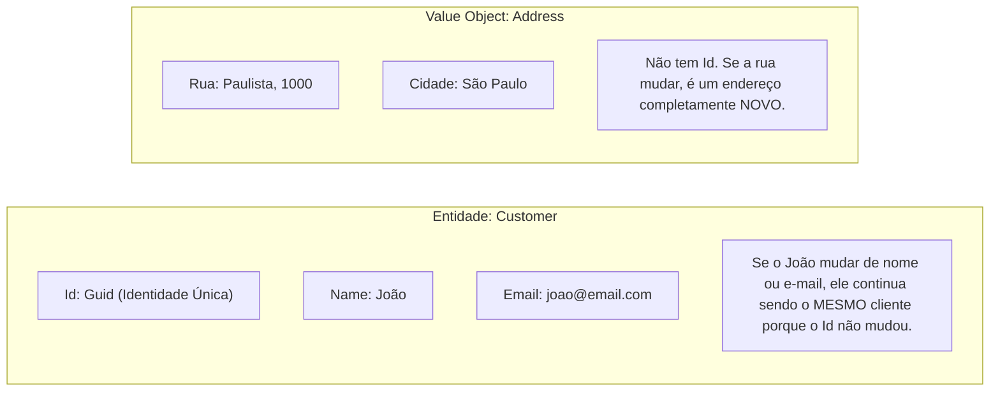

# 🧩 Entidades, Identidade e Regras de Negócio Invioláveis no DDD

> "Um modelo anêmico é apenas uma casca de banco de dados com getters e setters públicos onde qualquer um pode corromper os dados a qualquer momento." — Martin Fowler

No **Domain-Driven Design (DDD)**, o coração do sistema é o Domínio. A missão primária de uma entidade de domínio não é ser persistida no banco, mas sim **garantir que as regras de negócio e suas invariantes sejam impossíveis de violar**.

---

## 🧭 O que define uma Entidade?

Uma **Entidade** possui uma **identidade contínua** que a distingue de todas as outras entidades no universo, mesmo que todas as suas outras propriedades sejam idênticas.



---

## 🚫 Modelo Anêmico vs 🛡️ Modelo Rico

### ❌ O Modelo Anêmico (Anti-pattern comum):
```csharp
// Uma simples bolsa de dados burra (Dumb Data Bag)
public class Order
{
    public Guid Id { get; set; }
    public decimal Total { get; set; }
    public string Status { get; set; }
    public List<OrderItem> Items { get; set; }
}

// O Controller ou Service corrompe o estado sem regras centralizadas:
order.Status = "Paid"; // Quem valida se o pedido já estava cancelado?
order.Total = -500;    // Ninguém impede valores absurdos!
```

### ✅ O Modelo Rico em .NET 10:

Em um modelo rico:
1. Os construtores são restritos (privados ou protegidos).
2. As propriedades têm setters privados (`private set`).
3. Coleções são expostas como `IReadOnlyCollection<T>` para evitar adições diretas via `.Add()`.
4. As alterações de estado ocorrem através de métodos de negócio que protegem as **invariantes**.

```csharp
namespace EShop.Domain.Orders;

public sealed class Order
{
    private readonly List<OrderItem> _items = [];

    public Guid Id { get; private set; }
    public Guid CustomerId { get; private set; }
    public OrderStatus Status { get; private set; }
    public DateTime CreatedAtUtc { get; private set; }

    // Expõe apenas leitura: ninguém de fora consegue chamar order.Items.Add(...)
    public IReadOnlyCollection<OrderItem> Items => _items.AsReadOnly();

    public decimal TotalAmount => _items.Sum(i => i.UnitPrice * i.Quantity);

    // Construtor privado para garantir criação via fábrica controlada
    private Order() { }

    public static Order Create(Guid customerId)
    {
        if (customerId == Guid.Empty)
            throw new ArgumentException("Cliente inválido para o pedido.", nameof(customerId));

        return new Order
        {
            Id = Guid.NewGuid(),
            CustomerId = customerId,
            Status = OrderStatus.Draft,
            CreatedAtUtc = DateTime.UtcNow
        };
    }

    public void AddItem(Guid productId, string productName, decimal unitPrice, int quantity)
    {
        if (Status != OrderStatus.Draft)
            throw new InvalidOperationException("Não é possível adicionar itens a um pedido que não está em rascunho.");

        if (quantity <= 0)
            throw new ArgumentException("A quantidade deve ser maior que zero.", nameof(quantity));

        var existingItem = _items.FirstOrDefault(i => i.ProductId == productId);
        if (existingItem != null)
        {
            existingItem.IncreaseQuantity(quantity);
        }
        else
        {
            _items.Add(new OrderItem(Guid.NewGuid(), productId, productName, unitPrice, quantity));
        }
    }

    public void ConfirmOrder()
    {
        if (!_items.Any())
            throw new InvalidOperationException("Um pedido não pode ser confirmado sem itens.");

        if (Status != OrderStatus.Draft)
            throw new InvalidOperationException($"Não é possível confirmar um pedido com status {Status}.");

        Status = OrderStatus.AwaitingPayment;
    }
}
```

---

## 🎯 O que é uma Invariante de Negócio?

Uma **Invariante** é uma regra de negócio que **deve ser verdadeira durante todo o ciclo de vida do objeto**.
Exemplos práticos:
- *"Um pedido não pode ser despachado se não estiver pago."*
- *"A soma dos percentuais de desconto em uma linha de item nunca pode ultrapassar 30%."*
- *"A quantidade em estoque de um produto físico nunca pode ser negativa."*

Se o estado do objeto for alterado de forma a quebrar uma invariante, uma exceção de domínio deve ser lançada imediatamente, abortando a transação.

---

## 🎙️ Perguntas de Entrevista Sênior

### 1. "Por que expor coleções como `IReadOnlyCollection<T>` em vez de `List<T>` em entidades de domínio?"
**Resposta Esperada**: *Para proteger o encapsulamento. Se expusermos `List<T>`, qualquer serviço externo pode chamar `order.Items.Add(item)` diretamente, ignorando totalmente validações como limite de itens, recálculo de impostos e verificação de status do pedido. Ao expor apenas `IReadOnlyCollection<T>`, forçamos todas as alterações a passarem pelo método de negócio `order.AddItem(...)`.*

### 2. "Como você trata a validação em DDD: dentro da entidade ou com FluentValidation na camada de aplicação?"
**Resposta Esperada**: *Validações de contrato e formato de entrada (ex: se o e-mail tem formato válido ou campos obrigatórios vieram no JSON) pertencem à camada de Aplicação com FluentValidation antes de tocar no domínio. Já as regras de negócio e invariantes (ex: se o saldo é suficiente, se o pedido pode transicionar de estado) pertencem 100% ao Domínio, protegidas dentro dos métodos da entidade.*

---

## 🔗 Conexões do Grafo (Obsidian)
- [Clean Architecture em Camadas](../01-fundamentos-arquitetura/01-clean-architecture.md)
- [Value Objects e Imutabilidade](02-value-objects-e-imutabilidade.md)
- [Agregados e Aggregate Roots](03-agregados-e-aggregate-roots.md)
- [EF Core e Mapeamento de Entidades](../03-dados-persistencia/01-ef-core-e-sql-server.md)
