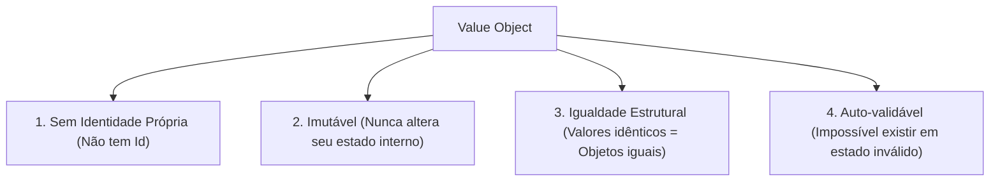

# 💎 Value Objects e Imutabilidade com C# 14 Records (.NET 10)

> "A obsessão por tipos primitivos (Primitive Obsession) é o hábito nocivo de usar strings e números brutos para modelar conceitos ricos do domínio. Um e-mail não é uma string; um CPF não é uma string; dinheiro não é um decimal."

No **Domain-Driven Design (DDD)**, um **Value Object (Objeto de Valor)** é um elemento conceitual definido exclusivamente por seus **valores/atributos**, e não por uma identidade (`Id`).

---

## 🧭 Características Fundamentais de um Value Object



Se você tem duas notas de R$ 50,00 na carteira, você não se importa com qual nota é qual — ambas possuem exatamente o mesmo valor e o mesmo poder de compra. Se você trocar uma pela outra, nada mudou. Isso é um **Value Object**.

---

## 🚀 A Revolução dos `records` no C# Moderno

Antigamente em C# (.NET Framework), implementar um Value Object exigia herdar de uma classe base abstrata e implementar manualmente `GetEqualityComponents()`, sobrescrever `Equals()`, `GetHashCode()`, `==` e `!=`.

No **C# 14 (.NET 10)**, usamos **`record`** ou **`readonly record struct`**:
- Fornece igualdade estrutural automática por valor.
- Gera `GetHashCode()` correto automaticamente.
- É imutável por padrão com `init`.
- Permite cópias não destrutivas com a sintaxe `with`.

---

## 💻 Implementação Prática: Eliminando a Primitive Obsession

### 1. Value Object: `Money` (Dinheiro com Moeda)

```csharp
namespace EShop.Domain.Shared;

public readonly record struct Money
{
    public decimal Amount { get; init; }
    public string Currency { get; init; }

    public Money(decimal amount, string currency)
    {
        if (amount < 0)
            throw new ArgumentOutOfRangeException(nameof(amount), "O valor não pode ser negativo.");

        if (string.IsNullOrWhiteSpace(currency) || currency.Length != 3)
            throw new ArgumentException("A moeda deve ser um código ISO de 3 letras (ex: BRL, USD).", nameof(currency));

        Amount = decimal.Round(amount, 2);
        Currency = currency.ToUpperInvariant();
    }

    // Operações matemáticas que retornam uma nova instância imutável
    public static Money operator +(Money a, Money b)
    {
        if (a.Currency != b.Currency)
            throw new InvalidOperationException($"Não é possível somar moedas distintas: {a.Currency} e {b.Currency}");

        return new Money(a.Amount + b.Amount, a.Currency);
    }

    public static Money Zero(string currency = "BRL") => new(0m, currency);
}
```

### 2. Value Object: `Address` (Endereço de Entrega)

```csharp
namespace EShop.Domain.Orders;

public sealed record Address
{
    public string Street { get; init; }
    public string City { get; init; }
    public string State { get; init; }
    public string ZipCode { get; init; }
    public string Country { get; init; }

    public Address(string street, string city, string state, string zipCode, string country)
    {
        ArgumentException.ThrowIfNullOrWhiteSpace(street);
        ArgumentException.ThrowIfNullOrWhiteSpace(city);
        ArgumentException.ThrowIfNullOrWhiteSpace(state);
        ArgumentException.ThrowIfNullOrWhiteSpace(zipCode);
        ArgumentException.ThrowIfNullOrWhiteSpace(country);

        Street = street;
        City = city;
        State = state;
        ZipCode = zipCode;
        Country = country;
    }
}
```

---

## 🗄️ Persistindo Value Objects no EF Core 10

No EF Core 10, o mapeamento de Value Objects é nativo e elegante através do recurso de **Complex Properties** (`ComplexProperty`) introduzido no EF Core 8/9 e otimizado no 10, ou via **Owned Types** (`OwnsOne`):

```csharp
public class OrderConfiguration : IEntityTypeConfiguration<Order>
{
    public void Configure(EntityTypeBuilder<Order> builder)
    {
        builder.HasKey(o => o.Id);

        // Mapeia o Value Object Address diretamente na tabela Orders (colunas Street, City, etc.)
        builder.ComplexProperty(o => o.ShippingAddress, addressBuilder =>
        {
            addressBuilder.Property(a => a.Street).HasColumnName("ShippingStreet").HasMaxLength(200);
            addressBuilder.Property(a => a.City).HasColumnName("ShippingCity").HasMaxLength(100);
            addressBuilder.Property(a => a.ZipCode).HasColumnName("ShippingZipCode").HasMaxLength(20);
        });
    }
}
```

---

## ⚖️ Trade-offs: Onde usar e onde NÃO exagerar

| Onde Value Objects brilham | Onde seria exagero/overengineering |
| :--- | :--- |
| Conceitos financeiros (`Money`, `TaxRate`). | Criar um Value Object para cada string óbvia (ex: `ProductDescription`). |
| Identificadores de documentos e validações rígidas (`Email`, `Cpf`, `Sku`). | Campos simples de auditoria (`CreatedByUserName`). |
| Conjunto de dados que sempre andam juntos (`Address`, `GeoCoordinate`). | Sistemas puramente CRUD de relatórios ou cadastros estáticos. |

---

## 🎙️ Perguntas de Entrevista Sênior

### 1. "Qual a diferença entre um Value Object e uma Entidade no DDD?"
**Resposta Esperada**: *Uma Entidade possui uma identidade (`Id`) contínua que independe de suas propriedades. Dois objetos com propriedades distintas são a mesma entidade se possuírem o mesmo `Id`. Um Value Object não possui identidade; sua identidade é a totalidade de seus valores (igualdade estrutural). Se dois Value Objects têm os mesmos valores, eles são absolutamente indistinguíveis.*

### 2. "Por que `readonly record struct` é ideal para Value Objects como `Money` ou `Coordinate` em .NET 10?"
**Resposta Esperada**: *Porque garante imutabilidade em tempo de compilação, igualdade por valor gerada automaticamente pelo compilador e, sendo uma `struct`, é alocado na stack ou inline dentro da classe hospedeira, gerando zero alocações na Heap e aliviando o trabalho do Garbage Collector em cenários de altíssimo throughput.*

---

## 🔗 Conexões do Grafo (Obsidian)
- [Entidades e Regras de Negócio](01-entidades-e-regras-de-dominio.md)
- [Agregados e Aggregate Roots](03-agregados-e-aggregate-roots.md)
- [EF Core e SQL Server](../03-dados-persistencia/01-ef-core-e-sql-server.md)
- [Performance e Alocações](../15-performance/01-profiling-e-otimizacoes-dotnet.md)
