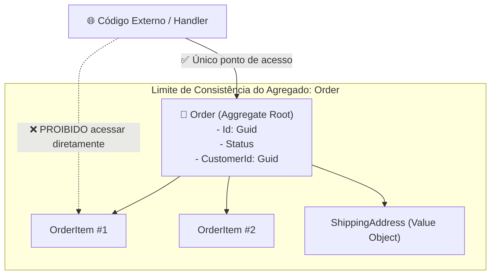

# 📦 Agregados, Aggregate Roots e Limites Transacionais no DDD

> "Um Agregado é um cluster de objetos de domínio associados que tratamos como uma unidade única para fins de alteração de dados." — Eric Evans

O conceito de **Agregado** é o padrão tático mais mal compreendido do DDD. Muitos desenvolvedores criam grafos de objetos gigantescos que carregam metade do banco de dados na memória. Aqui desmistificamos a engenharia prática de agregados focada em **consistência transacional e alta performance**.

---

## 🧭 O que é um Agregado e a Raiz de Agregado (Aggregate Root)?



### As Regras Fundamentais:
1. **Ponto Único de Entrada**: O mundo exterior só pode interagir com o agregado através da sua **Raiz (Aggregate Root)**.
2. **Entidades Internas Protegidas**: Entidades filhas (ex: `OrderItem`) têm identidades locais, mas nunca são carregadas ou salvas por um repositório próprio. **Existe apenas `IOrderRepository`, jamais `IOrderItemRepository`**.
3. **Limite de Transação (1 Agregado por Transação)**: Uma transação de banco de dados deve modificar apenas **uma única instância de agregado** por vez.

---

## 📜 As 4 Regras de Ouro do Design de Agregados (Vaughn Vernon)

### Regra 1: Modele Invariantes Verdadeiras dentro dos Limites de Consistência
Não agrupe entidades apenas porque "elas parecem relacionadas". Agrupe apenas entidades que dependem de regras que **precisam ser 100% consistentes no mesmo milissegundo**.

### Regra 2: Projete Agregados Pequenos
Agregados grandes causam:
- Bloqueios de concorrência (`OptimisticConcurrencyException`) frequentes.
- Alto consumo de memória ao hidratar dezenas de tabelas associadas.
- Queries lentas com dezenas de `JOINs`.

### Regra 3: Referencie Outros Agregados Apenas por Identidade (`Id`)
❌ **Errado (Acoplamento de Grafo):**
```csharp
public class Order
{
    public Customer Customer { get; set; } // Carrega o cliente inteiro na memória!
}
```

✅ **Correto (Referência por Id):**
```csharp
public class Order
{
    public Guid CustomerId { get; private set; } // Apenas o Id do outro agregado!
}
```

### Regra 4: Use Consistência Eventual Fora do Limite
Se a alteração em `Order` precisa atualizar o saldo do cliente ou a pontuação de fidelidade, isso deve acontecer de forma assíncrona através de **Eventos de Integração**, e não dentro da mesma transação do banco.

---

## 💻 Implementação C# .NET 10: Raiz de Agregado com Eventos

```csharp
namespace EShop.Domain.Common;

// Classe base para todas as Raízes de Agregado
public abstract class AggregateRoot
{
    private readonly List<IDomainEvent> _domainEvents = [];

    public IReadOnlyCollection<IDomainEvent> DomainEvents => _domainEvents.AsReadOnly();

    protected void RaiseDomainEvent(IDomainEvent domainEvent)
    {
        _domainEvents.Add(domainEvent);
    }

    public void ClearDomainEvents()
    {
        _domainEvents.Clear();
    }
}

public interface IDomainEvent
{
    DateTime OccurredOnUtc { get; }
}
```

### A Raiz `Order` Protegendo suas Invariantes:

```csharp
namespace EShop.Domain.Orders;

using EShop.Domain.Common;

public sealed class Order : AggregateRoot
{
    private readonly List<OrderItem> _items = [];

    public Guid Id { get; private set; }
    public Guid CustomerId { get; private set; }
    public OrderStatus Status { get; private set; }
    public IReadOnlyCollection<OrderItem> Items => _items.AsReadOnly();

    private Order() { }

    public static Order Create(Guid customerId)
    {
        var order = new Order
        {
            Id = Guid.NewGuid(),
            CustomerId = customerId,
            Status = OrderStatus.Draft
        };

        // Dispara evento de domínio quando algo relevante acontece
        order.RaiseDomainEvent(new OrderCreatedDomainEvent(order.Id, customerId, DateTime.UtcNow));
        return order;
    }

    public void Cancel(string reason)
    {
        if (Status == OrderStatus.Shipped || Status == OrderStatus.Completed)
            throw new InvalidOperationException($"Não é possível cancelar um pedido com status {Status}.");

        Status = OrderStatus.Cancelled;
        RaiseDomainEvent(new OrderCancelledDomainEvent(Id, reason, DateTime.UtcNow));
    }
}

public readonly record struct OrderCreatedDomainEvent(Guid OrderId, Guid CustomerId, DateTime OccurredOnUtc) : IDomainEvent;
public readonly record struct OrderCancelledDomainEvent(Guid OrderId, string Reason, DateTime OccurredOnUtc) : IDomainEvent;
```

---

## 🎙️ Perguntas de Entrevista Sênior

### 1. "Por que você não deve alterar dois agregados diferentes na mesma transação de banco de dados?"
**Resposta Esperada**: *Porque isso acopla o ciclo de vida e a escalabilidade de dois conceitos de negócio distintos, aumentando exponencialmente a chance de conflitos de concorrência e deadlocks no banco de dados. Além disso, se o sistema for dividido em microsserviços no futuro, transações distribuídas (2PC) são lentas e frágeis. A boa prática é alterar um agregado por transação e sincronizar outros agregados via consistência eventual e mensageria.*

### 2. "Como você sabe que um agregado ficou grande demais?"
**Resposta Esperada**: *Sintomas claros: 1) Alto índice de conflitos de concorrência otimista (usuários tentando salvar ao mesmo tempo partes diferentes do mesmo objeto); 2) Queries do EF Core com múltiplos `Include()` que geram gargalos de performance; 3) Dificuldade de raciocinar sobre as invariantes da classe.*

---

## 🔗 Conexões do Grafo (Obsidian)
- [Entidades e Regras de Negócio](01-entidades-e-regras-de-dominio.md)
- [Value Objects e Imutabilidade](02-value-objects-e-imutabilidade.md)
- [Domain Services e Domain Events](04-domain-services-e-events.md)
- [Outbox Pattern e Eventos de Integração](../05-comunicacao-microsservicos/03-outbox-inbox-patterns.md)
- [Transações e Concorrência](../03-dados-persistencia/02-transacoes-e-concorrencia.md)
