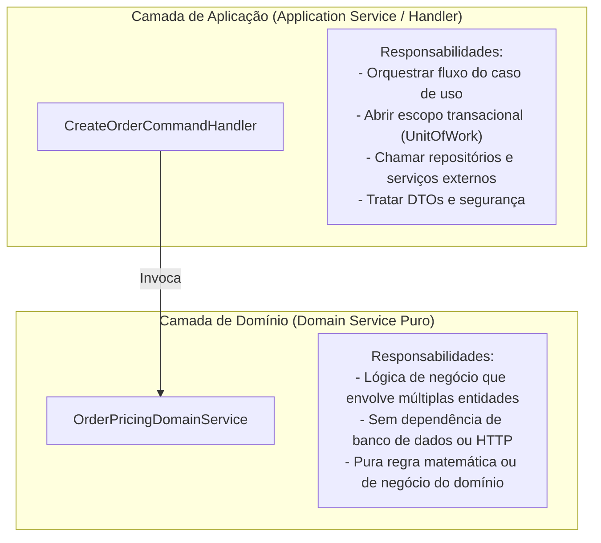
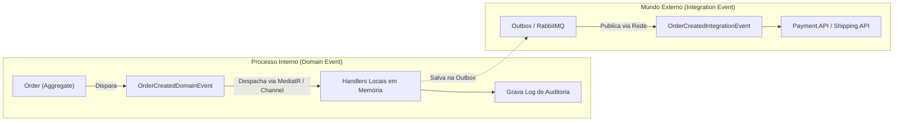

# ⚡ Domain Services, Domain Events e Abstração de Repositórios

> "Quando uma operação de negócio importante não pertence naturalmente a nenhuma Entidade ou Value Object específico, ela deve ser modelada como um Serviço de Domínio (Domain Service)." — Eric Evans

Completando os blocos táticos do DDD, este guia explica a diferença cirúrgica entre **Domain Services** e **Application Services**, a mecânica dos **Domain Events** e como tratar repositórios sem cair no abismo de abstrações vazias.

---

## 🧭 Domain Service vs Application Service: A Fronteira Crítica

Muitos desenvolvedores confundem esses dois tipos de serviço e acabam esvaziando o domínio ou colocando lógica de infraestrutura dentro de Domain Services.



### Quadro de Diferenciação:

| Critério | Application Service (ex: Handlers) | Domain Service (ex: Calculador de Juros/Preço) |
| :--- | :--- | :--- |
| **Objetivo** | Orquestrar o caso de uso. | Executar uma regra de negócio pura que não cabe em uma única entidade. |
| **Dependências** | Repositórios, E-mail, Cache, Message Bus. | Outras entidades, Value Objects ou interfaces de domínio puras. |
| **Acesso a Banco?** | ✅ Sim, via repositórios. | ❌ Não! Recebe os dados já em memória. |
| **Retorno** | DTOs de resposta da API. | Entidades, Value Objects ou tipos primitivos do domínio. |

---

## 📢 Domain Events vs Integration Events



1. **Domain Events (Eventos de Domínio)**:
   - Notificações **em memória**, síncronas ou assíncronas, dentro do **mesmo processo e da mesma transação**.
   - Utilizados para manter a consistência entre entidades do mesmo domínio sem acoplá-las diretamente.
2. **Integration Events (Eventos de Integração)**:
   - Notificações enviadas através da **rede** (ex: RabbitMQ, Kafka, Azure Service Bus).
   - Utilizados para comunicar **outros microsserviços ou sistemas externos**.

---

## ⚙️ Despachando Domain Events no EF Core 10 com Interceptors

A melhor forma de publicar Domain Events sem esquecê-los é interceptando o `SaveChangesAsync` no EF Core:

```csharp
using Microsoft.EntityFrameworkCore.Diagnostics;

public sealed class DispatchDomainEventsInterceptor(IMediator mediator) : SaveChangesInterceptor
{
    public override async ValueTask<InterceptionResult<int>> SavingChangesAsync(
        DbContextEventData eventData, 
        InterceptionResult<int> result, 
        CancellationToken cancellationToken = default)
    {
        var context = eventData.Context;
        if (context is null) return await base.SavingChangesAsync(eventData, result, cancellationToken);

        // 1. Localiza todas as raízes de agregado com eventos pendentes
        var aggregates = context.ChangeTracker
            .Entries<AggregateRoot>()
            .Where(e => e.Entity.DomainEvents.Any())
            .Select(e => e.Entity)
            .ToList();

        var domainEvents = aggregates
            .SelectMany(a => a.DomainEvents)
            .ToList();

        // 2. Limpa os eventos do agregado para evitar reenvio
        aggregates.ForEach(a => a.ClearDomainEvents());

        // 3. Despacha os eventos antes de commitar no banco (mesma transação!)
        foreach (var domainEvent in domainEvents)
        {
            await mediator.Publish(domainEvent, cancellationToken);
        }

        return await base.SavingChangesAsync(eventData, result, cancellationToken);
    }
}
```

---

## 🗄️ Abstração de Repositório: Quando Ajuda e Quando é Exagero?

### ✅ Quando a abstração de repositório ajuda:
- Para encapsular queries complexas de agregados com seus agregados filhos (`Include`).
- Para facilitar testes unitários da camada de aplicação sem depender de conexões de banco reais.

### ❌ Quando o Repositório se torna uma Praga (Overengineering):
- Criar `GenericRepository<T>` que apenas repassa chamadas para o `DbSet<T>` (`repo.Add(x)`, `repo.GetAll()`). O EF Core já é uma implementação robusta do padrão Repository e Unit of Work.
- Usar repositório para queries de leitura complexas (para relatórios ou dashboards, prefira **Dapper** ou queries diretas compiladas com projeção `Select`).

---

## 🎙️ Perguntas de Entrevista Sênior

### 1. "Os Domain Events devem ser despachados antes ou depois do `SaveChangesAsync()` do banco?"
**Resposta Esperada**: *Depende do caso de negócio. Se o evento dispara validações ou regras que precisam abortar a transação caso falhem, ele DEVE ser despachado ANTES do `SaveChangesAsync`, dentro da mesma transação ACID. Se o evento dispara efeitos colaterais externos irreversíveis (como envio de e-mails ou mensagens para filas), ele DEVE ser despachado DEPOIS da persistência confirmada (ou via Outbox Pattern).*

### 2. "Por que um Domain Service não deve injetar `IOrderRepository` diretamente?"
**Resposta Esperada**: *Para manter o domínio puro e desacoplado de operações de I/O. Se o serviço de domínio depende do repositório, ele assume a responsabilidade de orquestração de dados (que pertence ao Application Service) e perde sua pureza matemática, tornando os testes unitários dependentes de mocks de I/O.*

---

## 🔗 Conexões do Grafo (Obsidian)
- [Agregados e Aggregate Roots](03-agregados-e-aggregate-roots.md)
- [Outbox Pattern e Mensageria](../05-comunicacao-microsservicos/03-outbox-inbox-patterns.md)
- [EF Core e SQL Server](../03-dados-persistencia/01-ef-core-e-sql-server.md)
- [Testes Unitários de Domínio](../12-testes/01-piramide-de-testes.md)
