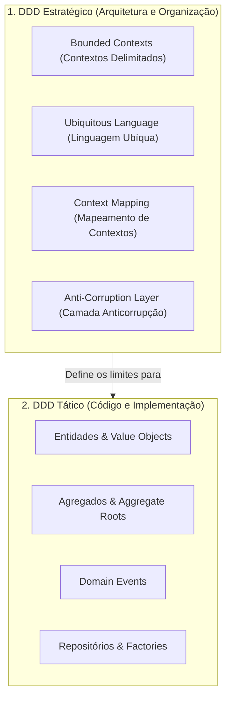
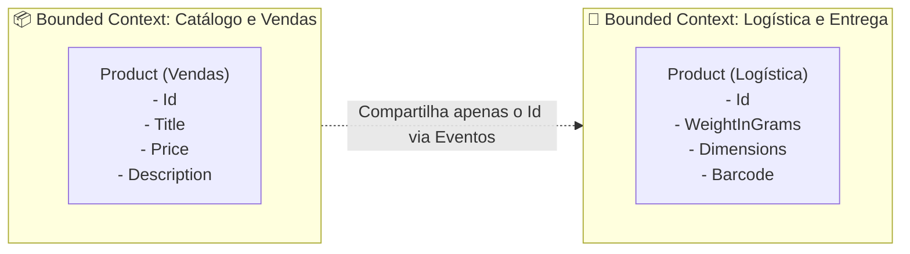

# 🗺️ DDD Estratégico vs Tático: Bounded Contexts e Context Mapping

> "Se você aplicar apenas os padrões táticos do DDD (entidades, value objects, repositórios) sem o DDD estratégico (Bounded Contexts e Linguagem Ubíqua), você criará apenas um monólito complexo e elegante." — Eric Evans

Muitas equipes transformam o DDD em uma religião dogmática cheia de burocracia, aplicando dezenas de classes abstratas para um cadastro simples. Neste guia, separamos o **DDD Estratégico** (essencial para microsserviços) do **DDD Tático** e mostramos como traçar fronteiras que realmente funcionam.

---

## 🧭 DDD Estratégico vs DDD Tático



---

## 🗣️ Linguagem Ubíqua (Ubiquitous Language)

A **Linguagem Ubíqua** é o vocabulário comum e rigoroso compartilhado por **desenvolvedores** e **especialistas de negócio (Product Owners, stakeholders)**.

### Regras Práticas da Linguagem Ubíqua:
1. **Se o negócio fala "Cliente", o código não pode ter a classe `User`**.
2. **Se o negócio diz "Despachar pedido", o código não deve ter `UpdateOrderStatus(3)`**, mas sim `order.Ship()`.
3. **Uma palavra pode ter significados totalmente diferentes em contextos diferentes**.
   - No contexto de **Vendas**, um "Produto" tem preço, fotos e descontos.
   - No contexto de **Logística/Estoque**, o mesmo "Produto" é um pacote físico com peso, altura, largura e código de barras.
   - ❌ Tentar criar uma única classe `Product` gigante com 80 colunas para atender a empresa inteira é o caminho mais rápido para o fracasso!

---

## 🧱 Bounded Contexts (Contextos Delimitados)

Um **Bounded Context** é o limite conceitual e físico dentro do qual um modelo de domínio específico se aplica e onde os termos da Linguagem Ubíqua têm significado estrito e inequívoco.



No mundo dos microsserviços, a regra de ouro é:
> **1 Bounded Context ≈ 1 Microsserviço** (ou um conjunto estritamente coeso de microsserviços).

---

## 🗺️ Context Mapping: Como os Contextos se Relacionam

Quando dois contextos precisam conversar, os padrões de integração do DDD definem o tipo de relacionamento:

| Padrão de Integração | Descrição | Exemplo Prático |
| :--- | :--- | :--- |
| **Shared Kernel (Núcleo Compartilhado)** | Dois times compartilham um subconjunto comum de código ou banco. Alto acoplamento, use com muita cautela. | Uma biblioteca NuGet de Value Objects compartilhados (`Money`, `Address`). |
| **Customer / Supplier** | O contexto fornecedor (Upstream) atende demandas do contexto cliente (Downstream). | A equipe de Pagamentos entrega endpoints específicos para o Checkout. |
| **Conformist** | O cliente simplesmente aceita o modelo do fornecedor sem qualquer tradução. | Integrar diretamente com a API do Stripe ou dos Correios sem envelopar. |
| **Anti-Corruption Layer (ACL)** | Uma camada de tradução que protege o domínio limpo de modelos externos feios ou legados. | Um adaptador que consome um SOAP/XML horrível de um mainframe e o transforma em entidades limpas de domínio. |

---

## 🛡️ Anti-Corruption Layer (ACL) na Prática (.NET 10)

```csharp
namespace EShop.Infrastructure.ExternalSystems.LegacyErp;

// Modelo sujo que vem do sistema legado externo
public readonly record struct LegacyErpCustomerDto(string CD_CLI, string NM_RAZAO, string DS_STATUS_BLOQ);

// Interface limpa exigida pelo nosso Domínio
public interface ICustomerCreditChecker
{
    Task<bool> HasCreditApprovedAsync(Guid customerId, CancellationToken ct);
}

// Implementação da ACL: Traduz e isola o nosso domínio da sujeira externa
public sealed class LegacyErpAntiCorruptionLayer(HttpClient httpClient) : ICustomerCreditChecker
{
    public async Task<bool> HasCreditApprovedAsync(Guid customerId, CancellationToken ct)
    {
        var response = await httpClient.GetFromJsonAsync<LegacyErpCustomerDto>($"/erp/clientes/{customerId}", ct);
        
        // Traduz o código obscuro "DS_STATUS_BLOQ == 'N'" para a regra limpa do nosso domínio
        return response.DS_STATUS_BLOQ == "N";
    }
}
```

---

## 😄 Onde DDD Ajuda e Onde Seria Exagero (Sem Religião!)

```mermaid
quadrantChart
    title Onde Usar DDD?
    x-axis Baixa Complexidade de Negócio --> Alta Complexidade de Negócio
    y-axis Baixo Impacto Financeiro --> Alto Impacto Financeiro
    quadrant-1 DDD Estratégico e Tático Obrigatórios
    quadrant-2 DDD Estratégico com CRUD Simples
    quadrant-3 CRUD Direto (Dapper / Minimal API)
    quadrant-4 Script Simples / Worker Básico
    "Core Checkout / Pagamentos": [0.85, 0.90]
    "Motor de Preços e Juros": [0.80, 0.85]
    "Cadastro de CEPs": [0.15, 0.20]
    "Auditoria e Logs": [0.30, 0.40]
```

### ✅ Use DDD Completo (Estratégico + Tático) quando:
- As regras de negócio forem complexas, cheias de condicionais e regras financeiras.
- O sistema for o diferencial competitivo da empresa (o "Core Domain").
- Múltiplos especialistas de negócio e desenvolvedores precisarem falar a mesma língua.

### ❌ NÃO Use DDD (Evite Overengineering) quando:
- A aplicação for puramente **CRUD** (ex: cadastro de tabelas auxiliares, relatórios, cadastros de estados e cidades). Nesses casos, usar Controllers simples com Dapper ou EF Core direto é 10x mais rápido e simples.
- Microsserviços de simples repasse de mensagens ou gateways.

---

## 🎙️ Perguntas de Entrevista Sênior

### 1. "O que é uma Camada Anticorrupção (ACL) e quando ela é indispensável?"
**Resposta Esperada**: *Uma ACL é uma camada mediadora que traduz chamadas entre dois modelos de domínio distintos, garantindo que o modelo downstream (nosso microsserviço) não seja poluído pelos conceitos, nomes ou estruturas legadas do upstream (serviço externo). É indispensável em integrações com mainframes, ERPs legados ou fornecedores terceiros para evitar que a dívida técnica externa contamine o núcleo do nosso sistema.*

### 2. "Por que ter uma classe única `Customer` para toda a empresa é um antipadrão?"
**Resposta Esperada**: *Porque viola o conceito de Bounded Context. Cada departamento tem uma visão e necessidades completamente diferentes do cliente: o Marketing quer histórico de cliques e preferências; o Jurídico quer termos aceitos e conformidade LGPD/GDPR; a Cobrança quer score de crédito e dados bancários. Unificar tudo em uma classe gera uma entidade anêmica de centenas de colunas, com concorrência infernal e acoplamento entre squads independentes.*

---

## 🔗 Conexões do Grafo (Obsidian)
- [Monólito vs Modular vs Microsserviços](../01-fundamentos-arquitetura/06-monolito-vs-modular-vs-microsservicos.md)
- [Entidades e Regras de Negócio](01-entidades-e-regras-de-dominio.md)
- [Strangler Fig Pattern e Migração de Legado](../20-evolucao-legado/01-strangler-fig-e-migracao-legado.md)
- [ADRs e Decisões de Arquitetura](../19-arquitetura-decisoes/01-adrs-e-tradeoffs.md)
