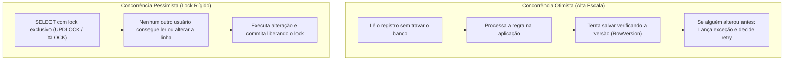

# 🛡️ Transações, Níveis de Isolamento e Concorrência no EF Core 10

> "Em sistemas concorrentes, se dois usuários tentarem comprar a última unidade do mesmo produto ao mesmo tempo, quem ganha a corrida? Se você não desenhou sua concorrência, o banco decidirá por você — e quase sempre da pior maneira."

Gerenciar transações e conflitos de concorrência é um dos temas mais críticos em microsserviços de comércio eletrônico, pagamentos e estoque.

---

## 🧭 Concorrência Otimista vs Pessimista



### Quando usar cada uma:
- **Otimista (Padrão recomendado em microsserviços modernos)**: Baixo overhead, não segura conexões de banco de dados, escala para milhões de requisições.
- **Pessimista**: Indicado apenas em cenários de altíssima colisão com janelas minúsculas (ex: venda de ingressos de show com fila de espera por milissegundos).

---

## 🔒 Concorrência Otimista no EF Core 10 com `RowVersion`

No SQL Server, a coluna do tipo `rowversion` (antigo `timestamp`) é um número incremental de 8 bytes alterado automaticamente pelo motor do banco a cada `UPDATE`.

### 1. Configuração na Entidade:

```csharp
public sealed class InventoryItem
{
    public Guid Id { get; private set; }
    public Guid ProductId { get; private set; }
    public int AvailableQuantity { get; private set; }
    
    // Token de concorrência gerado pelo SQL Server
    public byte[] Version { get; private set; } = [];

    public void DeductStock(int quantity)
    {
        if (quantity > AvailableQuantity)
            throw new InvalidOperationException("Estoque insuficiente.");

        AvailableQuantity -= quantity;
    }
}
```

### 2. Mapeamento no Fluent API:

```csharp
builder.Entity<InventoryItem>(b =>
{
    b.HasKey(x => x.Id);
    
    // Define a propriedade como token de concorrência com RowVersion
    b.Property(x => x.Version)
        .IsRowVersion();
});
```

### 3. Tratando `DbUpdateConcurrencyException`:

Quando dois comandos tentam alterar o mesmo item simultaneamente:
```csharp
public async Task<bool> TryDeductStockAsync(Guid itemId, int quantity, CancellationToken ct)
{
    try
    {
        var item = await context.InventoryItems.FindAsync([itemId], ct);
        if (item is null) return false;

        item.DeductStock(quantity);

        await context.SaveChangesAsync(ct);
        return true;
    }
    catch (DbUpdateConcurrencyException ex)
    {
        // 💥 Conflito de concorrência detectado! Outro usuário alterou o estoque primeiro.
        logger.LogWarning(ex, "Conflito de concorrência ao atualizar item {ItemId}", itemId);
        
        // Estratégias: 
        // 1. Recarregar do banco e tentar novamente (Retry).
        // 2. Avisar o usuário que o estoque esgotou.
        return false;
    }
}
```

---

## 🗄️ Níveis de Isolamento de Transação no SQL Server

| Nível de Isolamento | Fenômenos Permitidos | Trade-off / Impacto |
| :--- | :--- | :--- |
| **Read Uncommitted** | Dirty Read, Non-repeatable Read, Phantom Read | Leitura suja (lê dados antes do rollback). Nunca use em regras financeiras! |
| **Read Committed (Padrão)** | Non-repeatable Read, Phantom Read | Só lê dados commitados, mas leituras sucessivas podem ver dados diferentes. |
| **Snapshot Isolation** | Nenhum dos problemas acima (versão em `tempdb`) | **Altamente recomendado no SQL Server**: Leitura não bloqueia escrita e escrita não bloqueia leitura! |
| **Serializable** | Nenhum | Concorrência nula; bloqueia faixas inteiras de tabelas, gerando deadlocks frequentes. |

---

## 💼 Transações Explícitas e Execution Strategy

Ao trabalhar com resiliência de banco (ex: retries automáticos para falhas transientes do SQL Server via `EnableRetryOnFailure`), você não pode abrir transações manuais com `context.Database.BeginTransaction()` sem usar o `CreateExecutionStrategy()`:

```csharp
var strategy = context.Database.CreateExecutionStrategy();

await strategy.ExecuteAsync(async () =>
{
    // A estratégia reexecuta todo o bloco caso a conexão caia temporariamente
    await using var transaction = await context.Database.BeginTransactionAsync(IsolationLevel.ReadCommitted, ct);
    
    try
    {
        context.Orders.Add(order);
        await context.SaveChangesAsync(ct);

        context.OutboxMessages.Add(outboxMessage);
        await context.SaveChangesAsync(ct);

        await transaction.CommitAsync(ct);
    }
    catch
    {
        await transaction.RollbackAsync(ct);
        throw;
    }
});
```

---

## 🎙️ Perguntas de Entrevista Sênior

### 1. "O que é Snapshot Isolation no SQL Server e por que ele é tão superior ao Read Committed tradicional?"
**Resposta Esperada**: *No Read Committed padrão, comandos de SELECT adquirem Shared Locks (S-Locks), que bloqueiam comandos de UPDATE até que a leitura termine. No Snapshot Isolation, o SQL Server mantém versões históricas das linhas na `tempdb` (Row Versioning). Quando uma query lê dados, ela vê o snapshot no momento de início da transação sem adquirir locks de leitura. Leitores não bloqueiam escritores e escritores não bloqueiam leitores, eliminando deadlocks de concorrência mista.*

### 2. "Como você resolve um conflito de concorrência detectado por `DbUpdateConcurrencyException`?"
**Resposta Esperada**: *Existem três abordagens: 1) **Client Wins**: Forçamos os valores da aplicação sobrescreverem os do banco via `entry.OriginalValues.SetValues(entry.GetDatabaseValues())`; 2) **Database Wins**: Descartamos a alteração e atualizamos o estado local com os dados atuais do banco; 3) **Merge / Business Decision (Melhor prática)**: Recarregamos os dados mais recentes do banco, verificamos se a regra de negócio ainda permite a operação (ex: se ainda há estoque suficiente após o débito anterior) e reexecutamos o cálculo.*

---

## 🔗 Conexões do Grafo (Obsidian)
- [EF Core e SQL Server](01-ef-core-e-sql-server.md)
- [Performance e Otimização de Queries](03-performance-e-otimizacao-queries.md)
- [Agregados e Limites Transacionais](../02-dominio-ddd-pratico/03-agregados-e-aggregate-roots.md)
- [Outbox Pattern e Transações](../05-comunicacao-microsservicos/03-outbox-inbox-patterns.md)
- [Distributed Locking com Redis](../18-arquitetura-distribuida/02-transacoes-distribuidas-e-locks.md)
