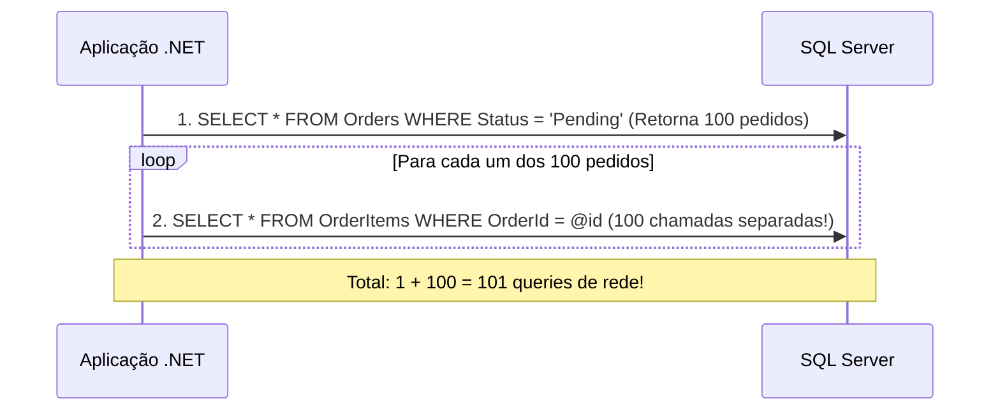
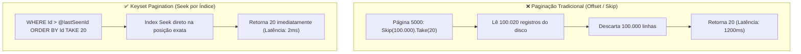

# ⚡ Performance e Otimização de Queries no EF Core 10

> "O código mais rápido é aquele que nunca é executado. A query mais rápida é aquela que transfere do banco de dados exatamente as colunas e linhas necessárias, sem um byte a mais."

O Entity Framework Core 10 é incrivelmente rápido, mas o uso ingênuo de métodos como `Include()` descontrolados, paginação via `Skip/Take` em tabelas gigantes e falta de projeção pode derrubar a performance de qualquer aplicação.

---

## 🚫 O Pesadelo do Problema N+1

O **Problema do N+1** acontece quando uma consulta principal executa 1 query para buscar N registros, e em seguida executa **N queries adicionais** em um loop para carregar os relacionamentos de cada registro.



### A Solução: Eager Loading com `Include` ou Projeção Direta
No EF Core, evite Lazy Loading em microsserviços. Use **Eager Loading** com `Include()` ou, preferencialmente, faça **Projeção Direta com `Select()`**:

```csharp
// ❌ Provoca N+1 se Lazy Loading estiver ativo ou executado em memória
var orders = await context.Orders.ToListAsync();
foreach (var o in orders)
{
    var count = o.Items.Count; // Consulta o banco de novo!
}

// ✅ Projeção direta: 1 única query SQL com JOIN otimizado
var summaries = await context.Orders
    .AsNoTracking()
    .Select(o => new OrderSummaryResponse(
        o.Id, 
        o.CustomerId, 
        o.Items.Count, 
        o.TotalAmount))
    .ToListAsync();
```

---

## 💥 Explosão Cartesiana vs `AsSplitQuery()`

Ao fazer múltiplos `Include()` em relacionamentos 1 para N:
```csharp
var orders = await context.Orders
    .Include(o => o.Items)
    .Include(o => o.Shipments)
    .Include(o => o.PaymentAttempts)
    .ToListAsync();
```
O SQL Server gera um **produto cartesiano**. Se um pedido tiver 10 itens, 3 entregas e 2 tentativas de pagamento, o SQL retornará **60 linhas repetindo todos os dados do pedido** na rede!

### A Solução no EF Core 10: `AsSplitQuery()`
```csharp
var orders = await context.Orders
    .AsNoTracking()
    .AsSplitQuery() // 🚀 Divide a consulta em queries independentes e rápidas
    .Include(o => o.Items)
    .Include(o => o.Shipments)
    .ToListAsync();
```
*O EF Core executa 1 query para Orders, 1 query para Items e 1 query para Shipments, montando os objetos em memória sem explosão de dados.*

---

## 🏃 Tracking vs NoTracking

O **Change Tracker** do EF Core mantém o estado de cada entidade em memória para saber o que atualizar no `SaveChanges()`.

```csharp
// Em endpoints de consulta (GET / Queries), NUNCA use tracking!
var products = await context.Products
    .AsNoTracking() // 🚀 Economiza até 60% de memória e tempo de CPU
    .Where(p => p.IsActive)
    .ToListAsync();
```

| Modo | Uso de Memória | Alocação de CPU | Indicado Para |
| :--- | :--- | :--- | :--- |
| `AsTracking()` (Padrão) | Alto | Alto | Comandos de escrita (`POST`, `PUT`, `DELETE`). |
| `AsNoTracking()` | **Mínimo** | **Mínimo** | Endpoints de consulta e leitura (`GET`). |
| `AsNoTrackingWithIdentityResolution()` | Médio | Médio | Queries de leitura com grafos complexos onde a mesma entidade se repete. |

---

## 📄 Paginação: Offset (`Skip/Take`) vs Keyset (Seek Pagination)

### O Problema do `Skip(100000).Take(20)`:
Para pular 100.000 linhas, o SQL Server é obrigado a **ler fisicamente 100.020 linhas do disco**, ordenar todas elas e descartar as primeiras 100.000!



### Implementação de Keyset Pagination no .NET 10:

```csharp
public async Task<List<ProductResponse>> GetProductsKeysetAsync(
    DateTime? lastCreatedAt, 
    Guid? lastId, 
    int pageSize = 20, 
    CancellationToken ct = default)
{
    var query = context.Products
        .AsNoTracking()
        .OrderByDescending(p => p.CreatedAtUtc)
        .ThenByDescending(p => p.Id);

    if (lastCreatedAt.HasValue && lastId.HasValue)
    {
        // Pula diretamente usando o índice composto, sem Skip()
        query = query.Where(p => 
            p.CreatedAtUtc < lastCreatedAt.Value || 
            (p.CreatedAtUtc == lastCreatedAt.Value && p.Id < lastId.Value));
    }

    return await query
        .Take(pageSize)
        .Select(p => new ProductResponse(p.Id, p.Name, p.Price, p.Sku, p.IsActive))
        .ToListAsync(ct);
}
```

---

## 🎯 Índices de Alta Performance no SQL Server

1. **Covering Index com `INCLUDE`**:
   Permite que a query resolva toda a busca exclusivamente na árvore do índice, sem tocar na tabela de dados (Zero Key Lookup).
```sql
CREATE NONCLUSTERED INDEX [IX_Orders_CustomerId_Status]
ON [ordering].[Orders] ([CustomerId], [Status])
INCLUDE ([TotalAmount], [CreatedAtUtc]);
```

2. **Filtered Index (Índice Filtrado)**:
   Indexa apenas as linhas que atendem a um critério de busca frequente, reduzindo o tamanho do índice no disco em até 95%.
```sql
CREATE NONCLUSTERED INDEX [IX_Orders_PendingPayment]
ON [ordering].[Orders] ([CreatedAtUtc])
WHERE [Status] = 'PendingPayment';
```

---

## 🎙️ Perguntas de Entrevista Sênior

### 1. "Quando o `AsSplitQuery()` é pior do que uma consulta única com JOIN?"
**Resposta Esperada**: *Quando as tabelas filhas possuem pouquíssimos registros e o custo de latência de abrir múltiplas requisições de rede ao banco de dados supera o custo da duplicação dos dados do produto cartesiano. Além disso, no modo Split Query, não há garantia de consistência de leitura entre as queries se elas forem executadas fora de uma transação com isolamento adequado, podendo ler dados inconsistentes caso ocorra um UPDATE no meio das queries.*

### 2. "Como você identifica gargalos de queries do EF Core em produção?"
**Resposta Esperada**: *Utilizo três ferramentas principais: 1) Logs de comandos lentos configurados no EF Core com `LogTo` ou Serilog; 2) Rastreamento distribuído via OpenTelemetry (`OpenTelemetry.Instrumentation.EntityFrameworkCore`), correlacionando a rota HTTP com a query SQL gerada; 3) Análise de planos de execução reais no SQL Server através de Extended Events e Query Store (verificando índices ausentes e Table Scans).*

---

## 🔗 Conexões do Grafo (Obsidian)
- [EF Core e SQL Server](01-ef-core-e-sql-server.md)
- [Cache Distribuído com Redis e HybridCache](04-cache-distribuido-redis-e-hybridcache.md)
- [OpenTelemetry e Tracing](../08-observabilidade/02-opentelemetry-tracing-e-metricas.md)
- [Performance e Profiling](../15-performance/01-profiling-e-otimizacoes-dotnet.md)
