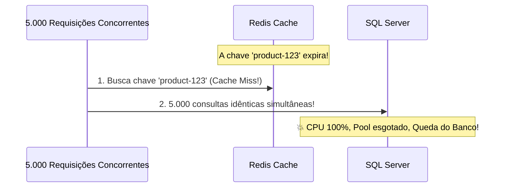
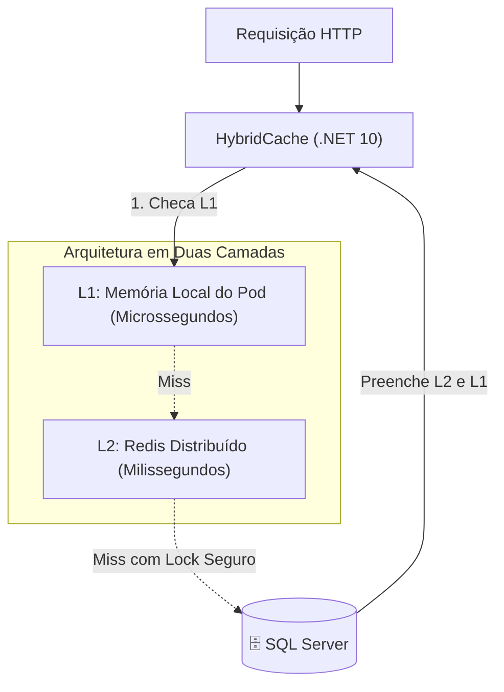

# ⚡ Cache Distribuído com Redis e HybridCache no .NET 10

> "Existem apenas duas coisas difíceis na Ciência da Computação: invalidação de cache e dar nome às coisas." — Phil Karlton

O cache é a ferramenta mais poderosa para reduzir a carga sobre bancos de dados relacionais. No **.NET 10**, a introdução e consolidação do **`HybridCache`** transformou completamente a forma como lidamos com caching em microsserviços.

---

## 🧭 O Problema do Cache Tradicional: O Efeito Manada (Cache Stampede)

Quando um item de cache muito popular (ex: o produto mais vendido na Black Friday) expira de repente, milhares de requisições simultâneas percebem a ausência do dado (Cache Miss) e disparam consultas idênticas ao banco de dados ao mesmo tempo.



---

## 🚀 A Solução Moderna do .NET 10: `HybridCache`

O **`HybridCache`** combina o melhor de dois mundos em uma única abstração unificada:
- **Nível 1 (L1 - Local em Memória)**: Responde na velocidade da memória RAM do processo local (~50 nanosegundos).
- **Nível 2 (L2 - Distribuído via Redis)**: Compartilha o estado entre todas as réplicas do microsserviço no Kubernetes.
- **Proteção Nativa contra Cache Stampede**: Apenas **uma única thread** executa a consulta ao banco; todas as outras aguardam o resultado e recebem o dado sem sobrecarregar o SQL.



---

## 💻 Configuração Prática no .NET 10

### 1. Instalação de Pacotes:
```bash
dotnet add package Microsoft.Extensions.Caching.Hybrid
dotnet add package Microsoft.Extensions.Caching.StackExchangeRedis
```

### 2. Registro no `Program.cs`:
```csharp
var builder = WebApplication.CreateBuilder(args);

// Configura o Redis como backend L2
builder.Services.AddStackExchangeRedisCache(options =>
{
    options.Configuration = builder.Configuration.GetConnectionString("Redis");
    options.InstanceName = "EShop_Catalog_";
});

// Configura o HybridCache (.NET 10)
#pragma warning disable EXTEXP0018 // Experimental API feature flag
builder.Services.AddHybridCache(options =>
{
    options.MaximumPayloadBytes = 1024 * 1024; // 1 MB máximo por item
    options.DefaultEntryOptions = new HybridCacheEntryOptions
    {
        Expiration = TimeSpan.FromMinutes(10), // Expiração no L2 (Redis)
        LocalCacheExpiration = TimeSpan.FromMinutes(2) // Expiração no L1 (RAM)
    };
});
#pragma warning restore EXTEXP0018
```

### 3. Consumo no Endpoint via `GetOrCreateAsync`:

```csharp
app.MapGet("/api/v1/products/{id:guid}", async (
    Guid id, 
    HybridCache cache, 
    CatalogDbContext context, 
    CancellationToken ct) =>
{
    var cacheKey = $"product-{id}";

    // Executa a busca segura com proteção de concorrência nativa
    var product = await cache.GetOrCreateAsync(
        cacheKey,
        async cancelToken =>
        {
            // Este bloco SÓ É EXECUTADO por uma única thread se houver Cache Miss!
            return await context.Products
                .AsNoTracking()
                .Select(p => new ProductResponse(p.Id, p.Name, p.Price, p.Sku, p.IsActive))
                .FirstOrDefaultAsync(p => p.Id == id, cancelToken);
        },
        cancellationToken: ct
    );

    return product is not null ? Results.Ok(product) : Results.NotFound();
});
```

---

## 🔄 Invalidação por Tags no .NET 10

O `HybridCache` suporta invalidação granular através de **Tags**:

```csharp
// Gravando o item no cache associando a tags
await cache.SetAsync(
    $"product-{productId}", 
    product, 
    tags: ["products", $"category-{product.CategoryId}"],
    cancellationToken: ct);

// Quando um produto da categoria é atualizado, invalidamos toda a categoria:
await cache.RemoveByTagAsync($"category-{categoryId}", ct);
```

---

## ⚖️ Trade-offs: Caching Estruturado

| Aspecto | `IMemoryCache` Puro | `IDistributedCache` (Redis) | `HybridCache` (.NET 10) |
| :--- | :--- | :--- | :--- |
| **Velocidade de Leitura** | Instantânea (~100 ns) | Rápida (~1 a 3 ms via rede) | **Instantânea no L1 (~100 ns)** |
| **Consistência entre Nós** | Inexistente (cada nó tem seu dado) | Alta (compartilhado) | Alta com L1 TTL curto |
| **Proteção contra Stampede** | Manual com SemaphoreSlim | Manual com Distributed Lock | **Automática e transparente** |
| **Sobrecarga de Rede** | Nula | Toda leitura trafega na rede | Apenas na primeira leitura do pod |

---

## 🎙️ Perguntas de Entrevista Sênior

### 1. "O que é o problema do Cache Stampede e como você o previne em produção?"
**Resposta Esperada**: *Ocorre quando uma chave de cache muito requisitada expira, fazendo com que milhares de chamadas concorrentes cheguem ao banco de dados ao mesmo tempo, podendo derrubá-lo. Resolvemos utilizando bloqueios por chave (locking por chave com `SemaphoreSlim` local ou distributed lock) ou, modernamente no .NET 10, adotando a abstração nativa `HybridCache`, que garante que apenas uma requisição consulte a fonte original enquanto as outras aguardam de forma assíncrona.*

### 2. "Por que não devemos usar cache em memória simples (`IMemoryCache`) em microsserviços escalados em múltiplos containers?"
**Resposta Esperada**: *Porque em microsserviços escalados horizontalmente, cada container terá sua própria memória isolada. Isso gera inconsistência de dados: se um usuário atualiza um produto no Pod A, o Pod B continuará servindo o dado antigo em memória por minutos. A solução ideal é usar cache distribuído compartilhado (Redis) ou uma arquitetura de duas camadas com TTL muito curto no L1 e eventos de invalidação.*

---

## 🔗 Conexões do Grafo (Obsidian)
- [Performance e Otimização de Queries](03-performance-e-otimizacao-queries.md)
- [Escalabilidade Horizontal e Gargalos](../10-escalabilidade/01-escalabilidade-horizontal-e-gargalos.md)
- [Distributed Locking com Redis](../18-arquitetura-distribuida/02-transacoes-distribuidas-e-locks.md)
- [Performance e Profiling no .NET](../15-performance/01-profiling-e-otimizacoes-dotnet.md)
