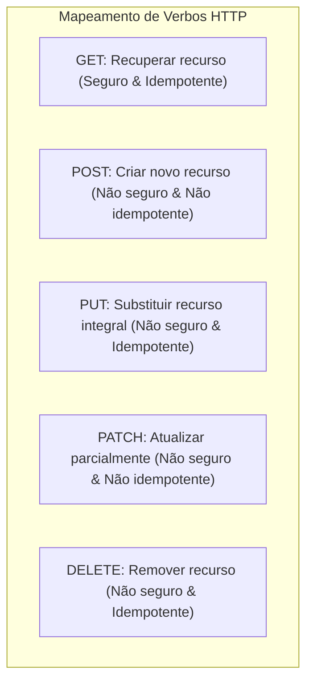

# 🌐 Fundamentos de REST, Protocolo HTTP e Serialização no .NET 10

> "REST não é um protocolo nem uma especificação rígida; é um estilo arquitetural para sistemas hipermídia distribuídos que aproveita toda a riqueza do protocolo HTTP." — Roy Fielding

Em microsserviços, a comunicação HTTP é a interface externa primária para clientes Web, Mobile e gateways. Compreender os verbos, códigos de status, idempotência e serialização ultraveloz é mandatório.

---

## 🧭 Métodos HTTP: Idempotência e Segurança



### O que significa "Seguro" e "Idempotente"?
- **Método Seguro (Safe)**: Não altera o estado do servidor (apenas leitura, ex: `GET`, `HEAD`).
- **Método Idempotente**: Executar a mesma requisição 1 vez ou 100 vezes seguidas produz o **mesmo efeito final no estado do sistema**.
  - `PUT /orders/123`: Se você enviar o payload com o novo endereço 10 vezes, o endereço final do pedido 123 será o mesmo.
  - `DELETE /orders/123`: Se deletar uma vez, o recurso é removido. Deletar de novo não altera mais nada.
  - `POST /orders`: **Não é idempotente**! Executar 3 vezes pode criar 3 pedidos distintos e cobrar o cartão 3 vezes (a menos que use header de Idempotency Key).

---

## 📋 Status Codes Essenciais em Microsserviços

| Código | Nome | Significado e Quando Usar |
| :--- | :--- | :--- |
| **`200 OK`** | Sucesso padrão | Retorno bem-sucedido de consultas (`GET`) ou atualizações (`PUT`/`PATCH`). |
| **`201 Created`** | Criado com sucesso | Retornado no `POST` junto com o header `Location: /api/v1/orders/{id}`. |
| **`202 Accepted`** | Aceito para processamento | Ideal para microsserviços assíncronos: a mensagem entrou na fila, mas o processamento ainda não terminou. |
| **`204 No Content`** | Sem conteúdo | Operação concluída com sucesso sem corpo de resposta (típico de `DELETE`). |
| **`400 Bad Request`** | Requisição Inválida | Sintaxe incorreta ou corpo JSON malformado. |
| **`401 Unauthorized`** | Não Autenticado | Token JWT ausente ou expirado. |
| **`403 Forbidden`** | Proibido / Sem Permissão | Usuário autenticado, mas sem Role ou Claim necessária para acessar o recurso. |
| **`404 Not Found`** | Não Encontrado | O recurso solicitado não existe no sistema. |
| **`409 Conflict`** | Conflito de Estado | Conflito de concorrência ou tentativa de cadastrar recurso já existente (ex: CPF duplicado). |
| **`422 Unprocessable Entity`** | Entidade Não Processável | O JSON é válido, mas falhou nas regras de validação de negócio (RFC 4918 / RFC 7807). |
| **`500 Internal Server Error`** | Erro Interno | Falha inesperada no servidor. Nunca exponha stack trace para o cliente! |

---

## ⚡ Serialização JSON com Source Generators no .NET 10

No .NET 10, a serialização JSON padrão com `System.Text.Json` pode usar **Source Generators em tempo de compilação**, eliminando o uso de Reflection em tempo de execução:

### Vantagens do Source Generator:
1. **Até 40% mais rápido** no startup e na serialização.
2. **Zero alocações de memória reflexiva**.
3. **100% compatível com Native AOT** (Ahead-of-Time).

### Implementação do JsonSerializerContext:

```csharp
using System.Text.Json.Serialization;

namespace EShop.Api.Serialization;

[JsonSourceGenerationOptions(
    PropertyNamingPolicy = JsonKnownNamingPolicy.CamelCase,
    DefaultIgnoreCondition = JsonIgnoreCondition.WhenWritingNull,
    WriteIndented = false)]
[JsonSerializable(typeof(CreateOrderRequest))]
[JsonSerializable(typeof(OrderResponse))]
[JsonSerializable(typeof(List<OrderSummaryResponse>))]
[JsonSerializable(typeof(ProblemDetails))]
public sealed partial class AppJsonSerializerContext : JsonSerializerContext
{
}
```

### Configuração no `Program.cs`:

```csharp
var builder = WebApplication.CreateSlimBuilder(args);

// Configura o motor HTTP para usar o contexto pré-compilado
builder.Services.ConfigureHttpJsonOptions(options =>
{
    options.SerializerOptions.TypeInfoResolverChain.Insert(0, AppJsonSerializerContext.Default);
});
```

---

## 🎙️ Perguntas de Entrevista Sênior

### 1. "Qual a diferença conceitual e prática entre `PUT` e `PATCH`?"
**Resposta Esperada**: *`PUT` é uma substituição completa do recurso: se um cliente envia um `PUT /users/1` contendo apenas o campo `{ "name": "João" }`, todos os outros campos omitidos (como telefone e endereço) devem ser apagados ou resetados para seus padrões. Já o `PATCH` aplica uma modificação parcial: apenas os campos especificados no payload são atualizados, preservando o restante do estado do recurso no servidor.*

### 2. "Por que o status `202 Accepted` é o mais indicado ao disparar operações via mensageria assíncrona?"
**Resposta Esperada**: *Porque quando a API apenas recebe a requisição, valida os dados e grava o comando em uma fila (RabbitMQ) ou tabela Outbox para processamento em background, o recurso ainda não foi criado de fato. Responder `201 Created` seria mentir para o cliente. O `202 Accepted` informa honestamente que a solicitação foi recebida e aceita, mas a conclusão do processamento é assíncrona, frequentemente acompanhada de um header `Location` com a URL para consulta do status do job.*

---

## 🔗 Conexões do Grafo (Obsidian)
- [Clean Architecture em Camadas](../01-fundamentos-arquitetura/01-clean-architecture.md)
- [Minimal APIs vs Controllers](02-minimal-apis-vs-controllers.md)
- [Padronização de Erros com ProblemDetails](03-padronizacao-erros-problemdetails.md)
- [Performance e Profiling no .NET](../15-performance/01-profiling-e-otimizacoes-dotnet.md)
