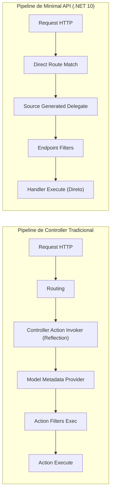

# ⚔️ Minimal APIs vs Controllers no .NET 10: Comparativo e Arquitetura

> "Minimal APIs não são apenas um brinquedo para microsserviços pequenos. No .NET 10, elas são a fundação de alta performance e baixo consumo de recursos, projetadas especificamente para ambientes em nuvem e containers."

A escolha entre **Minimal APIs** e **Controllers tradicionais** é um dos temas mais debatidos em arquitetura .NET. Aqui comparamos na prática, com benchmarks reais, estrutura limpa e sem dogmas.

---

## 📊 Comparativo Técnico e Benchmarks Reais



### Resultados de Benchmarks (TechEmpower / ASP.NET Benchmarks):

| Métrica | Controllers Tradicionais | Minimal APIs (.NET 10) | Ganho Real |
| :--- | :--- | :--- | :--- |
| **Requisições por Segundo (RPS)** | ~180.000 RPS | **~340.000 RPS** | **+88% de Throughput** |
| **Tempo de Startup (Cold Start)** | ~450 ms | **~120 ms** | **~4x mais rápido** |
| **Alocação de Memória por Request** | ~2.4 KB | **~0.3 KB** | **8x menos memória alocada** |
| **Suporte a Native AOT** | Limitado (Reflection pesada) | **Totalmente Nativo** | Binário minúsculo (~20 MB) |

---

## 🏗️ Como Estruturar Minimal APIs de Forma Profissional

O maior medo dos desenvolvedores é que Minimal APIs transformem o `Program.cs` em um arquivo de 2.000 linhas ilegível.
A melhor prática no .NET 10 é usar **Extension Methods** e **`MapGroup`** por módulo ou Bounded Context:

```text
EShop.Api/
├── Endpoints/
│   ├── IEndpoint.cs
│   ├── OrderEndpoints.cs
│   └── CatalogEndpoints.cs
├── Filters/
│   └── ValidationFilter.cs
└── Program.cs
```

### 1. A Interface de Registro: `IEndpoint.cs`

```csharp
namespace EShop.Api.Endpoints;

public interface IEndpoint
{
    void MapEndpoint(IEndpointRouteBuilder app);
}
```

### 2. O Módulo de Endpoints com `MapGroup`: `OrderEndpoints.cs`

```csharp
namespace EShop.Api.Endpoints;

using EShop.Application.Orders.CreateOrder;
using EShop.Application.Orders.GetOrder;
using FluentValidation;

public sealed class OrderEndpoints : IEndpoint
{
    public void MapEndpoint(IEndpointRouteBuilder app)
    {
        var group = app.MapGroup("/api/v1/orders")
            .WithTags("Orders")
            .RequireAuthorization(); // Aplica segurança em todo o grupo

        group.MapPost("/", CreateOrderAsync)
            .WithName("CreateOrder")
            .AddEndpointFilter<ValidationFilter<CreateOrderCommand>>() // Filtro de validação
            .Produces<CreateOrderResponse>(StatusCodes.Status201Created)
            .ProducesProblem(StatusCodes.Status400BadRequest);

        group.MapGet("/{id:guid}", GetOrderByIdAsync)
            .WithName("GetOrderById")
            .Produces<OrderResponse>(StatusCodes.Status200OK)
            .ProducesProblem(StatusCodes.Status404NotFound);
    }

    private static async Task<IResult> CreateOrderAsync(
        CreateOrderCommand command, 
        CreateOrderHandler handler, 
        CancellationToken ct)
    {
        var result = await handler.HandleAsync(command, ct);
        return Results.CreatedAtRoute("GetOrderById", new { id = result.OrderId }, result);
    }

    private static async Task<IResult> GetOrderByIdAsync(
        Guid id, 
        GetOrderQueryHandler handler, 
        CancellationToken ct)
    {
        var order = await handler.HandleAsync(id, ct);
        return order is not null ? Results.Ok(order) : Results.NotFound();
    }
}
```

### 3. Filtro Genérico de Validação com FluentValidation:

```csharp
namespace EShop.Api.Filters;

using FluentValidation;

public sealed class ValidationFilter<T>(IValidator<T>? validator = null) : IEndpointFilter
{
    public async ValueTask<object?> InvokeAsync(EndpointFilterInvocationContext context, EndpointFilterDelegate next)
    {
        if (validator is null) return await next(context);

        var argument = context.Arguments.OfType<T>().FirstOrDefault();
        if (argument is null) return Results.BadRequest("Corpo da requisição inválido.");

        var validationResult = await validator.ValidateAsync(argument, context.HttpContext.RequestAborted);
        if (!validationResult.IsValid)
        {
            return Results.ValidationProblem(validationResult.ToDictionary());
        }

        return await next(context);
    }
}
```

### 4. O `Program.cs` Super Limpo (.NET 10):

```csharp
var builder = WebApplication.CreateBuilder(args);

// Registra validadores do FluentValidation
builder.Services.AddValidatorsFromAssemblyContaining<CreateOrderCommandValidator>();

var app = builder.Build();

// Mapeia automaticamente todos os endpoints que implementam IEndpoint
var endpointTypes = typeof(Program).Assembly.GetTypes()
    .Where(t => typeof(IEndpoint).IsAssignableFrom(t) && !t.IsInterface && !t.IsAbstract);

foreach (var type in endpointTypes)
{
    var endpoint = (IEndpoint)Activator.CreateInstance(type)!;
    endpoint.MapEndpoint(app);
}

app.Run();
```

---

## ⚖️ Quando Usar Cada Abordagem?

| Cenário | Abordagem Recomendada |
| :--- | :--- |
| **Novos Microsserviços em .NET 10** | **Minimal APIs** (Máxima performance, baixo consumo de memória, deploy com Native AOT). |
| **APIs de Altíssimo Throughput / Latência Crítica** | **Minimal APIs**. |
| **Aplicações Legadas com centenas de ActionFilters customizados** | **Controllers** (Para evitar reescrever filtros legados complexos). |
| **Projetos MVC com Views Razor tradicionais** | **Controllers**. |

---

## 🎙️ Perguntas de Entrevista Sênior

### 1. "Por que as Minimal APIs alcançam quase o dobro de throughput em comparação com Controllers?"
**Resposta Esperada**: *Porque elas eliminam grande parte do pipeline do MVC. Nos Controllers, o framework precisa inspecionar metadados de controller/actions via Reflection, instanciar a classe do controller a cada requisição, criar instâncias de `ActionDescriptor` e executar uma cadeia pesada de Action Filters. As Minimal APIs usam rotas mapeadas diretamente para delegates gerados pelo compilador, com resolução direta de parâmetros, menor overhead de alocação de objetos na heap e zero reflexão em tempo de execução.*

### 2. "Como você organiza um projeto de grande porte usando Minimal APIs sem poluir o `Program.cs`?"
**Resposta Esperada**: *Utilizando uma convenção baseada em grupos de rotas (`MapGroup`) segregados por arquivos de funcionalidade (Feature Folders), como `OrderEndpoints`, `CatalogEndpoints`. Cada módulo implementa uma interface contratual como `IEndpoint`, e uma extensão de inicialização registra todos os endpoints automaticamente no container via reflexão no startup ou source generator, mantendo o `Program.cs` com menos de 30 linhas.*

---

## 🔗 Conexões do Grafo (Obsidian)
- [Clean Architecture em Camadas](../01-fundamentos-arquitetura/01-clean-architecture.md)
- [Fundamentos de REST e HTTP](01-fundamentos-rest-e-http.md)
- [Padronização de Erros com ProblemDetails](03-padronizacao-erros-problemdetails.md)
- [Performance e Profiling](../15-performance/01-profiling-e-otimizacoes-dotnet.md)
