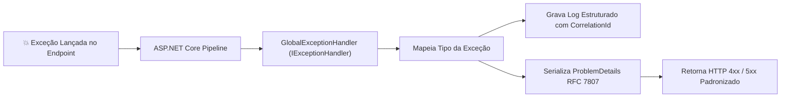

# 🚨 Padronização de Erros com ProblemDetails (RFC 7807) e IExceptionHandler

> "Uma API profissional nunca retorna texto puro, HTML de erro ou um JSON arbitrário inventado em um dia ruim. Ela adota padrões universais da indústria para que qualquer cliente no mundo saiba exatamente como consumir e tratar suas falhas."

Em ecossistemas de microsserviços, múltiplos times consomem suas APIs. A **RFC 7807** (e sua atualização **RFC 9457**) define o padrão internacional **`ProblemDetails`** para representar erros em APIs HTTP.

---

## 🧭 Anatomia do `ProblemDetails` (RFC 7807)

```json
{
  "type": "https://eshop.com/errors/insufficient-stock",
  "title": "Estoque Insuficiente",
  "status": 409,
  "detail": "O produto 'Clean Code .NET 10' possui apenas 2 unidades em estoque, mas foram solicitadas 5.",
  "instance": "/api/v1/orders",
  "traceId": "00-4bf92f3577b34da6a3ce929d0e0e4736-00f067aa0ba902b7-01",
  "invalidParams": [
    { "name": "quantity", "reason": "Quantidade requisitada excede o estoque disponível." }
  ]
}
```

### Campos Padrão da Especificação:
- **`type`**: Uma URI absoluta ou relativa que identifica a categoria do erro.
- **`title`**: Um resumo curto e legível para humanos sobre o problema (não muda de ocorrência para ocorrência).
- **`status`**: O código HTTP retornado pelo servidor (ex: 400, 404, 409, 422).
- **`detail`**: Uma explicação detalhada e específica para esta ocorrência particular do erro.
- **`instance`**: A URI do endpoint onde o erro ocorreu.
- **`extensions`**: Campos adicionais customizados (como `traceId`, `timestamp`, lista de validações).

---

## 🛡️ O Tratador Global Moderno no .NET 10: `IExceptionHandler`

Esqueça os blocos de `try/catch` manuais espalhados em todos os endpoints ou middlewares de erro caseiros com `InvokeAsync`. O .NET 10 utiliza a interface oficial **`IExceptionHandler`**:



### 1. Implementação do `GlobalExceptionHandler.cs`:

```csharp
namespace EShop.Api.Middlewares;

using System.Diagnostics;
using EShop.Domain.Common.Exceptions;
using FluentValidation;
using Microsoft.AspNetCore.Diagnostics;
using Microsoft.AspNetCore.Mvc;

public sealed class GlobalExceptionHandler(ILogger<GlobalExceptionHandler> logger) : IExceptionHandler
{
    public async ValueTask<bool> TryHandleAsync(
        HttpContext httpContext, 
        Exception exception, 
        CancellationToken cancellationToken)
    {
        var traceId = Activity.Current?.Id ?? httpContext.TraceIdentifier;

        logger.LogError(exception, "Falha durante o processamento da requisição {TraceId}: {Message}", 
            traceId, exception.Message);

        var problemDetails = exception switch
        {
            ValidationException valEx => new ProblemDetails
            {
                Status = StatusCodes.Status422UnprocessableEntity,
                Title = "Falha de Validação",
                Type = "https://eshop.com/errors/validation-failure",
                Detail = "Um ou mais campos contêm valores inválidos.",
                Extensions = 
                { 
                    ["errors"] = valEx.Errors.Select(e => new { e.PropertyName, e.ErrorMessage }) 
                }
            },
            DomainException domEx => new ProblemDetails
            {
                Status = StatusCodes.Status409Conflict,
                Title = "Conflito de Regra de Negócio",
                Type = "https://eshop.com/errors/domain-rule-violation",
                Detail = domEx.Message
            },
            KeyNotFoundException notFoundEx => new ProblemDetails
            {
                Status = StatusCodes.Status404NotFound,
                Title = "Recurso Não Encontrado",
                Type = "https://eshop.com/errors/not-found",
                Detail = notFoundEx.Message
            },
            _ => new ProblemDetails
            {
                Status = StatusCodes.Status500InternalServerError,
                Title = "Erro Interno do Servidor",
                Type = "https://eshop.com/errors/internal-server-error",
                Detail = "Ocorreu um erro interno inesperado. Por favor, contate o suporte."
            }
        };

        // Adiciona metadados de rastreabilidade
        problemDetails.Instance = httpContext.Request.Path;
        problemDetails.Extensions["traceId"] = traceId;
        problemDetails.Extensions["timestamp"] = DateTime.UtcNow;

        httpContext.Response.StatusCode = problemDetails.Status.Value;
        httpContext.Response.ContentType = "application/problem+json";

        await httpContext.Response.WriteAsJsonAsync(problemDetails, cancellationToken);

        return true; // Indica que a exceção foi completamente tratada
    }
}
```

### 2. Configuração no `Program.cs`:

```csharp
var builder = WebApplication.CreateBuilder(args);

// Habilita suporte nativo a ProblemDetails e registra o manipulador global
builder.Services.AddProblemDetails();
builder.Services.AddExceptionHandler<GlobalExceptionHandler>();

var app = builder.Build();

// Ativa o middleware no topo do pipeline!
app.UseExceptionHandler();

app.Run();
```

---

## 🔒 Segurança: Jamais Vaze Detalhes Internos em Produção

> [!CAUTION]
> **Vazamento de Dados Sensíveis (CWE-209):**
> Nunca retorne `exception.ToString()` ou o Stack Trace completo em ambiente de produção! Isso entrega a invasores versões de pacotes NuGet, estrutura interna de tabelas SQL e diretórios do servidor. Se o erro for um `500 Internal Server Error`, forneça apenas o `traceId` para que o usuário informe ao suporte e investigue nos logs internos.

---

## 🎙️ Perguntas de Entrevista Sênior

### 1. "Por que adotar `IExceptionHandler` em vez de um middleware customizado com `try/catch` tradicional?"
**Resposta Esperada**: *O `IExceptionHandler` (introduzido no .NET 8 e consolidado no .NET 10) é a abstração nativa do ASP.NET Core projetada para compor uma cadeia de manipuladores de erro com tipagem forte e injeção de dependência limpa. Diferente de middlewares legados, ele se integra perfeitamente ao ecossistema nativo de `AddProblemDetails()`, suporta injeção de métricas de telemetria automáticas e opera com alocação otimizada de memória via `ValueTask`.*

### 2. "Qual o header HTTP `Content-Type` correto para respostas de erro baseadas em ProblemDetails?"
**Resposta Esperada**: *O `application/problem+json` (ou `application/problem+xml`), conforme estabelecido formalmente pela RFC 7807, e não o genérico `application/json`.*

---

## 🔗 Conexões do Grafo (Obsidian)
- [Fundamentos de REST e HTTP](01-fundamentos-rest-e-http.md)
- [Minimal APIs vs Controllers](02-minimal-apis-vs-controllers.md)
- [Structured Logging e Correlation ID](../08-observabilidade/01-structured-logging-e-correlation-id.md)
- [OpenTelemetry e Tracing](../08-observabilidade/02-opentelemetry-tracing-e-metricas.md)
