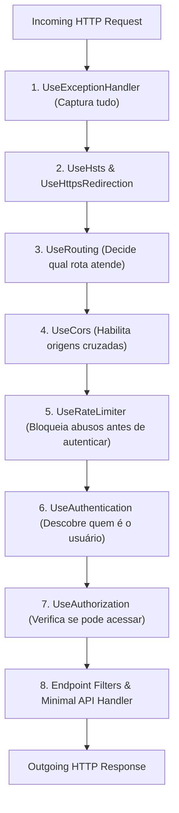

# 🚀 Pipeline HTTP: Middlewares, Filtros, Rate Limiting e OpenAPI

> "A ordem dos middlewares no pipeline do ASP.NET Core não é uma sugestão; é uma lei matemática estrita. Colocar a autorização antes da autenticação ou o rate limiting no lugar errado pode deixar sua API completamente vulnerável."

O **pipeline HTTP** do .NET 10 é uma cadeia bidirecional de execução baseada no padrão *Russian Doll* (Boneca Russa). Cada componente inspeciona e pode modificar a requisição na ida e a resposta na volta.

---

## 🧭 A Ordem Canônica do Pipeline HTTP



---

## ⚖️ Middlewares vs Endpoint Filters: Onde Colocar Cada Coisa?

| Aspecto | Middleware (`app.Use(...)`) | Endpoint Filter (`AddEndpointFilter`) |
| :--- | :--- | :--- |
| **Escopo** | Global para toda a aplicação. | Local para um endpoint específico ou grupo de rotas (`MapGroup`). |
| **Acesso a Parâmetros** | Trabalha no nível baixo (`HttpContext`, Stream de bytes). | Acesso direto aos **argumentos do método tipados** (DTOs, CancellationToken). |
| **Acesso ao Resultado** | Manipula headers e streams de saída brutos. | Pode interceptar, inspecionar e alterar o `IResult` retornado. |
| **Casos de Uso** | Logging de tráfego, Rate Limiting, CORS, CorrelationId. | Validação com FluentValidation, auditoria de casos de uso específicos. |

---

## 🛑 Rate Limiting Nativo no .NET 10

Proteger sua API contra ataques de força bruta, scraping e Denial of Service (DoS) é nativo no .NET 10 via `Microsoft.AspNetCore.RateLimiting`.

### Os 4 Algoritmos Suportados:

1. **Fixed Window (Janela Fixa)**: Permite até X requisições a cada intervalo fixo (ex: 100 req por minuto).
2. **Sliding Window (Janela Deslizante)**: Divide a janela em segmentos móveis, evitando picos no momento de reset da janela fixa.
3. **Token Bucket (Balde de Fichas)**: Adiciona fichas continuamente a uma taxa fixa; requisições consomem fichas. Suporta rajadas (bursts) controladas.
4. **Concurrency Limiter**: Limita o número de requisições sendo processadas **concorrentemente** (ex: máximo de 10 requisições simultâneas em um endpoint pesado).

### Configuração no `Program.cs`:

```csharp
using System.Threading.RateLimiting;
using Microsoft.AspNetCore.RateLimiting;

var builder = WebApplication.CreateBuilder(args);

builder.Services.AddRateLimiter(options =>
{
    options.RejectionStatusCode = StatusCodes.Status429TooManyRequests;

    // Política com Sliding Window por IP do cliente
    options.AddPolicy("ip-sliding", httpContext =>
    {
        var clientIp = httpContext.Connection.RemoteIpAddress?.ToString() ?? "unknown";

        return RateLimitPartition.GetSlidingWindowLimiter(
            clientIp,
            _ => new SlidingWindowRateLimiterOptions
            {
                PermitLimit = 60, // 60 requisições
                Window = TimeSpan.FromMinutes(1),
                SegmentsPerWindow = 6,
                QueueLimit = 2 // Fila de espera antes de rejeitar com 429
            });
    });
});

var app = builder.Build();

app.UseRateLimiter();

// Aplica a política ao endpoint
app.MapGet("/api/v1/catalog", () => Results.Ok())
   .RequireRateLimiting("ip-sliding");
```

---

## 📖 Documentação Moderna com OpenAPI e Scalar / Swagger

No .NET 10, a geração de especificações OpenAPI é nativa (`Microsoft.AspNetCore.OpenApi`). Para visualização moderna, a biblioteca **Scalar** vem substituindo o clássico Swagger UI por uma interface extremamente elegante e rápida:

```csharp
builder.Services.AddOpenApi();

var app = builder.Build();

if (app.Environment.IsDevelopment())
{
    app.MapOpenApi(); // Expõe a especificação /openapi/v1.json
    
    // UI moderna interativa com Scalar
    app.MapScalarApiReference(options =>
    {
        options.WithTitle("EShop Microservices API")
               .WithTheme(ScalarTheme.Moon);
    });
}
```

---

## 🎙️ Perguntas de Entrevista Sênior

### 1. "O que acontece se você inverter a ordem de `UseAuthentication()` e `UseAuthorization()`?"
**Resposta Esperada**: *A segurança da aplicação falhará de forma catastrófica ou negará todos os acessos. Se o `UseAuthorization` rodar antes do `UseAuthentication`, a verificação de permissões ocorrerá antes que o token JWT seja lido e decodificado. Consequentemente, o `User.Identity.IsAuthenticated` será sempre falso, bloqueando usuários válidos com erro `401 Unauthorized` ou bypassando proteções se a configuração for falha.*

### 2. "Por que devemos posicionar o middleware de Rate Limiting ANTES de operações pesadas e do banco de dados?"
**Resposta Esperada**: *Para proteger os recursos internos de infraestrutura. Se o Rate Limiting for posicionado no início do pipeline, requisições abusivas ou ataques de DoS são rejeitadas imediatamente no nível HTTP com status `429 Too Many Requests`, sem consumir CPU com validações de token criptográfico, sem abrir conexões com o SQL Server e sem alocar memória para o pipeline da aplicação.*

---

## 🔗 Conexões do Grafo (Obsidian)
- [Minimal APIs vs Controllers](02-minimal-apis-vs-controllers.md)
- [Padronização de Erros com ProblemDetails](03-padronizacao-erros-problemdetails.md)
- [Autenticação JWT e Segurança](../07-seguranca/01-autenticacao-jwt-e-identity.md)
- [API Gateway com YARP e BFF](../14-gateway-bff/01-api-gateway-yarp-e-bff.md)
