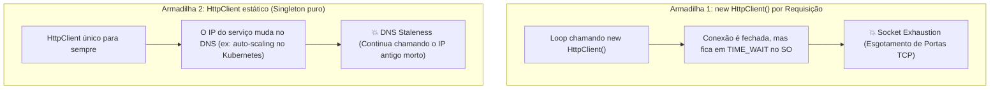
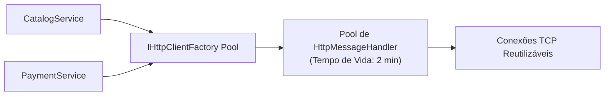

# 📞 Comunicação Síncrona via HTTP e IHttpClientFactory no .NET 10

> "Usar `new HttpClient()` diretamente dentro de um método parece inocente, mas sob carga real ele esgota as portas TCP do sistema operacional em poucos segundos, derrubando todo o seu servidor."

Em microsserviços, quando um serviço precisa de uma resposta imediata de outro serviço em tempo real (ex: consulta de catálogo ou validação de estoque antes do checkout), a comunicação síncrona via **HTTP/REST** é frequentemente utilizada.

---

## 🛑 As Duas Armadilhas do `HttpClient` Tradicional



1. **Socket Exhaustion**: Ao descartar o `HttpClient` com `using`, o socket TCP subjacente não é liberado imediatamente; ele permanece no estado `TIME_WAIT` por até 4 minutos. Sob 1.000 requisições simultâneas, o sistema operacional esgota a faixa de portas efêmeras (erro `SocketException: Only one usage of each socket address`).
2. **DNS Stale Problem**: Se você criar um `HttpClient` estático único para resolver o socket exhaustion, o cliente segura a conexão TCP aberta indefinidamente. Se o endereço IP do microsserviço de destino for alterado (por exemplo, após um novo deploy ou escalonamento no Kubernetes), o seu cliente continuará tentando enviar tráfego para o IP antigo que não existe mais.

---

## 🚀 A Solução Oficial: `IHttpClientFactory`

O **`IHttpClientFactory`** resolve ambos os problemas gerenciando um pool interno de instâncias de `HttpMessageHandler`:
- Reutiliza os sockets TCP para evitar exaustão de portas.
- Recicla os handlers a cada 2 minutos (por padrão) para respeitar alterações de **DNS**.



---

## 💻 Implementação: Typed Clients no .NET 10

A melhor forma de consumir APIs externas ou outros microsserviços é através de **Typed Clients (Clientes Tipados)**:

### 1. Definição do Cliente Tipado:

```csharp
namespace EShop.Application.Contracts.Clients;

public sealed class PaymentServiceClient(HttpClient httpClient, ILogger<PaymentServiceClient> logger)
{
    public async Task<PaymentAuthorizationResponse> AuthorizePaymentAsync(
        PaymentRequest request, 
        CancellationToken ct)
    {
        logger.LogInformation("Solicitando autorização de pagamento para o pedido {OrderId}", request.OrderId);

        var response = await httpClient.PostAsJsonAsync("/api/v1/payments/authorize", request, ct);

        response.EnsureSuccessStatusCode();

        var authResult = await response.Content.ReadFromJsonAsync<PaymentAuthorizationResponse>(cancellationToken: ct);
        return authResult!;
    }
}
```

### 2. Registro no `Program.cs` com Configuração de DNS e HTTP/2:

```csharp
var builder = WebApplication.CreateBuilder(args);

// Registro do Typed Client com tempo de vida do handler seguro para DNS
builder.Services.AddHttpClient<PaymentServiceClient>(client =>
{
    client.BaseAddress = new Uri(builder.Configuration["Services:PaymentUrl"]!);
    client.Timeout = TimeSpan.FromSeconds(5); // Timeout rigoroso
    client.DefaultRequestHeaders.Add("Accept", "application/json");
})
.ConfigurePrimaryHttpMessageHandler(() => new SocketsHttpHandler
{
    PooledConnectionLifetime = TimeSpan.FromMinutes(2), // 🚀 Atualiza DNS a cada 2 minutos!
    EnableMultipleHttp2Connections = true
});
```

---

## ⚠️ O Efeito Cascata da Comunicação Síncrona

A comunicação síncrona cria um acoplamento temporal: se o serviço **A** chama **B**, que chama **C**, que chama **D**, a latência total da requisição é a soma de todos os tempos de rede, e a disponibilidade geral é multiplicativa:

$$\text{Disponibilidade} = A \times B \times C \times D$$
Se cada serviço tiver 99% de disponibilidade, o sistema como um todo terá apenas:
$$0.99 \times 0.99 \times 0.99 \times 0.99 \approx 96.05\%$$

> Por isso, a comunicação síncrona deve ser sempre blindada com **Pipelines de Resiliência (Timeout, Circuit Breaker)** (veja o [Capítulo 6](../06-resiliencia/01-padroes-resiliencia-retry-circuit-breaker.md)) ou substituída por **Comunicação Assíncrona baseada em Eventos**.

---

## 🎙️ Perguntas de Entrevista Sênior

### 1. "Por que `using var client = new HttpClient()` é considerado uma má prática no C#?"
**Resposta Esperada**: *Porque o `HttpClient` implementa `IDisposable`, mas o socket TCP subjacente (`HttpMessageHandler`) não é fechado de imediato quando o objeto é descartado. O sistema operacional mantém o socket no estado `TIME_WAIT` por alguns minutos para garantir que pacotes atrasados na rede cheguem com segurança. Sob tráfego elevado, isso causa exaustão de portas TCP (`Socket Exhaustion`), impedindo a aplicação de abrir novas conexões de rede.*

### 2. "Como o `IHttpClientFactory` equilibra a reutilização de sockets TCP com a atualização periódica do DNS?"
**Resposta Esperada**: *O `IHttpClientFactory` gerencia o ciclo de vida dos `HttpMessageHandler` em um pool interno. Ele mantém conexões ativas e reutilizáveis para evitar a exaustão de sockets, mas define um tempo limite de rotação para cada handler (por padrão, 2 minutos via `PooledConnectionLifetime`). Quando o tempo expira, o handler é aposentado e um novo é criado, forçando uma nova consulta aos servidores de DNS e permitindo acompanhar mudanças de IPs em ambientes de containers como Kubernetes.*

---

## 🔗 Conexões do Grafo (Obsidian)
- [Fundamentos de REST e HTTP](../04-apis-e-http/01-fundamentos-rest-e-http.md)
- [Comunicação Assíncrona e Eventos](02-comunicacao-assincrona-eventos.md)
- [Padrões de Resiliência: Timeout e Circuit Breaker](../06-resiliencia/01-padroes-resiliencia-retry-circuit-breaker.md)
- [Polly v8 Pipelines](../06-resiliencia/02-polly-v8-pipelines-na-pratica.md)
