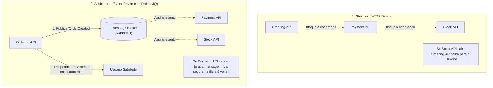

# 📨 Comunicação Assíncrona e Eventos de Integração no .NET 10

> "Em sistemas distribuídos, se o serviço A precisa esperar o serviço B responder para poder terminar sua tarefa, você não construiu microsserviços; você construiu um monólito quebrado com cabos de rede."

A **comunicação assíncrona orientada a eventos** é o alicerce para alcançar desacoplamento temporal, escalabilidade elástica e alta resiliência operacional.

---

## 🧭 Comunicação Síncrona vs Assíncrona



---

## 📜 Contratos de Mensagens e Versionamento

Em mensageria, o contrato é a API pública. Ele deve ser imutável e independente de implementação interna.

### 1. Definição do Contrato com C# 14 Records:

```csharp
namespace EShop.Contracts.Events;

// Usar interface ou record com propriedades de inicialização imutáveis
public sealed record OrderPlacedIntegrationEvent(
    Guid OrderId,
    Guid CustomerId,
    decimal TotalAmount,
    DateTime CreatedAtUtc,
    IReadOnlyList<OrderItemDto> Items
);

public sealed record OrderItemDto(
    Guid ProductId,
    string ProductName,
    decimal UnitPrice,
    int Quantity
);
```

### Regras para Evolução de Contratos sem Quebra:
1. **Adição de campos é permitida**: Novos campos devem ser opcionais (`string?` ou com valor padrão).
2. **Campos antigos nunca são removidos**: Se um campo não for mais usado, marque-o como depreciado e mantenha o preenchimento até que todos os consumidores migrem.
3. **Mudanças estruturais exigem novo evento**: Se a semântica mudou radicalmente, publique `OrderPlacedV2IntegrationEvent`.

---

## 💥 O Mito do "Exactly-Once Delivery" (Entrega Exatamente Uma Vez)

> [!CAUTION]
> **A Verdade Matemática sobre Sistemas Distribuídos:**
> Não existe entrega "Exatamente Uma Vez" (Exactly-Once) na camada de transporte de rede. O Teorema dos Dois Generais (Two Generals' Problem) e a Impossibilidade de Fischer-Lynch-Paterson (FLP) provam matematicamente que em uma rede assíncrona sujeita a falhas de pacotes, é impossível garantir que uma mensagem foi entregue sem o risco de repetição.

### O que os Message Brokers realmente entregam?
Eles entregam **At-Least-Once (Pelo Menos Uma Vez)**:
1. O broker entrega a mensagem para o consumidor.
2. O consumidor processa com sucesso.
3. A rede cai antes do ACK (confirmação) chegar de volta ao broker.
4. O broker presume que a mensagem falhou e a **reenvia**.
5. **Resultado**: O consumidor recebe a mesma mensagem duas vezes!

> 💡 **A regra de ouro da engenharia sênior:**
> Nunca tente forçar o broker a entregar "exatamente uma vez". Em vez disso, projete seus **consumidores para serem IDEMPOTENTES**!

---

## 🛠️ Implementação com MassTransit e RabbitMQ no .NET 10

O **MassTransit** é o framework de mensageria padrão da indústria para .NET 10, abstraindo detalhes complexos do RabbitMQ.

### 1. Consumidor com MassTransit:

```csharp
namespace EShop.Payment.Consumers;

using EShop.Contracts.Events;
using MassTransit;

public sealed class OrderPlacedConsumer(
    IPaymentProcessor paymentProcessor, 
    ILogger<OrderPlacedConsumer> logger) 
    : IConsumer<OrderPlacedIntegrationEvent>
{
    public async Task Consume(ConsumeContext<OrderPlacedIntegrationEvent> context)
    {
        var message = context.Message;
        logger.LogInformation("Recebido pedido {OrderId} para cobrança de R$ {Amount}", 
            message.OrderId, message.TotalAmount);

        // Processa o pagamento de forma segura
        await paymentProcessor.ProcessAsync(message.OrderId, message.TotalAmount, context.CancellationToken);
    }
}
```

### 2. Configuração no `Program.cs`:

```csharp
var builder = WebApplication.CreateBuilder(args);

builder.Services.AddMassTransit(x =>
{
    // Registra todos os consumidores do assembly
    x.AddConsumer<OrderPlacedConsumer>();

    x.UsingRabbitMq((context, cfg) =>
    {
        cfg.Host(builder.Configuration.GetConnectionString("RabbitMq"));

        // Configuração automática de filas e retries
        cfg.UseMessageRetry(r => r.Exponential(
            retryLimit: 5,
            minInterval: TimeSpan.FromSeconds(1),
            maxInterval: TimeSpan.FromSeconds(30),
            delta: TimeSpan.FromSeconds(2)));

        cfg.ConfigureEndpoints(context);
    });
});
```

---

## 🎙️ Perguntas de Entrevista Sênior

### 1. "Por que 'Exactly-Once Delivery' é considerado uma ilusão na camada de transporte de mensageria?"
**Resposta Esperada**: *Devido à falibilidade da rede (Problema dos Dois Generais). O remetente só sabe que o destinatário recebeu a mensagem se receber uma confirmação (ACK). Se o ACK se perder na rede após o processamento, o remetente não tem como distinguir se a mensagem falhou ou se apenas o ACK se perdeu. Para evitar perda de dados, a única opção segura do broker é retransmitir a mensagem, caracterizando a garantia 'At-Least-Once'. A garantia de execução única deve ser implementada na camada da aplicação através de idempotência (deduplicação por chave).*

### 2. "Qual a diferença conceitual entre um Evento de Domínio e um Evento de Integração?"
**Resposta Esperada**: *Um Evento de Domínio é interno a um único Bounded Context/processo, trafega em memória (geralmente despachado via MediatR ou Channels) dentro da mesma transação de banco de dados e notifica outras entidades do mesmo agregado. Um Evento de Integração cruza fronteiras de rede via message broker (RabbitMQ/Kafka), possui contratos serializáveis públicos e notifica outros microsserviços sobre fatos de negócio consolidados.*

---

## 🔗 Conexões do Grafo (Obsidian)
- [Domain Services e Domain Events](../02-dominio-ddd-pratico/04-domain-services-e-events.md)
- [Outbox e Inbox Patterns](03-outbox-inbox-patterns.md)
- [Consistência Eventual e Idempotência](04-consistencia-eventual-e-idempotencia.md)
- [RabbitMQ Exchanges e Queues](../13-mensageria-eventos/01-rabbitmq-avancado.md)
- [Teorema CAP e Falhas de Rede](../18-arquitetura-distribuida/01-teorema-cap-e-falhas-rede.md)
