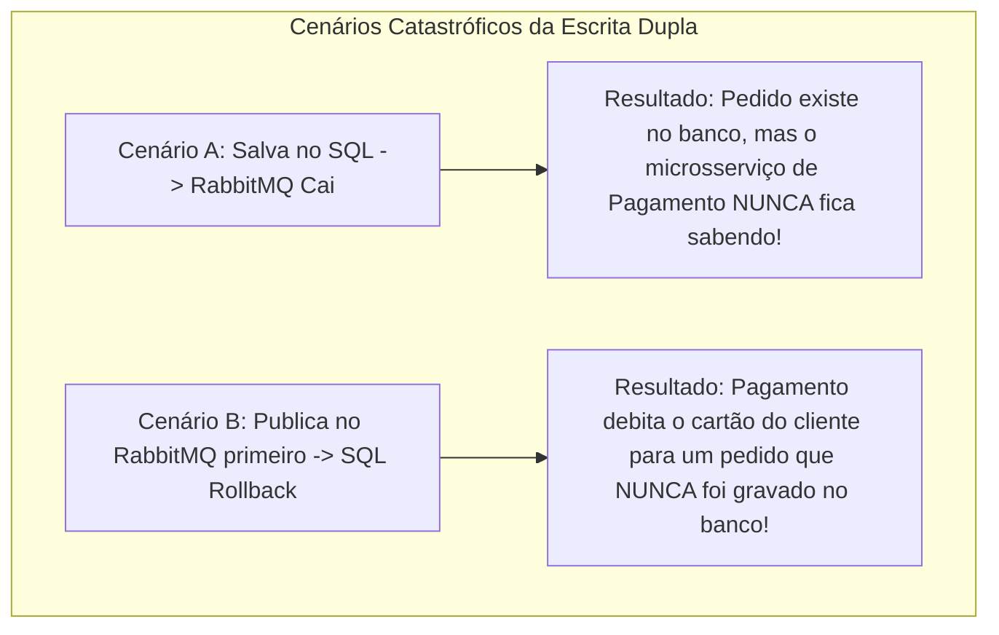
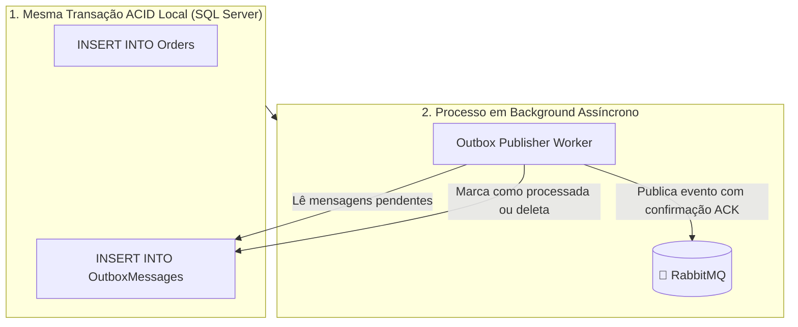

# 📦 O Problema da Escrita Dupla e os Padrões Outbox e Inbox

> "Se o seu código salva no banco de dados e logo em seguida chama `publish()` na fila de mensageria, você acabou de criar uma inconsistência silenciosa em produção que nenhum teste unitário conseguirá pegar."

Em microsserviços, a garantia de que uma alteração no banco de dados e a emissão do seu respectivo evento de integração ocorram de forma atômica é um dos desafios de engenharia mais cruciais.

---

## 💥 O Problema da Escrita Dupla (The Dual-Write Problem)

Imagine este código ingênuo em um endpoint de criação de pedidos:

```csharp
// ❌ CÓDIGO PERIGOSO: Escrita Dupla Ingênua
await dbContext.Orders.AddAsync(order);
await dbContext.SaveChangesAsync(); // 1. Salvou no banco com sucesso!

// 💣 E se a conexão com o RabbitMQ cair ou o processo morrer exatamente AQUI?
await bus.Publish(new OrderCreatedIntegrationEvent(order.Id)); // 2. Falhou!
```



Não podemos usar transações distribuídas (2PC - Two-Phase Commit) porque o RabbitMQ e o SQL Server não compartilham um coordenador de transação moderno sem penalidades brutais de latência.

---

## 📬 A Solução: Transactional Outbox Pattern

O **Transactional Outbox Pattern** garante que o estado da entidade e o evento de integração sejam salvos na **mesma transação ACID local do banco de dados**:



### Como funciona:
1. Ao salvar o `Order`, criamos um registro na tabela `OutboxMessages` contendo o payload serializado do evento.
2. O `SaveChangesAsync` do EF Core persiste **ambos na mesma transação local**. Se um falhar, nada é salvo.
3. Um processo em background (como um `BackgroundService` ou o Transactional Outbox do MassTransit) lê as mensagens da tabela `OutboxMessages`, envia para o RabbitMQ e, somente após receber o ACK do broker, marca a mensagem como processada.

---

## 📥 O Padrão Oposto: Transactional Inbox Pattern

Se o **Outbox** resolve a confiabilidade de envio, o **Inbox** resolve a confiabilidade de consumo:
- Quando o consumidor recebe uma mensagem do broker, ele grava o `MessageId` em uma tabela `InboxMessages` dentro da mesma transação em que atualiza seus dados de negócio.
- Se a mesma mensagem for reenviada pelo broker devido a uma falha de rede temporária (garantia *At-Least-Once*), o consumidor verifica o `MessageId` na tabela Inbox. Se já existir, ele simplesmente confirma com ACK e **descarta o processamento duplicado**.

---

## ⚙️ Implementação Prática com MassTransit e EF Core 10

Configurar o Outbox e Inbox manualmente exige lidar com polling, locks e concorrência. O **MassTransit** oferece uma implementação pronta, testada e otimizada para o EF Core 10:

```csharp
var builder = WebApplication.CreateBuilder(args);

builder.Services.AddDbContext<OrderingDbContext>(options =>
    options.UseSqlServer(builder.Configuration.GetConnectionString("SqlDefault")));

builder.Services.AddMassTransit(x =>
{
    // Registra os consumidores
    x.AddConsumer<PaymentCompletedConsumer>();

    // 🚀 Ativa o Entity Framework Outbox nativo
    x.AddEntityFrameworkOutbox<OrderingDbContext>(o =>
    {
        o.UseSqlServer();
        o.UseBusOutbox(); // Redireciona chamadas de bus.Publish para a tabela Outbox
        o.DuplicateDetectionWindow = TimeSpan.FromMinutes(30);
    });

    x.UsingRabbitMq((context, cfg) =>
    {
        cfg.Host(builder.Configuration.GetConnectionString("RabbitMq"));
        cfg.ConfigureEndpoints(context);
    });
});
```

### No Handler da Aplicação (.NET 10):

```csharp
public sealed class CreateOrderHandler(
    OrderingDbContext context, 
    IPublishEndpoint publishEndpoint)
{
    public async Task HandleAsync(CreateOrderCommand command, CancellationToken ct)
    {
        var order = Order.Create(command.CustomerId);
        
        await context.Orders.AddAsync(order, ct);

        // 🚀 O MassTransit intercepta essa chamada e grava na tabela de Outbox do OrderingDbContext!
        await publishEndpoint.Publish(new OrderPlacedIntegrationEvent(
            order.Id, 
            order.CustomerId, 
            order.TotalAmount, 
            DateTime.UtcNow, 
            []), ct);

        // Commita o Pedido e o Evento na MESMA transação ACID local!
        await context.SaveChangesAsync(ct);
    }
}
```

---

## 🎙️ Perguntas de Entrevista Sênior

### 1. "O que é o Problema da Escrita Dupla (Dual-Write Problem) e por que transações distribuídas (2PC) não são a resposta recomendada?"
**Resposta Esperada**: *Ocorre quando uma aplicação precisa atualizar dois sistemas de armazenamento distintos (ex: banco de dados relacional e message broker) em uma única operação de negócio. Se um deles falhar, o estado fica inconsistente. O Two-Phase Commit (2PC) requer que todos os participantes mantenham locks abertos durante duas fases de preparação e confirmação, o que causa acoplamento temporal brutal, baixa tolerância a falhas parciais e degradação drástica de throughput na nuvem. A solução recomendada pela indústria é o Transactional Outbox Pattern.*

### 2. "Qual a diferença entre o Transactional Outbox Pattern e o Transactional Inbox Pattern?"
**Resposta Esperada**: *O Outbox Pattern atua no lado do **produtor/remetente**, garantindo que o evento só seja publicado na fila se a transação do banco de dados for commitada com sucesso. O Inbox Pattern atua no lado do **consumidor/destinatário**, armazenando os identificadores de mensagens recebidas para garantir a **idempotência de consumo**, evitando que mensagens duplicadas reenviadas pelo broker causem processamentos repetidos.*

---

## 🔗 Conexões do Grafo (Obsidian)
- [Transações e Concorrência no EF Core](../03-dados-persistencia/02-transacoes-e-concorrencia.md)
- [Comunicação Assíncrona e Eventos](02-comunicacao-assincrona-eventos.md)
- [Consistência Eventual e Idempotência](04-consistencia-eventual-e-idempotencia.md)
- [Sagas: Coreografia vs Orquestração](../13-mensageria-eventos/02-sagas-coreografia-vs-orquestracao.md)
