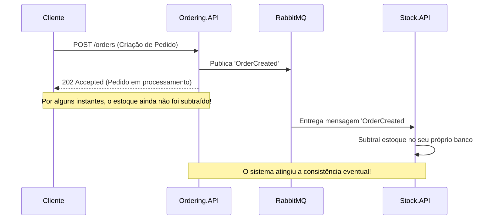
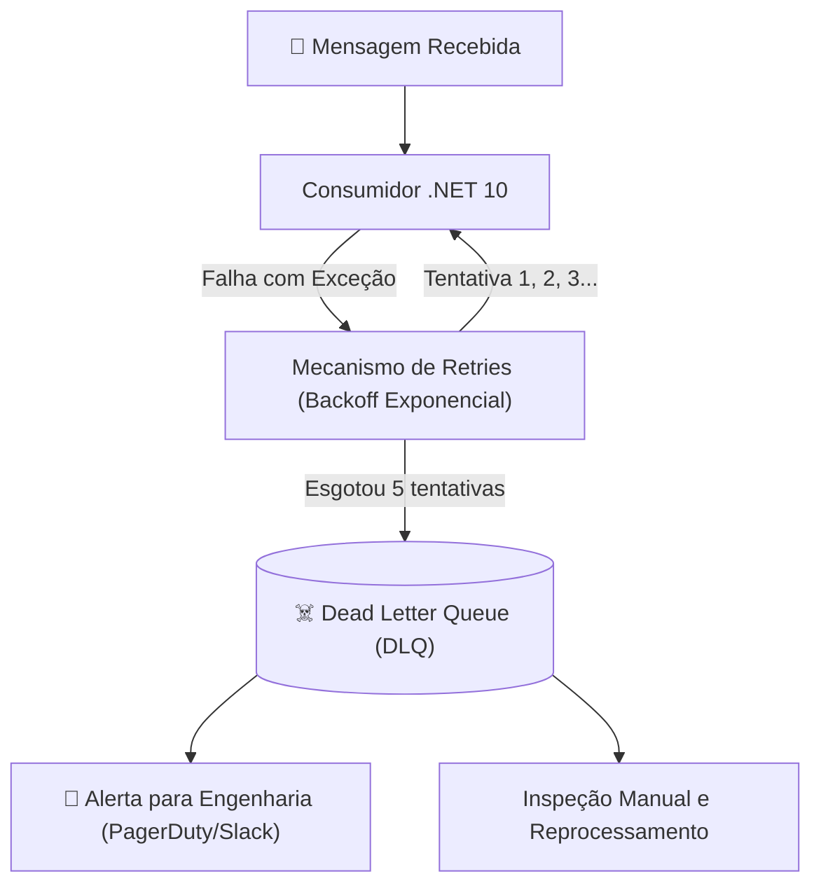

# 🔄 Consistência Eventual, Idempotência e Dead Letter Queues (DLQ)

> "Em microsserviços, a consistência imediata é um luxo que você só tem dentro do seu próprio banco de dados. Fora dele, você vive no reino da consistência eventual."

Ao migrar de um monólito com transações ACID centralizadas para um ecossistema distribuído de microsserviços, a **consistência eventual** torna-se o modelo padrão de operação. Compreender idempotência e o tratamento de mensagens com falha é mandatório para qualquer engenheiro sênior.

---

## 🧭 O que é Consistência Eventual (Eventual Consistency)?

A consistência eventual afirma que, **dado tempo suficiente e ausência de novas alterações**, todos os nós do sistema eventualmente convergirão para o mesmo estado coerente.



---

## 🛡️ Idempotência Prática: Consumindo com Segurança

Como message brokers operam na garantia **At-Least-Once**, seu consumidor **vai receber mensagens duplicadas** em produção.

### Estratégias de Idempotência:

#### 1. Idempotência Natural (Por Design de Estado):
Operações que naturalmente produzem o mesmo resultado independente do número de repetições:
- ❌ **Não Idempotente**: `UPDATE Accounts SET Balance = Balance + 100 WHERE Id = 1;` (Se rodar 2 vezes, debita 200!).
- ✅ **Idempotente**: `UPDATE Orders SET Status = 'Paid' WHERE Id = 1 AND Status = 'Pending';` (Se rodar 10 vezes, o pedido continua apenas como 'Paid').

#### 2. Idempotência Sintética (Tabela de Deduplicação / Idempotency Key):
Para operações com efeitos colaterais cumulativos (como cobrança de cartão), gravamos um identificador único de mensagem:

```csharp
namespace EShop.Payment.Consumers;

public sealed class ProcessPaymentConsumer(
    PaymentDbContext dbContext, 
    IBankGateway bankGateway, 
    ILogger<ProcessPaymentConsumer> logger) 
    : IConsumer<ProcessPaymentCommand>
{
    public async Task Consume(ConsumeContext<ProcessPaymentCommand> context)
    {
        var message = context.Message;

        // 1. Verifica se esta mensagem específica já foi processada anteriormente
        var alreadyProcessed = await dbContext.ProcessedMessages
            .AnyAsync(m => m.MessageId == context.MessageId!.Value, context.CancellationToken);

        if (alreadyProcessed)
        {
            logger.LogWarning("Mensagem duplicada detectada: {MessageId}. Ignorando processamento.", context.MessageId);
            return; // Descarte seguro (ACK imediato)
        }

        // 2. Executa a cobrança externa
        var chargeSuccess = await bankGateway.ChargeAsync(message.CustomerId, message.Amount, context.CancellationToken);

        // 3. Salva a transação e o registro de deduplicação atomicamente
        dbContext.Payments.Add(new PaymentRecord(message.OrderId, message.Amount, chargeSuccess));
        dbContext.ProcessedMessages.Add(new ProcessedMessage(context.MessageId!.Value, DateTime.UtcNow));

        await dbContext.SaveChangesAsync(context.CancellationToken);
    }
}
```

---

## ⏳ Lidando com Mensagens Fora de Ordem (Message Ordering)

Em sistemas distribuídos com múltiplas instâncias de consumidores consumindo de uma fila, **não há garantia de que mensagens chegarão na ordem exata de envio**.

Imagine o seguinte caso real:
1. O usuário cria o pedido (`OrderCreated`).
2. Imediatamente depois, cancela o pedido (`OrderCancelled`).
3. Por latência de rede, `OrderCancelled` chega e é processado **antes** de `OrderCreated`.

### Como mitigar:
1. **Guardas de Máquina de Estado**: Um pedido no estado `Cancelled` nunca pode transicionar de volta para `Created`. Se um evento antigo chegar, o agregado rejeita a mudança.
2. **Versionamento de Entidade / Sequence Numbers**: Cada evento carrega a versão da entidade (`Version: 1`, `Version: 2`). Se o consumidor receber a `Version: 2` antes da `1`, ele pode colocar a mensagem em espera ou rejeitá-la.

---

## ☠️ Poison Messages e Dead Letter Queues (DLQ)

Uma **Poison Message (Mensagem Venenosa)** é uma mensagem que não pode ser processada com sucesso por conter dados corrompidos (ex: JSON inválido, divisão por zero, referência nula).



Se você não tiver uma **Dead Letter Queue (DLQ)**, a mensagem falhará eternamente em loop infinito, consumindo 100% de CPU da aplicação e impedindo o processamento das próximas mensagens da fila!

---

## 🎙️ Perguntas de Entrevista Sênior

### 1. "O que é uma Poison Message e qual o papel de uma Dead Letter Queue (DLQ) em arquiteturas de mensageria?"
**Resposta Esperada**: *Uma Poison Message é uma mensagem defeituosa que causa falhas repetidas e não recuperáveis no consumidor (como erros de validação estrutural ou bugs de código). A DLQ é uma fila de destino especial para onde o broker move a mensagem após um número pré-determinado de tentativas de retry com backoff. Isso impede que a mensagem trave o fluxo dos outros itens saudáveis da fila e permite que o time de engenharia inspecione o payload com calma, corrija o problema e execute um redelivery controlado.*

### 2. "Como garantir idempotência em um endpoint de API que realiza débitos financeiros?"
**Resposta Esperada**: *Exigindo que o cliente envie um header `Idempotency-Key` (geralmente um UUID v4) na requisição HTTP. Ao receber a chamada, a API verifica no Redis ou banco se aquela chave já foi processada. Se foi processada, retorna imediatamente o mesmo resultado armazenado da primeira execução sem reprocessar a cobrança. Se estiver em processamento concorrente, bloqueia via lock distribuído ou retorna HTTP 409 Conflict. Se for nova, processa a transação e grava o resultado atrelado à chave.*

---

## 🔗 Conexões do Grafo (Obsidian)
- [Comunicação Assíncrona e Eventos](02-comunicacao-assincrona-eventos.md)
- [Outbox e Inbox Patterns](03-outbox-inbox-patterns.md)
- [Padrões de Resiliência: Timeout e Retry](../06-resiliencia/01-padroes-resiliencia-retry-circuit-breaker.md)
- [Sagas e Coreografia](../13-mensageria-eventos/02-sagas-coreografia-vs-orquestracao.md)
- [Teorema CAP e Sistemas Distribuídos](../18-arquitetura-distribuida/01-teorema-cap-e-falhas-rede.md)
