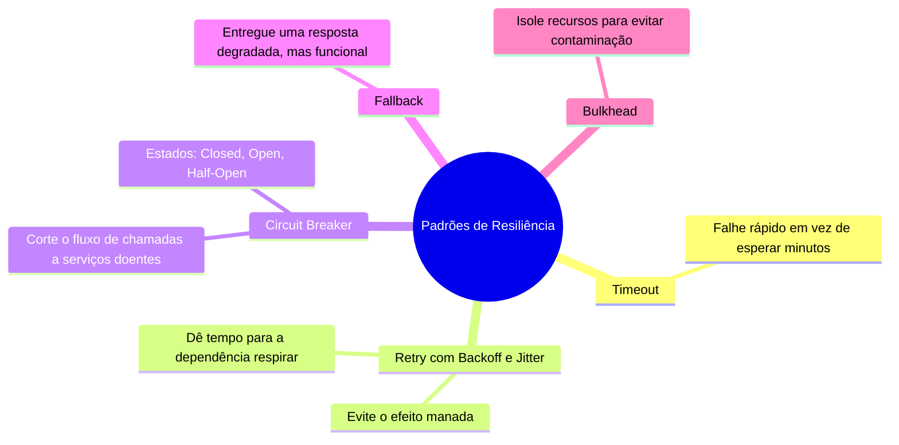
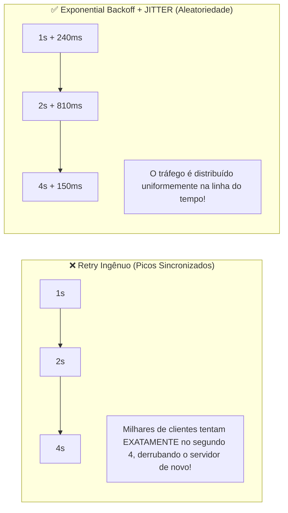
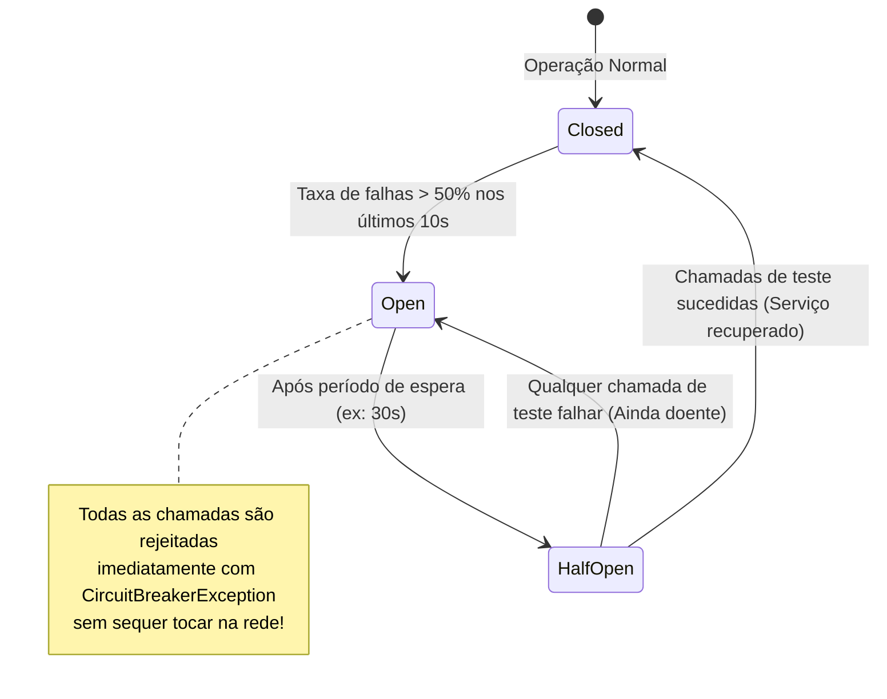

# 🛡️ Padrões Fundamentais de Resiliência em Sistemas Distribuídos

> "Em arquiteturas de microsserviços, falhas não são uma exceção improvável; falhas são uma certeza estatística cotidiana. Seu trabalho como arquiteto não é evitar falhas, mas construir sistemas que sobrevivam a elas de forma graciosa."

Quando uma dependência externa falha (um gateway de pagamento fora do ar, um banco de dados temporariamente sobrecarregado), a aplicação ingênua propaga a falha em cascata, derrubando todos os serviços vizinhos.

---

## 🧭 O Efeito Dominó: Falhas em Cascata (Cascading Failure)

Se o `Payment.API` fica lento e demora 30 segundos para responder:
1. As threads do `Ordering.API` ficam todas presas esperando.
2. O pool de threads do .NET esgota-se.
3. O `Ordering.API` para de responder até mesmo para operações simples (como consultar pedidos).
4. O API Gateway começa a retornar HTTP 504 Gateway Timeout para os usuários.
5. **Resultado**: O sistema inteiro caiu por causa de uma única dependência instável!

---

## 🧱 Os Padrões Fundamentais de Blindagem

---

### 1. Timeout (Tempo Limite Rígido)
Nunca faça chamadas de rede sem um timeout estrito (ex: 2 a 3 segundos para APIs internas). **Falhar rápido libera recursos vitais** para que outras requisições possam ser atendidas.

---

### 2. Retry com Exponential Backoff e Jitter

Fazer retry imediato (`Tentar de novo a cada 100ms`) sobrecarrega ainda mais um serviço que já está lutando para se recuperar de uma sobrecarga de tráfego.

**Jitter (Ruído Aleatório)** adiciona uma variação randômica ao tempo de espera entre cada tentativa, desincronizando os clientes e eliminando o efeito manada (*Thundering Herd*).

---

### 3. Circuit Breaker (Disjuntor de Circuito)

Assim como o disjuntor da sua casa desarma para evitar que a fiação elétrica pegue fogo em caso de curto-circuito, o **Circuit Breaker** interrompe chamadas a um serviço doente para protegê-lo e evitar que o cliente desperdice tempo com timeouts repetidos.

1. **Closed (Fechado - Saudável)**: Requisições passam normalmente. Se a taxa de erro ultrapassar um limite (ex: 50% de falhas), o disjuntor **Abre (Open)**.
2. **Open (Aberto - Isolado)**: Todas as chamadas falham instantaneamente na própria aplicação local sem fazer requisições de rede. Dá tempo para o microsserviço afetado se restabelecer.
3. **Half-Open (Semiaberto - Teste)**: Após um tempo (ex: 30 segundos), o circuito deixa passar uma quantidade limitada de requisições de teste. Se tiverem sucesso, fecha o circuito; se falharem, volta para Open.

---

### 4. Fallback (Degradação Graciosa)

Em vez de exibir uma tela vermelha de erro genérico para o usuário quando o serviço falha:
- Se o serviço de recomendações personalizadas cair, exiba os "Produtos Mais Vendidos" do cache local.
- Se a cotação de frete em tempo real dos Correios cair, cobre um valor de frete estimado fixo e recalcule na emissão da nota fiscal.

---

### 5. Bulkhead (Compartimentalização Estanque)

Inspirado nos compartimentos estanques de navios (que evitam que todo o barco afunde se um compartimento for inundado):
- Isole pools de threads ou conexões para serviços críticos.
- Uma pane no serviço de envio de notificações de marketing nunca deve roubar as conexões de banco de dados do checkout de vendas.

---

## 🎙️ Perguntas de Entrevista Sênior

### 1. "O que é Jitter e por que Exponential Backoff isolado pode ser insuficiente para proteger um microsserviço sobrecarregado?"
**Resposta Esperada**: *O Exponential Backoff dobra o tempo de espera a cada tentativa (ex: 1s, 2s, 4s). No entanto, se uma falha de rede afetou 10.000 clientes simultaneamente, todos eles calcularão os mesmos intervalos e dispararão seus retries exatamente no mesmo milissegundo, criando ondas periódicas de choque de tráfego que voltam a derrubar o servidor. O Jitter injeta uma aleatoriedade matemática (ex: tempo base ± valor randômico), espalhando as tentativas no tempo e suavizando a carga no servidor.*

### 2. "Quais códigos de status HTTP DEVEM e quais NÃO DEVEM disparar a política de Retry?"
**Resposta Esperada**: *Apenas **falhas transientes** devem sofrer Retry: erros de rede/timeout (`HttpRequestException`), status HTTP `503 Service Unavailable`, `504 Gateway Timeout` e `429 Too Many Requests` (respeitando o header `Retry-After`). Erros definitivos como `400 Bad Request`, `401 Unauthorized`, `403 Forbidden` ou `404 Not Found` **NUNCA** devem sofrer Retry, pois a repetição de um payload inválido produzirá exatamente o mesmo erro, gerando apenas desperdício de CPU e banda.*

---

## 🔗 Conexões do Grafo (Obsidian)
- [Comunicação Síncrona via HTTP](../05-comunicacao-microsservicos/01-comunicacao-sincrona-http.md)
- [Polly v8 Pipelines na Prática](02-polly-v8-pipelines-na-pratica.md)
- [Distributed Tracing e Observabilidade](../08-observabilidade/02-opentelemetry-tracing-e-metricas.md)
- [API Gateway com YARP](../14-gateway-bff/01-api-gateway-yarp-e-bff.md)
