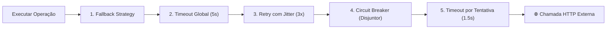

# 🛡️ Polly v8: Resilience Pipelines e Testes de Caos na Prática (.NET 10)

> "Polly v8 não é apenas uma atualização da biblioteca que você usava no .NET Core; é uma reengenharia completa com foco em alocação zero, composição pura de pipelines e integração nativa com o ecossistema de telemetria do .NET 10."

Nesta aula prática, configuramos um **`ResiliencePipeline` completo** e simulamos ao vivo o cenário de caos: **Ordering $\to$ Payment $\to$ 💥 Indisponível**, observando o sistema reagir sem derrubar o cliente.

---

## 🚀 Polly v8 vs Polly v7 Legado

A arquitetura antiga do Polly (v7) sofria de sérios problemas:
- Alocações excessivas de memória a cada execução de política.
- Dificuldade em combinar múltiplos padrões (`PolicyWrap` era confuso e propenso a erros de ordem).
- Telemetria e métricas dispersas.

No **Polly v8 (.NET 10)**, a API foi reconstruída em torno do **`ResiliencePipelineBuilder`**:



---

## 💻 Construindo o Pipeline de Resiliência no .NET 10

### 1. Instalação de Pacotes:
```bash
dotnet add package Microsoft.Extensions.Resilience
dotnet add package Microsoft.Extensions.Http.Resilience
```

### 2. Configuração no `Program.cs`:

```csharp
using Polly;
using Polly.CircuitBreaker;
using Polly.Retry;
using Polly.Timeout;

var builder = WebApplication.CreateBuilder(args);

// Configuração do Pipeline de Resiliência com Polly v8
builder.Services.AddResiliencePipeline<string, HttpResponseMessage>("payment-pipeline", pipelineBuilder =>
{
    // 1. Fallback: Se tudo falhar, retorna um resultado degradado seguro
    pipelineBuilder.AddFallback(new()
    {
        ShouldHandle = new PredicateBuilder<HttpResponseMessage>()
            .Handle<Exception>()
            .HandleResult(r => !r.IsSuccessStatusCode),
        FallbackAction = args =>
        {
            var fallbackResponse = new HttpResponseMessage(System.Net.HttpStatusCode.Accepted)
            {
                Content = new StringContent("{\"status\":\"AwaitingManualReview\",\"reason\":\"Gateway temporariamente indisponível.\"}")
            };
            return Outcome.FromResultAsValueTask(fallbackResponse);
        }
    });

    // 2. Retry com Backoff Exponencial e JITTER
    pipelineBuilder.AddRetry(new()
    {
        ShouldHandle = new PredicateBuilder<HttpResponseMessage>()
            .Handle<HttpRequestException>()
            .Handle<TimeoutRejectedException>()
            .HandleResult(r => r.StatusCode >= System.Net.HttpStatusCode.InternalServerError),
        MaxRetryAttempts = 3,
        Delay = TimeSpan.FromMilliseconds(500),
        BackoffType = DelayBackoffType.Exponential,
        UseJitter = true, // 🎲 Ruído aleatório para evitar colisões
        OnRetry = args =>
        {
            Console.WriteLine($"[RETRY] Tentativa {args.AttemptNumber} após {args.RetryDelay.TotalMilliseconds:F0}ms...");
            return default;
        }
    });

    // 3. Circuit Breaker
    pipelineBuilder.AddCircuitBreaker(new()
    {
        ShouldHandle = new PredicateBuilder<HttpResponseMessage>()
            .Handle<HttpRequestException>()
            .HandleResult(r => r.StatusCode >= System.Net.HttpStatusCode.InternalServerError),
        FailureRatio = 0.5, // Abre se 50% das chamadas falharem
        SamplingDuration = TimeSpan.FromSeconds(10),
        MinimumThroughput = 5,
        BreakDuration = TimeSpan.FromSeconds(15), // Permanece aberto por 15s
        OnOpened = args =>
        {
            Console.ForegroundColor = ConsoleColor.Red;
            Console.WriteLine($"🚨 [CIRCUIT BREAKER] Circuito ABERTO por {args.BreakDuration.TotalSeconds}s!");
            Console.ResetColor();
            return default;
        },
        OnClosed = _ =>
        {
            Console.ForegroundColor = ConsoleColor.Green;
            Console.WriteLine("✅ [CIRCUIT BREAKER] Circuito REFECHADO com sucesso!");
            Console.ResetColor();
            return default;
        }
    });

    // 4. Timeout por Tentativa
    pipelineBuilder.AddTimeout(new()
    {
        Timeout = TimeSpan.FromSeconds(2)
    });
});
```

---

## 💥 Provocando o Cenário de Caos: Ordering $\to$ Payment $\to$ 💥 Indisponível

Vamos ver o que acontece quando o `Payment.API` fica fora do ar ou morre:

```csharp
public sealed class OrderCheckoutService(
    HttpClient httpClient, 
    [FromKeyedServices("payment-pipeline")] ResiliencePipeline<HttpResponseMessage> pipeline)
{
    public async Task<string> ProcessCheckoutAsync(Guid orderId, decimal amount, CancellationToken ct)
    {
        // Executa a requisição encapsulada dentro do pipeline resiliente
        var response = await pipeline.ExecuteAsync(
            async state => await httpClient.PostAsJsonAsync("/api/v1/payments", new { orderId, amount }, state),
            ct);

        return await response.Content.ReadAsStringAsync(ct);
    }
}
```

### O que o Console Exibe Durante o Incidente:

```text
[HTTP POST /api/v1/payments] -> 503 Service Unavailable (💥 Falha na dependência)
[RETRY] Tentativa 1 após 642ms (com Jitter)...
[HTTP POST /api/v1/payments] -> 503 Service Unavailable
[RETRY] Tentativa 2 após 1320ms (com Jitter)...
[HTTP POST /api/v1/payments] -> 503 Service Unavailable
[RETRY] Tentativa 3 após 2850ms (com Jitter)...
[HTTP POST /api/v1/payments] -> 503 Service Unavailable
🚨 [CIRCUIT BREAKER] Circuito ABERTO por 15s! Todas as novas chamadas serão bloqueadas na origem!
[FALLBACK] Resposta graciosa gerada: Pedido aceito e encaminhado para fila de contingência.
```

### O Comportamento do Sistema:
1. **O cliente NÃO recebe erro 500**: O Fallback assume e responde de forma elegante com status `202 Accepted`.
2. **O Ordering.API NÃO trava**: Os timeouts e circuit breakers impedem o esgotamento do pool de threads.
3. **O Payment.API NÃO é bombardeado**: O circuito aberto corta 100% das chamadas durante 15 segundos, permitindo que a equipe ou o auto-healing do Kubernetes restabeleça o pod do Payment.

---

## 🎙️ Perguntas de Entrevista Sênior

### 1. "Qual a ordem ideal das estratégias dentro de um ResiliencePipeline do Polly v8?"
**Resposta Esperada**: *A ordem recomendada de fora para dentro é: **Fallback** no nível mais externo (para capturar qualquer falha não tratada da cadeia) $\to$ **Timeout Global** $\to$ **Retry** com backoff e jitter $\to$ **Circuit Breaker** $\to$ **Timeout por Tentativa** no nível mais interno. Se colocarmos o Circuit Breaker fora do Retry, o disjuntor contará as tentativas individuais de um mesmo comando como falhas distintas do serviço, abrindo prematuramente.*

### 2. "Como testar a resiliência de microsserviços de forma automatizada em pipelines de CI/CD?"
**Resposta Esperada**: *Através de **Chaos Testing (Engenharia de Caos)** integrada aos testes de integração usando Testcontainers ou Toxiproxy. Com o Toxiproxy, podemos simular latência de rede artificial (ex: adicionar 4.000ms de delay) ou fechar a porta TCP no meio de um teste para validar programmaticamente se o Circuit Breaker abre, se o Retry é disparado na cadência correta com Jitter e se o Fallback responde sem estourar exceções não tratadas.*

---

## 🔗 Conexões do Grafo (Obsidian)
- [Padrões de Resiliência](01-padroes-resiliencia-retry-circuit-breaker.md)
- [Comunicação Síncrona via HTTP](../05-comunicacao-microsservicos/01-comunicacao-sincrona-http.md)
- [OpenTelemetry e Métricas de Resiliência](../08-observabilidade/02-opentelemetry-tracing-e-metricas.md)
- [Testes de Integração com Testcontainers](../12-testes/02-testcontainers-e-testes-integracao.md)
