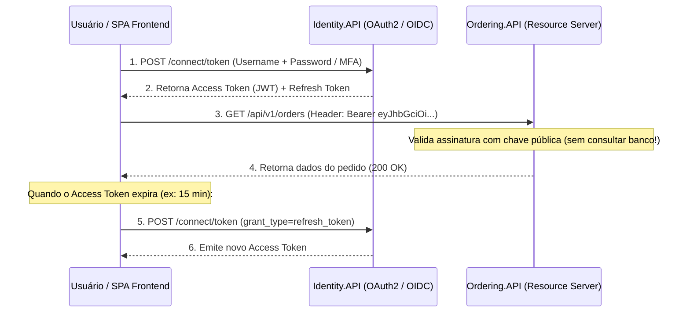

# 🔐 Autenticação, JWT, Tokens e Autorização Baseada em Políticas (.NET 10)

> "Autenticação responde à pergunta: 'Quem é você?'. Autorização responde à pergunta: 'O que você tem permissão para fazer?'. Misturar esses dois conceitos é o primeiro passo para brechas de segurança críticas."

Em uma arquitetura de microsserviços, não faz sentido cada serviço manter sua própria tabela de senhas e usuários. Centralizamos a emissão de identidade em um **Identity Provider (IdP)** e protegemos os microsserviços através de tokens **JSON Web Token (JWT)** criptograficamente assinados.

---

## 🧭 O Fluxo de Autenticação com OAuth 2.0 e OpenID Connect (OIDC)



---

## 🔍 Anatomia de um JWT (JSON Web Token)

Um JWT é composto por três partes separadas por pontos (`.`): `header.payload.signature`

```text
eyJhbGciOiJSUzI1NiIsInR5cCI6IkpXVCJ9.eyJzdWIiOiIxMjM0NTY3ODkwIiwibmFtZSI6IkpvYW8iLCJyb2xlIjoiQWRtaW4iLCJzY29wZSI6WyJvcmRlcnMucmVhZCJdfQ.K9s...
```

1. **Header**: Algoritmo criptográfico utilizado (ex: `RS256` - Chave Pública/Privada).
2. **Payload (Claims)**: Declarações sobre o usuário (`sub` = UserId, `email`, `roles`, `scopes`, `exp` = Data de expiração).
3. **Signature (Assinatura)**: Gerada pela chave privada do Identity Provider. Qualquer microsserviço com a **chave pública** pode validar se o token é legítimo **sem fazer nenhuma chamada de rede ao Identity.API**!

---

## 🛡️ Configuração do Resource Server no .NET 10

Em nossos microsserviços (ex: `Ordering.API`), configuramos a validação de JWT via Bearer Token:

```csharp
using Microsoft.AspNetCore.Authentication.JwtBearer;
using Microsoft.IdentityModel.Tokens;

var builder = WebApplication.CreateBuilder(args);

builder.Services.AddAuthentication(JwtBearerDefaults.AuthenticationScheme)
    .AddJwtBearer(options =>
    {
        options.Authority = builder.Configuration["Identity:AuthorityUrl"]; // URL do Identity.API
        options.Audience = "ordering-api"; // Protege contra tokens emitidos para outras APIs

        options.TokenValidationParameters = new TokenValidationParameters
        {
            ValidateIssuer = true,
            ValidateAudience = true,
            ValidateLifetime = true,
            ValidateIssuerSigningKey = true,
            ClockSkew = TimeSpan.Zero // Sem tolerância de tempo extra para expiração
        };
    });

// Autorização Granular por Políticas (Policy-Based Authorization)
builder.Services.AddAuthorizationBuilder()
    .AddPolicy("RequireAdminRole", policy => policy.RequireRole("Admin"))
    .AddPolicy("CanManageOrders", policy => policy.RequireClaim("scope", "orders.manage"))
    .AddPolicy("VipCustomerOnly", policy => policy.RequireAssertion(ctx => 
        ctx.User.HasClaim(c => c.Type == "customer_tier" && c.Value == "VIP")));
```

---

## 💻 Protegendo Endpoints com Minimal APIs

```csharp
var app = builder.Build();

app.UseAuthentication();
app.UseAuthorization();

// Endpoint público
app.MapGet("/api/v1/health", () => Results.Ok("Healthy"));

// Endpoint protegido padrão
app.MapGet("/api/v1/orders/my-orders", (ClaimsPrincipal user) =>
{
    var userId = user.FindFirst(ClaimTypes.NameIdentifier)?.Value;
    return Results.Ok($"Pedidos do usuário {userId}");
}).RequireAuthorization();

// Endpoint restrito por política
app.MapDelete("/api/v1/orders/{id:guid}", (Guid id) => Results.NoContent())
   .RequireAuthorization("CanManageOrders");
```

---

## 🔄 Refresh Token Rotation (Rotação Segura)

Access Tokens devem ter vida curta (ex: 10 a 15 minutos). Quando expiram, usamos o **Refresh Token** para obter um novo par de chaves sem deslogar o usuário.

> [!IMPORTANT]
> **Refresh Token Rotation**: Cada vez que um Refresh Token é utilizado, ele deve ser **invalidado e substituído por um novo Refresh Token**. Se um invasor tentar reutilizar um Refresh Token antigo já consumido, o sistema detecta o roubo de sessão imediatamente e cancela todos os tokens daquele usuário!

---

## 🎙️ Perguntas de Entrevista Sênior

### 1. "Por que você deve preferir Autorização Baseada em Políticas (Policy-Based) a simplesmente verificar Roles (`[Authorize(Roles = "Admin")]`)?"
**Resposta Esperada**: *Porque Roles são estáticas e causam acoplamento de código. Se a empresa criar uma nova regra onde 'Supervisores' também podem aprovar pedidos acima de R$ 50.000, o código com `[Authorize(Roles = "Admin,Supervisor")]` precisará ser alterado e recompilado em dezenas de lugares. Com Policy-Based Authorization, os endpoints exigem apenas uma política abstrata como `[Authorize(Policy = "CanApproveHighValueOrders")]`, e a definição de quais claims, regras de negócio ou limites satisfazem a política fica isolada em um único lugar no `Program.cs`.*

### 2. "Qual o risco de colocar tokens de acesso JWT com tempo de expiração muito longo (ex: 30 dias)?"
**Resposta Esperada**: *Como o JWT é stateless e validado offline pelos microsserviços via chave pública, **ele não pode ser revogado facilmente** antes de expirar. Se um token com validade de 30 dias vazar ou as permissões do usuário forem revogadas no banco, o invasor continuará acessando os microsserviços livremente por um mês. A boa prática é manter o Access Token curto (5 a 15 minutos) e controlar a revogação através do Refresh Token mantido no banco de dados do Identity.*

---

## 🔗 Conexões do Grafo (Obsidian)
- [Pipeline HTTP e Middlewares](../04-apis-e-http/04-middlewares-e-filtros.md)
- [Segurança Service-to-Service e OWASP](02-service-to-service-e-owasp.md)
- [API Gateway com YARP](../14-gateway-bff/01-api-gateway-yarp-e-bff.md)
