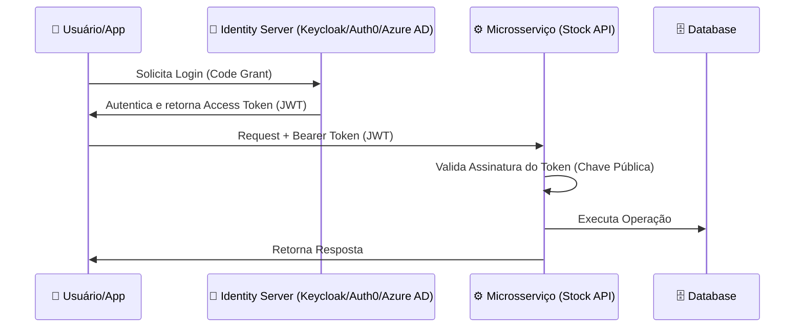

# 🔐 Autenticação e Autorização Enterprise (OAuth2 & OpenID Connect)

Em sistemas distribuídos, o microsserviço **não deve gerenciar senhas**. Ele deve delegar a identidade para um **Identity Provider (IdP)**.

## 🏗️ O Fluxo de Identidade
Utilizamos o padrão **OpenID Connect (OIDC)** sobre **OAuth2**.



## 🛠️ Implementação no .NET 10 (Minimal APIs)

### 1. Configuração da Validação de JWT
O microsserviço precisa saber como validar o token sem precisar perguntar ao IdP em cada request (validação offline via chave pública).

```csharp
builder.Services.AddAuthentication(JwtBearerDefaults.AuthenticationScheme)
    .AddJwtBearer(options =>
    {
        options.Authority = "https://seu-identity-server.com"; // URL do IdP
        options.TokenValidationParameters = new TokenValidationParameters
        {
            ValidateIssuer = true,
            ValidateAudience = true,
            ValidateLifetime = true,
            ValidAudience = "stock-api"
        };
    });

builder.Services.AddAuthorization(options =>
    options.AddPolicy("AdminOnly", policy => policy.RequireRole("admin")));
```

### 2. Protegendo Endpoints
```csharp
group.MapPost("/", async (...) => { ... })
     .RequireAuthorization("AdminOnly"); // Apenas Admins podem criar estoque
```

## 🚫 Erros Comuns em Produção
- **Hardcoded Secrets**: Nunca coloque a `ClientSecret` no código. Use Secrets Management.
- **Ignorar expiração**: Tokens sem `exp` (expiration) são riscos de segurança permanentes.
- **Validar Token no Banco**: Não faça queries ao banco para validar se o token existe; use a assinatura digital do JWT.
