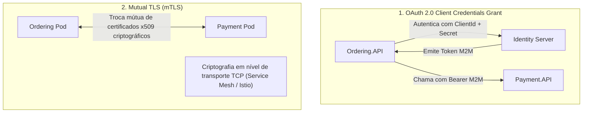

# 🛡️ Segurança Service-to-Service, Propagação de Tokens e OWASP Top 10

> "Achar que a rede interna do seu cluster é segura por padrão é a premissa que permitiu as maiores invasões da história. A arquitetura Zero Trust dita: nunca confie, sempre verifique."

Quando o `Ordering.API` precisa chamar o `Payment.API`, como garantimos que a chamada é legítima, que o serviço tem a identidade comprovada e que nenhum invasor dentro da mesma rede está forjando pacotes?

---

## 🧭 Comunicação Service-to-Service: As Duas Abordagens Principais



### 1. Client Credentials (Machine-to-Machine - M2M):
Usado quando um microsserviço executa uma tarefa em seu próprio nome (ex: um job noturno que consolida pagamentos). O microsserviço possui suas próprias credenciais (`ClientId` e `ClientSecret`).

### 2. Token Propagation (Propagação do Token do Usuário):
Quando o usuário original fez a requisição e a cadeia de chamadas precisa manter o contexto e as permissões daquele usuário.

---

## 💻 Propagando Tokens com `DelegatingHandler` no .NET 10

Para repassar automaticamente o token Bearer da requisição original para as chamadas HTTP internas:

```csharp
namespace EShop.Infrastructure.Security;

using System.Net.Http.Headers;
using Microsoft.AspNetCore.Http;

public sealed class TokenPropagationHandler(IHttpContextAccessor httpContextAccessor) : DelegatingHandler
{
    protected override async Task<HttpResponseMessage> SendAsync(HttpRequestMessage request, CancellationToken cancellationToken)
    {
        var httpContext = httpContextAccessor.HttpContext;

        if (httpContext != null && httpContext.Request.Headers.TryGetValue("Authorization", out var authHeader))
        {
            // Propaga o mesmo Bearer Token recebido para o próximo microsserviço
            if (AuthenticationHeaderValue.TryParse(authHeader, out var parsedHeader))
            {
                request.Headers.Authorization = parsedHeader;
            }
        }

        return await base.SendAsync(request, cancellationToken);
    }
}
```

### Registro no `Program.cs`:

```csharp
builder.Services.AddHttpContextAccessor();
builder.Services.AddTransient<TokenPropagationHandler>();

builder.Services.AddHttpClient<PaymentServiceClient>()
    .AddHttpMessageHandler<TokenPropagationHandler>(); // 🚀 Anexa o handler ao cliente tipado!
```

---

## 🚨 OWASP Top 10 para Microsserviços e APIs

Os maiores vetores de ataque em arquiteturas distribuídas modernas:

| Padrão de Ataque | O que é e o Risco | Como Mitigar no .NET 10 |
| :--- | :--- | :--- |
| **BOLA (Broken Object Level Authorization)** | Usuário A altera o `Id` na URL (`/orders/999`) e consegue ver ou cancelar o pedido do Usuário B. | Nunca confie apenas no `Id` da rota. Valide sempre se `order.CustomerId == currentUser.Id`. |
| **Broken Authentication** | Tokens fracos, ausência de rotação de chaves ou endpoints de refresh desprotegidos. | Utilizar bibliotecas padrão (IdentityServer, Keycloak, Microsoft Entra ID), tokens com RS256 e HTTPS estrito. |
| **SSRF (Server-Side Request Forgery)** | A API recebe uma URL do usuário e faz um `HttpClient.GetAsync(url)` que bate em metadados internos de nuvem (`http://169.254.169.254`). | Validar e sanitizar URLs contra whitelists rígidas de domínios permitidos. |
| **Security Misconfiguration** | Deixar Swagger aberto em produção, expor stack trace em erros 500 ou CORS com `AllowAnyOrigin()`. | Ativar Swagger apenas em `IsDevelopment()`, usar `IExceptionHandler` com `ProblemDetails` e CORS restrito. |

---

## 🛡️ Secure Headers Essenciais

Adicione headers de segurança na saída da API via middleware:

```csharp
app.Use(async (context, next) =>
{
    context.Response.Headers.Append("X-Content-Type-Options", "nosniff");
    context.Response.Headers.Append("X-Frame-Options", "DENY");
    context.Response.Headers.Append("Content-Security-Policy", "default-src 'self'");
    context.Response.Headers.Append("Strict-Transport-Security", "max-age=31536000; includeSubDomains");
    
    await next();
});
```

---

## 🎙️ Perguntas de Entrevista Sênior

### 1. "O que é BOLA (Broken Object Level Authorization) e por que é a vulnerabilidade nº 1 da OWASP em APIs?"
**Resposta Esperada**: *BOLA ocorre quando um endpoint expõe um identificador de objeto na URL (ex: `/api/orders/{id}`) e o código verifica apenas se o requisitante está autenticado (tem um JWT válido), mas se esquece de validar se o requisitante é o legítimo proprietário daquele registro específico. Um usuário comum com login válido pode iterar sobre todos os números de pedido da concorrência e extrair dados confidenciais de clientes. A correção exige verificar no banco se o recurso pertence à claim `sub` do usuário logado antes de retornar os dados.*

### 2. "Como funciona o mTLS (Mutual TLS) e por que ele é amplamente utilizado em Service Meshes?"
**Resposta Esperada**: *No TLS comum (HTTPS), apenas o servidor apresenta um certificado digital para provar sua identidade ao cliente. No mTLS, **ambas as partes apresentam certificados X.509 válidos** durante o handshake TLS. O servidor valida a identidade criptográfica do cliente e o cliente valida a do servidor. Em Service Meshes (como Istio ou Linkerd), o mTLS é aplicado automaticamente entre os proxies sidecar nos pods, criptografando 100% do tráfego do cluster de ponta a ponta sem exigir alterações no código da aplicação.*

---

## 🔗 Conexões do Grafo (Obsidian)
- [Autenticação JWT e Identity](01-autenticacao-jwt-e-identity.md)
- [Pipeline HTTP e Middlewares](../04-apis-e-http/04-middlewares-e-filtros.md)
- [API Gateway com YARP](../14-gateway-bff/01-api-gateway-yarp-e-bff.md)
- [Segurança de Containers e Imagens](../09-containerizacao/01-docker-e-docker-compose.md)
