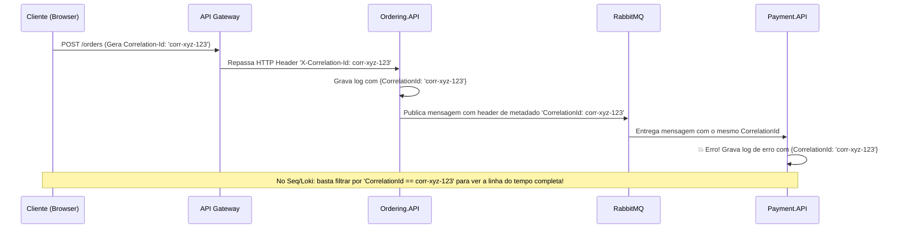

# 👁️ Structured Logging, Serilog e Correlation ID no .NET 10

> "Logs em texto puro não estruturado ('Erro ao salvar pedido 123') são cemitérios de informação onde é impossível fazer queries, filtros e alertas automáticos. Logs modernos são fluxos estruturados de eventos em formato JSON."

Em uma arquitetura com 20 microsserviços gerando milhões de linhas de log por minuto, encontrar a causa raiz de um erro exige **Logs Estruturados** e um **Correlation ID** que acompanhe a requisição de ponta a ponta.

---

## 🧭 O que é Structured Logging (Log Estruturado)?

No log tradicional em string interpolada, os dados se perdem no meio do texto:
```csharp
// ❌ PÉSSIMO: String interpolada (destrói a estrutura e aloca strings inúteis)
logger.LogInformation($"Pedido {order.Id} criado para o cliente {order.CustomerId} com valor {order.TotalAmount}");
```

No log estruturado do .NET 10, usamos **Message Templates** com parâmetros nomeados:
```csharp
// ✅ EXCELENTE: Template estruturado com propriedades preservadas
logger.LogInformation("Pedido {OrderId} criado para o cliente {CustomerId} com valor {TotalAmount}",
    order.Id, order.CustomerId, order.TotalAmount);
```

### Como o mecanismo armazena o evento:
```json
{
  "@timestamp": "2026-09-11T02:15:30.123Z",
  "@level": "Information",
  "messageTemplate": "Pedido {OrderId} criado para o cliente {CustomerId} com valor {TotalAmount}",
  "properties": {
    "OrderId": "7b8f3e21-0a4a-4e2b-8a2b-8d1e2f3a4b5c",
    "CustomerId": "9f1c2d3e-4b5a-6e7f-8a9b-0c1d2e3f4a5b",
    "TotalAmount": 249.90,
    "Application": "Ordering.API",
    "Environment": "Production"
  }
}
```
*Agora qualquer ferramenta como Seq, ElasticSearch ou Grafana Loki pode executar queries do tipo:*
`properties.TotalAmount > 200 AND properties.CustomerId = "..."`

---

## 🆔 O que é Correlation ID e por que ele é indispensável?

Um usuário clica em "Comprar" e a tela exibe uma mensagem de falha. Qual das 5 APIs e 3 filas pelas quais a requisição passou causou o problema?



---

## 💻 Implementação do Middleware de Correlation ID no .NET 10

```csharp
namespace EShop.Api.Middlewares;

public sealed class CorrelationIdMiddleware(RequestDelegate next)
{
    private const string CorrelationIdHeaderName = "X-Correlation-Id";

    public async Task InvokeAsync(HttpContext context)
    {
        // 1. Obtém o CorrelationId do header existente ou gera um novo GUID se for o início da cadeia
        if (!context.Request.Headers.TryGetValue(CorrelationIdHeaderName, out var correlationId) || 
            string.IsNullOrWhiteSpace(correlationId))
        {
            correlationId = Guid.NewGuid().ToString("N");
        }

        // 2. Injeta no header de resposta para que o cliente saiba o ID da sua transação
        context.Response.Headers.Append(CorrelationIdHeaderName, correlationId);

        // 3. Empurra o CorrelationId para o escopo de logs do ILogger / Serilog
        using (logger.BeginScope(new Dictionary<string, object>
        {
            ["CorrelationId"] = correlationId.ToString()
        }))
        {
            await next(context);
        }
    }
}
```

---

## ⚙️ Configuração Profissional do Serilog no `Program.cs`

```csharp
using Serilog;
using Serilog.Events;

var builder = WebApplication.CreateBuilder(args);

// Configuração fluente do Serilog lendo do appsettings e enriquecendo metadados
Log.Logger = new LoggerConfiguration()
    .MinimumLevel.Override("Microsoft", LogEventLevel.Warning)
    .MinimumLevel.Override("Microsoft.Hosting.Lifetime", LogEventLevel.Information)
    .Enrich.FromLogContext()
    .Enrich.WithProperty("Service", "Ordering.API")
    .Enrich.WithEnvironmentName()
    .Enrich.WithMachineName()
    .WriteTo.Console(new Serilog.Formatting.Compact.CompactJsonFormatter()) // JSON estruturado para stdout
    .CreateLogger();

builder.Host.UseSerilog();

var app = builder.Build();

app.UseMiddleware<CorrelationIdMiddleware>();

app.MapPost("/api/v1/orders", (ILogger<Program> logger) =>
{
    logger.LogInformation("Recebendo solicitação de novo pedido...");
    return Results.Accepted();
});

app.Run();
```

---

## 🎙️ Perguntas de Entrevista Sênior

### 1. "Qual o impacto de performance de usar string interpolation em logs (`logger.LogDebug($"Debug info: {expensiveCalculation()}")`) mesmo quando o nível Debug está desativado em produção?"
**Resposta Esperada**: *O compilador do C# avalia a interpolação de strings e executa o método custoso **antes** de passar o resultado para o `LogDebug()`. Mesmo que o Serilog descarte o log por estar configurado em nível `Information`, a CPU gastou ciclos processando o cálculo e alocando strings desnecessárias na Heap, gerando pressão de Garbage Collector. A abordagem correta é usar Message Templates estruturados ou encapsular a chamada em `if (logger.IsEnabled(LogLevel.Debug))`.*

### 2. "Como você garante que o Correlation ID trafegue tanto por chamadas HTTP quanto por mensagens assíncronas do RabbitMQ?"
**Resposta Esperada**: *Em chamadas HTTP, utilizamos um `DelegatingHandler` customizado no `HttpClient` que lê o Correlation ID do `IHttpContextAccessor` atual e injeta o header `X-Correlation-Id`. Em mensageria (RabbitMQ/MassTransit), configuramos um Message Filter/Publish Filter no MassTransit que captura o Correlation ID do contexto ativo e o embute nos headers de metadados da mensagem AMQP. No consumidor, um Consume Filter lê o header e abre um escopo de log idêntico.*

---

## 🔗 Conexões do Grafo (Obsidian)
- [Padronização de Erros com ProblemDetails](../04-apis-e-http/03-padronizacao-erros-problemdetails.md)
- [OpenTelemetry Tracing e Métricas](02-opentelemetry-tracing-e-metricas.md)
- [Comunicação Síncrona via HTTP](../05-comunicacao-microsservicos/01-comunicacao-sincrona-http.md)
- [Comunicação Assíncrona e Eventos](../05-comunicacao-microsservicos/02-comunicacao-assincrona-eventos.md)
