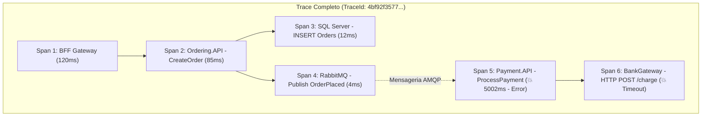
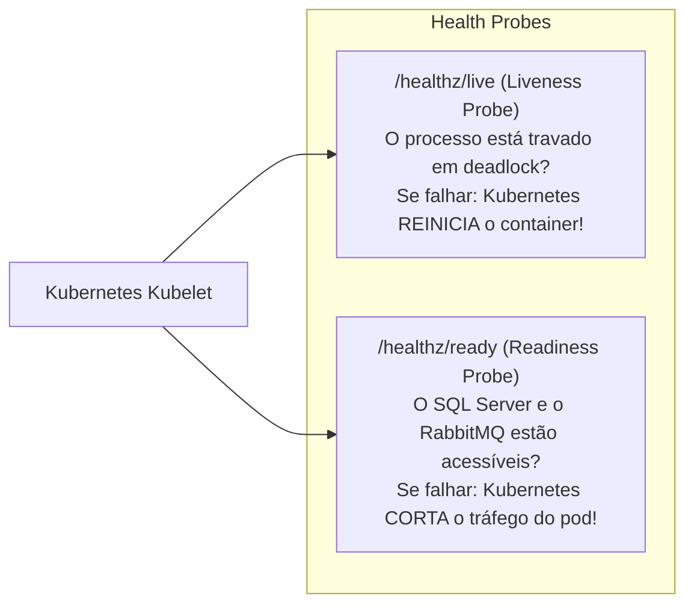

# 🕵️ OpenTelemetry, Tracing Distribuído e "Onde a Requisição Morreu?"

> "Em um monólito, você tem uma Stack Trace de uma única thread. Em microsserviços, uma única ação do usuário se divide em dezenas de processos assíncronos e redes distintas. Sem Tracing Distribuído, encontrar a causa de um erro é como procurar uma agulha em um palheiro no escuro."

O **OpenTelemetry (OTel)** é o padrão aberto global mantido pela CNCF (Cloud Native Computing Foundation) para coletar métricas, logs e rastreamento distribuído sem aprisionamento a fornecedores proprietários.

---

## 🧭 O Padrão W3C TraceContext: TraceId e SpanId

O OpenTelemetry padronizou a propagação de contexto através do header HTTP oficial **`traceparent`**:

```text
traceparent: 00-4bf92f3577b34da6a3ce929d0e0e4736-00f067aa0ba902b7-01
              └─┬─┘ └──────────────────────────────┘ └──────────────┘ └─┬─┘
             Versão           TraceId (32 hex)        SpanId (16 hex)   Flags
```



- **Trace ID**: Identificador único global de toda a jornada da requisição (do clique do usuário até a conclusão de todas as filas).
- **Span ID**: Identificador de um passo específico de trabalho (uma query SQL, uma chamada HTTP ou o consumo de uma mensagem na fila).

---

## 💻 Configuração do OpenTelemetry no .NET 10

No .NET 10, o suporte ao OpenTelemetry é nativo através das APIs de alta performance `System.Diagnostics.Activity` e `System.Diagnostics.Metrics.Meter`:

```csharp
using OpenTelemetry.Metrics;
using OpenTelemetry.Resources;
using OpenTelemetry.Trace;

var builder = WebApplication.CreateBuilder(args);

const string serviceName = "Ordering.API";

builder.Services.AddOpenTelemetry()
    .ConfigureResource(resource => resource.AddService(serviceName))
    .WithTracing(tracing =>
    {
        tracing
            .AddAspNetCoreInstrumentation() // Rastreia requisições HTTP recebidas
            .AddHttpClientInstrumentation() // Rastreia chamadas HTTP síncronas realizadas
            .AddEntityFrameworkCoreInstrumentation() // Rastreia queries geradas pelo EF Core
            .AddSource("MassTransit") // Rastreia publicações e consumo do RabbitMQ
            .AddOtlpExporter(opt => opt.Endpoint = new Uri(builder.Configuration["OTel:Endpoint"]!)); // Exporta para Jaeger/Aspire
    })
    .WithMetrics(metrics =>
    {
        metrics
            .AddAspNetCoreInstrumentation()
            .AddHttpClientInstrumentation()
            .AddRuntimeInstrumentation() // Métricas do Garbage Collector, Threads e CPU
            .AddPrometheusExporter(); // Exporta para o Prometheus raspar (/metrics)
    });
```

---

## 🏥 Health Checks: Liveness vs Readiness no .NET 10

O Kubernetes precisa saber se a aplicação está viva e se está pronta para receber tráfego:



### Configuração no `Program.cs`:

```csharp
builder.Services.AddHealthChecks()
    .AddSqlServer(builder.Configuration.GetConnectionString("SqlDefault")!, tags: ["ready"])
    .AddRedis(builder.Configuration.GetConnectionString("Redis")!, tags: ["ready"])
    .AddRabbitMQ(tags: ["ready"]);

var app = builder.Build();

// Liveness: apenas responde 200 OK se o processo HTTP estiver respondendo
app.MapHealthChecks("/healthz/live", new() { Predicate = _ => false });

// Readiness: valida se todas as dependências marcadas com a tag 'ready' estão operacionais
app.MapHealthChecks("/healthz/ready", new() { Predicate = check => check.Tags.Contains("ready") });
```

---

## 🎯 O Grande Cenário: "Onde Essa Requisição Morreu?"

Considere o fluxo completo da nossa arquitetura:
**Cliente $\to$ BFF $\to$ Ordering $\to$ RabbitMQ $\to$ Payment**

O usuário relata que clicou em finalizar compra e recebeu uma mensagem de erro genérica. Você abre o **Jaeger / Aspire Dashboard** e busca pelo `TraceId` informado no log:

```text
Trace ID: 00-7a8e9d1234567890abcdef1234567890-0000000000000000-01
Total Duration: 5.12s
Spans: 6 (1 error)

-------------------------------------------------------------------------------------------------
[+] BFF.Gateway : POST /api/checkout                         [ 200 OK ]  [ 5.12s ]
    [+] Ordering.API : POST /orders                          [ 200 OK ]  [ 0.08s ]
        ├── Ordering.API : EF Core INSERT Orders             [ 200 OK ]  [ 0.02s ]
        └── Ordering.API : RabbitMQ Publish OrderCreated     [ 200 OK ]  [ 0.01s ]
            [+] Payment.API : Consume OrderCreated           [ 💥 ERROR] [ 5.01s ]
                └── Payment.API : HTTP POST /charge (Bank)   [ 💥 TIMEOUT] [ 5.00s ]
                    └── Exception: System.TimeoutRejectedException: The operation exceeded 5000ms.
-------------------------------------------------------------------------------------------------
```

### A Resposta Clara e Inquestionável:
> *"A requisição **NÃO** morreu no BFF, **NÃO** morreu no Ordering e a mensagem **NÃO** se perdeu no RabbitMQ. A requisição morreu dentro do **Payment.API**, especificamente no Span de integração bancária `HTTP POST /charge`, que sofreu um **Timeout de 5.000ms** na chamada ao gateway de pagamentos parceiro."*

Você identificou o culpado exato, a linha de código, a dependência externa e a latência em **menos de 30 segundos**, sem precisar adivinhar ou reiniciar servidores.

---

## 🎙️ Perguntas de Entrevista Sênior

### 1. "Qual a diferença entre a Liveness Probe e a Readiness Probe no Kubernetes e o que acontece se você colocar uma checagem de banco de dados na Liveness Probe?"
**Resposta Esperada**: *A Liveness Probe verifica se o processo da aplicação está vivo. Se falhar, o Kubernetes **mata e reinicia o container**. A Readiness Probe verifica se o container está apto a receber tráfego. Se falhar, o Kubernetes apenas remove o pod do Service Load Balancer sem matá-lo. **Nunca coloque checagens de banco de dados na Liveness Probe**: se o SQL Server sofrer uma lentidão temporária de 30 segundos, todos os pods de todos os microsserviços falharão na Liveness ao mesmo tempo, fazendo o Kubernetes reiniciar o cluster inteiro em loop infinito (*CrashLoopBackOff*), transformando uma lentidão passageira em uma queda generalizada do sistema.*

### 2. "Como o padrão W3C TraceContext garante o rastreamento através de filas assíncronas do RabbitMQ?"
**Resposta Esperada**: *O W3C define o formato do header `traceparent`. Ao publicar uma mensagem no RabbitMQ, o produtor injeta o `traceparent` no dicionário de headers/metadados da mensagem AMQP. Quando o consumidor retira a mensagem da fila, a biblioteca de instrumentação (MassTransit/OpenTelemetry) lê esse cabeçalho e inicia uma nova `Activity` filha vinculada ao mesmo `TraceId` pai, unificando a árvore de rastreamento mesmo que a mensagem tenha ficado parada na fila por minutos.*

---

## 🔗 Conexões do Grafo (Obsidian)
- [Structured Logging e Correlation ID](01-structured-logging-e-correlation-id.md)
- [Padronização de Erros com ProblemDetails](../04-apis-e-http/03-padronizacao-erros-problemdetails.md)
- [Comunicação Assíncrona e Eventos](../05-comunicacao-microsservicos/02-comunicacao-assincrona-eventos.md)
- [Polly v8 e Testes de Caos](../06-resiliencia/02-polly-v8-pipelines-na-pratica.md)
- [API Gateway com YARP](../14-gateway-bff/01-api-gateway-yarp-e-bff.md)
