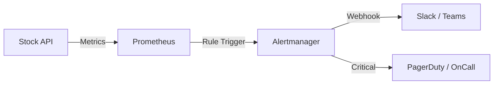

# 🚨 Monitoramento e Alertas (Observabilidade Ativa)

Observabilidade não é apenas olhar dashboards; é ser avisado proativamente quando algo quebra antes que o cliente ligue reclamando.

## 🔄 O Fluxo de Alerta
O ecossistema moderno funciona assim:
`Aplicação (Métricas)` $\rightarrow$ `Prometheus (Coleta)` $\rightarrow$ `Alertmanager (Regra)` $\rightarrow$ `Slack/PagerDuty (Notificação)`



## 🛠️ Configurando Alertas no Prometheus
Criamos regras de alerta (`alert.rules`) baseadas em PromQL.

**Exemplo: Taxa de Erros HTTP 500 > 5%**
```yaml
groups:
  - name: stock_alerts
    rules:
      - alert: HighErrorRate
        expr: (sum(rate(http_requests_total{status=~"5.."}[1m])) / sum(rate(http_requests_total[1m]))) * 100 > 5
        for: 1m
        labels:
          severity: critical
        annotations:
          summary: "Taxa de erro alta na Stock API"
          description: "A API está retornando mais de 5% de erro 500 nos últimos 60 segundos."
```

## 📊 Dashboards de Negócio vs. Dashboards Técnicos
Para produção, você precisa de dois tipos de visões no Grafana:

1.  **Visão Técnica (SRE)**:
    - Latência (p95, p99).
    - Consumo de CPU/RAM dos pods.
    - Taxa de mensagens na DLQ (Dead Letter Queue) do RabbitMQ.
2.  **Visão de Negócio (Product Owner)**:
    - Quantidade de vendas por minuto.
    - Número de produtos "Out of Stock".
    - Tempo médio de processamento de pedido.

## 📋 Check-list de Alerta
- [ ] Definir o que é "Crítico" (acorda o dev) vs "Aviso" (resolve amanhã).
- [ ] Configurar rotação de On-Call (quem é o responsável esta semana?).
- [ ] Validar o alerta disparando um erro proposital em ambiente de Staging.
