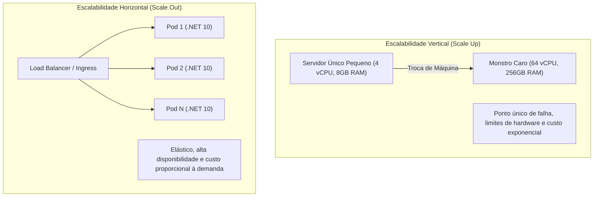
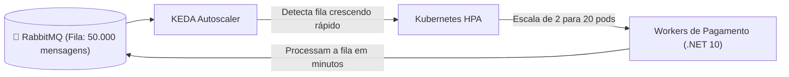

# 📈 Escalabilidade Horizontal, Gargalos Críticos e Autoscaling no .NET 10

> "Escalar verticalmente (comprar um servidor maior com 128 núcleos) tem um limite físico e financeiro rápido. A verdadeira escalabilidade em nuvem é horizontal: desenhar aplicações que rodam com 2 instâncias de madrugada e 200 instâncias na Black Friday de forma totalmente elástica."

Escalar não é apenas colocar um Load Balancer na frente da API. Se os nós compartilharem estado na memória ou esgotarem o pool de conexões do banco de dados, dobrar o número de servidores só fará o sistema quebrar duas vezes mais rápido.

---

## 🧭 Escalabilidade Horizontal vs Vertical



---

## 🚨 Os 4 Grandes Gargalos de Infraestrutura (Bottlenecks)

Ao testar a aplicação sob carga intensa, o limite raramente é o código C# puro do .NET 10 (que é extremamente rápido). O colapso costuma ocorrer nos seguintes gargalos:

### 1. Connection Pool Bottleneck (Esgotamento do Pool de Conexões SQL)
O SQL Server gerencia conexões através do ADO.NET Connection Pool (tamanho padrão máximo: 100 conexões por instância).
- Se sua API mantém conexões abertas esperando I/O demorado ou faz queries lentas, as 100 conexões se esgotam.
- Novas requisições entram em fila esperando liberação de conexão, até que estouram o erro:
  `Timeout expired. The timeout period elapsed prior to obtaining a connection from the pool.`
- **Solução**: Manter queries ultrarrápidas, usar `AsNoTracking()`, fechar conexões imediatamente e adotar réplicas de leitura (*Read Replicas*).

### 2. CPU Bottleneck (Saturação de Processador)
- Causado por cálculos matemáticos pesados, criptografia excessiva, regexes mal formuladas (ReDoS) ou serialização JSON baseada em reflexão pesada.
- **Solução**: Usar Source Generators no `System.Text.Json` e descarregar processamento pesado para background workers assíncronos.

### 3. Memory & GC Bottleneck (Pressão no Garbage Collector)
- Alocar milhões de objetos de curta duração faz o Garbage Collector disparar coletas de Geração 2 (Gen2 / Full GC), congelando todas as threads da aplicação (*Stop-the-World pauses*).
- **Solução**: Usar `ReadOnlySpan<T>`, `ArrayPool<T>` e evitar concorrência com arrays gigantes no LOH (Large Object Heap).

### 4. I/O Bottleneck (Espera de Disco e Rede)
- Fazer chamadas síncronas bloqueantes (`.Result` ou `.Wait()`) em vez de operações puramente assíncronas com `async/await`.

---

## ⚡ Escalonamento Baseado em Filas com KEDA (Kubernetes Event-driven Autoscaling)

Em microsserviços orientados a eventos, você não deve escalar os consumidores apenas com base no uso de CPU ou Memória. Se uma fila tiver 100.000 pedidos represados, os pods de pagamento podem estar com a CPU baixa simplesmente esperando a entrega das mensagens!

O **KEDA** monitora a **profundidade da fila do RabbitMQ** em tempo real e instrui o Kubernetes a subir réplicas proporcionais ao backlog:



### Especificação do ScaledObject do KEDA:

```yaml
apiVersion: keda.sh/v1alpha1
kind: ScaledObject
metadata:
  name: payment-consumer-scaler
spec:
  scaleTargetRef:
    name: payment-consumer-deployment
  minReplicaCount: 1
  maxReplicaCount: 30
  triggers:
    - type: rabbitmq
      metadata:
        protocol: amqp
        queueName: payment-process-queue
        mode: QueueLength
        value: "500" # Sobe 1 pod extra a cada 500 mensagens acumuladas!
      authenticationRef:
        name: rabbitmq-keda-auth
```

---

## 🧪 Testes de Carga com k6

Nunca declare uma arquitetura escalável sem antes submetê-la a um teste de estresse real com **k6**:

```javascript
import http from 'k6/http';
import { check, sleep } from 'k6';

export const options = {
  stages: [
    { duration: '30s', target: 50 },   // Aquece até 50 usuários virtuais
    { duration: '1m', target: 500 },   // Rampa agressiva até 500 usuários
    { duration: '30s', target: 2000 },  // Teste de pico de estresse (2000 usuários)
    { duration: '30s', target: 0 },     // Resfriamento
  ],
  thresholds: {
    http_req_duration: ['p(95)<200'], // 95% das requisições devem responder abaixo de 200ms
    http_req_failed: ['rate<0.01'],   // Menos de 1% de erros permitidos
  },
};

export default function () {
  const url = 'http://localhost:5001/api/v1/orders';
  const payload = JSON.stringify({
    customerId: '9f1c2d3e-4b5a-6e7f-8a9b-0c1d2e3f4a5b',
    amount: 149.90,
  });

  const params = {
    headers: { 'Content-Type': 'application/json' },
  };

  const res = http.post(url, payload, params);
  check(res, { 'status is 201': (r) => r.status === 201 });
  sleep(0.1);
}
```

---

## 🎙️ Perguntas de Entrevista Sênior

### 1. "O que acontece se aumentarmos o número de réplicas de uma API de 5 para 50 pods sem alterar a infraestrutura do banco de dados relacional?"
**Resposta Esperada**: *Geralmente ocorre o colapso do banco de dados por esgotamento de conexões (*Connection Pool Saturation*). Se cada um dos 50 pods estiver configurado com um pool máximo padrão de 100 conexões, eles poderão abrir concorrentemente até 5.000 conexões com o SQL Server. O banco gastará quase todo o seu tempo e memória apenas alternando contextos e gerenciando locks de conexão (*Context Switching*), derrubando a performance geral para quase zero. A solução exige limitar os pools das APIs, usar proxies de conexão (como Azure SQL Database Elastic Pools ou PgBouncer) e adotar réplicas de leitura.*

### 2. "Por que o autoscaling tradicional baseado em CPU falha frequentemente em consumidores de mensageria?"
**Resposta Esperada**: *Porque tarefas de mensageria e background workers frequentemente são limitadas por I/O (espera de banco de dados, rede externa ou APIs de terceiros), e não por CPU. O worker pode estar demorando 2 segundos para processar cada mensagem com a CPU oscilando em apenas 15%. Se a fila receber 100.000 mensagens de repente, o autoscaler baseado em CPU não fará nada, e o tempo de atraso (lag) da fila explodirá para horas. A solução é usar escalonamento baseado em eventos e métricas de fila (backlog length) através de ferramentas como o KEDA.*

---

## 🔗 Conexões do Grafo (Obsidian)
- [Cache Distribuído com Redis e HybridCache](../03-dados-persistencia/04-cache-distribuido-redis-e-hybridcache.md)
- [Performance e Otimização de Queries](../03-dados-persistencia/03-performance-e-otimizacao-queries.md)
- [RabbitMQ e MassTransit](../13-mensageria-eventos/01-rabbitmq-avancado.md)
- [Performance e GC Internals](../15-performance/01-profiling-e-otimizacoes-dotnet.md)
- [API Gateway com YARP](../14-gateway-bff/01-api-gateway-yarp-e-bff.md)
