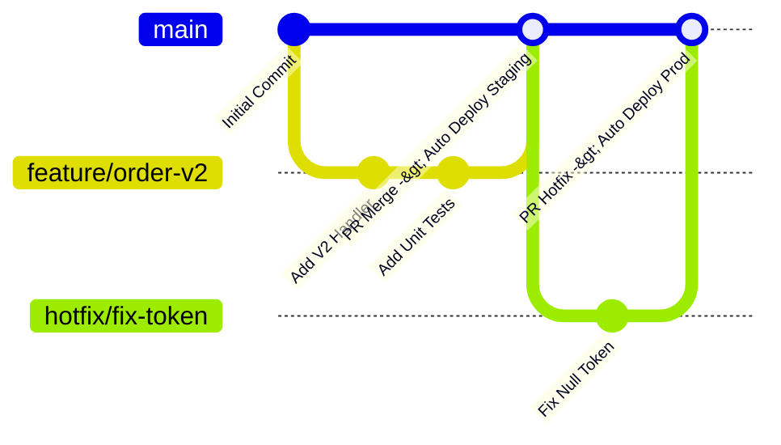
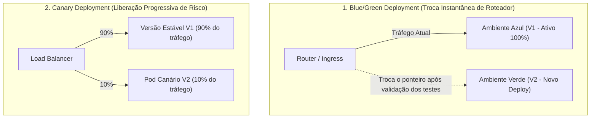

# 🚀 Pipelines de CI/CD, Estratégias de Deploy e Zero Downtime no .NET 10

> "Se fazer deploy em produção é um evento estressante marcado para a madrugada de sexta-feira com pizza fria e orações, seu processo de entrega de software está completamente quebrado. Deploy profissional ocorre dezenas de vezes por dia em horário comercial, com zero downtime e rollback automático."

A integração contínua (CI) e a entrega contínua (CD) garantem que cada Pull Request seja testado, escaneado contra vulnerabilidades, empacotado em containers e disponibilizado para os usuários sem qualquer interrupção de serviço.

---

## 🧭 Estratégia de Branching: Trunk-Based Development vs GitFlow



Em microsserviços de alto desempenho, o clássico **GitFlow** (com branches longas `develop`, `release`, `feature` que duram semanas) é considerado um antipadrão que gera "infernos de merge" (*Merge Hell*).

A indústria adota **Trunk-Based Development**:
- Branches de funcionalidade muito curtas (duram no máximo 1 a 2 dias).
- Merges frequentes na branch principal (`main`).
- Funcionalidades incompletas são protegidas por **Feature Flags** (veja o [Capítulo 20](../20-evolucao-legado/01-strangler-fig-e-migracao-legado.md)) em vez de ficarem semanas isoladas em branches mofando.

---

## 🛠️ Pipeline Completo de CI/CD com GitHub Actions (.NET 10)

```yaml
name: CI/CD Pipeline - Ordering.API

on:
  push:
    branches: [ main ]
  pull_request:
    branches: [ main ]

jobs:
  # ----------------------------------------------------------------------
  # Estágio 1: Testes, Qualidade e Segurança (Quality Gate)
  # ----------------------------------------------------------------------
  build-and-test:
    name: Build, Test & Security Scan
    runs-on: ubuntu-latest
    steps:
      - name: Checkout do Código
        uses: actions/checkout@v4

      - name: Setup .NET 10 SDK
        uses: actions/setup-dotnet@v4
        with:
          dotnet-version: '10.0.x'

      - name: Restaurar Dependências
        run: dotnet restore src/Ordering.Api/Ordering.Api.csproj

      - name: Compilar
        run: dotnet build --no-restore -c Release src/Ordering.Api/Ordering.Api.csproj

      - name: Executar Testes Unitários com Cobertura
        run: dotnet test --no-build -c Release --collect:"XPlat Code Coverage"

      - name: Scan de Vulnerabilidades de Container com Trivy
        uses: aquasecurity/trivy-action@master
        with:
          scan-type: 'fs'
          ignore-unfixed: true
          severity: 'CRITICAL,HIGH'

  # ----------------------------------------------------------------------
  # Estágio 2: Build de Container e Push para Registry
  # ----------------------------------------------------------------------
  docker-publish:
    name: Build & Push Docker Image
    needs: build-and-test
    if: github.ref == 'refs/heads/main'
    runs-on: ubuntu-latest
    steps:
      - name: Checkout
        uses: actions/checkout@v4

      - name: Login no GitHub Container Registry (GHCR)
        uses: docker/login-action@v3
        with:
          registry: ghcr.io
          username: ${{ github.actor }}
          password: ${{ secrets.GITHUB_TOKEN }}

      - name: Build e Push da Imagem com Tag de Commit SHA
        uses: docker/build-push-action@v5
        with:
          context: .
          file: src/Ordering.Api/Dockerfile
          push: true
          tags: |
            ghcr.io/eshop/ordering-api:latest
            ghcr.io/eshop/ordering-api:${{ github.sha }}
```

---

## 🔄 Estratégias de Deploy com Zero Downtime



### 1. Blue/Green Deployment:
- Mantemos dois ambientes de produção idênticos (Azul e Verde).
- O tráfego dos usuários está 100% no Azul.
- Fazemos o deploy da nova versão no Verde e rodamos testes de fumaça (*Smoke Tests*).
- Se tudo estiver perfeito, o roteador/ingress comuta o tráfego instantaneamente para o Verde.
- **Rollback Instantâneo**: Se algo quebrar, basta voltar o roteador para o Azul em 1 segundo!

### 2. Canary Deployment:
- Em vez de trocar 100% dos usuários, direcionamos apenas **2% a 5% do tráfego real** para a nova versão.
- Observamos métricas do OpenTelemetry (taxa de erros HTTP 500, latência P99).
- Se as métricas estiverem saudáveis por 15 minutos, aumentamos para 25%, 50% e finalmente 100%.

---

## 🎙️ Perguntas de Entrevista Sênior

### 1. "Qual a diferença entre Blue/Green Deployment e Canary Deployment e qual o critério para escolher entre eles?"
**Resposta Esperada**: *O Blue/Green mantém dois ambientes de produção completos e comuta 100% do tráfego de uma vez após a validação inicial, oferecendo rollback quase instantâneo, mas exigindo o dobro de recursos de infraestrutura temporária. O Canary libera a nova versão de forma incremental para uma porcentagem pequena de tráfego real (ex: 5%), validando o comportamento sob carga real e minimizando o raio de impacto de bugs não detectados em testes. O Canary é a escolha preferida para sistemas com milhões de usuários onde o custo de dobrar a infraestrutura é proibitivo e o risco de falhas generalizadas é inaceitável.*

### 2. "Como garantir que migrações de banco de dados não quebrem a aplicação durante um Blue/Green ou Canary onde a V1 e a V2 rodam simultaneamente?"
**Resposta Esperada**: *Aplicando o padrão de banco de dados **Expand and Contract (Parallel Run)**. Nunca faça migrações destrutivas (como renomear ou deletar colunas antigas) no mesmo deploy da nova versão. Na fase Expand, criamos a nova coluna mantendo a antiga funcional para a V1. Quando a V2 estabilizar em 100% do tráfego, em um deploy futuro e independente (fase Contract), removemos a coluna antiga.*

---

## 🔗 Conexões do Grafo (Obsidian)
- [Dockerfiles Multi-stage e Containers](../09-containerizacao/01-docker-e-docker-compose.md)
- [Migração de Banco Expand and Contract](../20-evolucao-legado/01-strangler-fig-e-migracao-legado.md)
- [Feature Flags no Release Contínuo](../20-evolucao-legado/01-strangler-fig-e-migracao-legado.md#feature-flags)
- [Observabilidade e Alertas de Telemetria](../08-observabilidade/02-opentelemetry-tracing-e-metricas.md)
