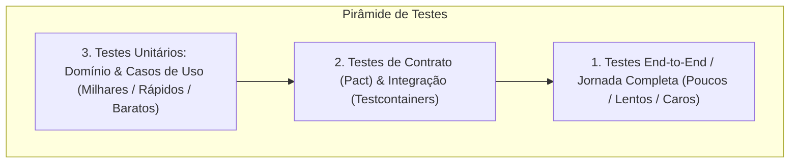

# 🧪 A Pirâmide de Testes em Microsserviços e Testes Unitários no .NET 10

> "Testar não é verificar se o código compila ou clicar manualmente no Postman. Testar é criar uma rede de segurança automatizada e determinística que permite à equipe refatorar a arquitetura inteira com confiança de que nenhuma regra de negócio foi violada."

Em microsserviços, a estratégia de testes deve equilibrar **velocidade de feedback**, **confiabilidade de execução** e **custo de manutenção**.

---

## 🧭 A Pirâmide de Testes em Microsserviços



1. **Testes Unitários (Base)**: Executam em milissegundos na memória. Testam entidades puras, invariantes, cálculos de domínio e handlers de aplicação com dependências mockadas.
2. **Testes de Integração & Contrato (Meio)**: Testam a conversa real com o banco de dados (SQL Server) e message brokers (RabbitMQ) usando instâncias reais via **Testcontainers**.
3. **Testes End-to-End (Topo)**: Validam o fluxo completo através do API Gateway, executados apenas em homologação antes do deploy.

---

## 🎭 Test Doubles: Mocks vs Stubs vs Fakes

| Tipo de Double | O que faz | Exemplo no .NET 10 |
| :--- | :--- | :--- |
| **Dummy** | Objeto passado apenas para preencher parâmetros de assinatura, nunca utilizado de fato. | Um `CancellationToken.None`. |
| **Stub** | Fornece respostas enlatadas e pré-programadas para chamadas feitas durante o teste. | Retornar sempre `true` para `creditChecker.HasCreditAsync()`. |
| **Mock** | Objeto configurado com expectativas sobre quais métodos devem ser chamados e com quais parâmetros. | Verificar se `emailSender.Received(1).SendAsync(...)`. |
| **Fake** | Tem uma implementação funcional real, mas simplificada e não adequada para produção. | Um repositório em memória baseado em `ConcurrentDictionary`. |

---

## 💻 Testes Unitários de Domínio com xUnit e FluentAssertions

Entidades de domínio puras nunca precisam de mocks, pois não dependem de I/O externo:

```csharp
namespace EShop.Domain.Tests.Orders;

using EShop.Domain.Orders;
using FluentAssertions;
using Xunit;

public sealed class OrderDomainTests
{
    [Fact]
    public void Create_WithValidCustomer_ShouldInitializeInDraftStatus()
    {
        // Arrange
        var customerId = Guid.NewGuid();

        // Act
        var order = Order.Create(customerId);

        // Assert
        order.Should().NotBeNull();
        order.CustomerId.Should().Be(customerId);
        order.Status.Should().Be(OrderStatus.Draft);
        order.Items.Should().BeEmpty();
        order.TotalAmount.Should().Be(0m);
    }

    [Fact]
    public void AddItem_WhenOrderIsNotInDraft_ShouldThrowInvalidOperationException()
    {
        // Arrange
        var order = Order.Create(Guid.NewGuid());
        order.AddItem(Guid.NewGuid(), "Livro .NET 10", 100m, 1);
        order.ConfirmOrder(); // Muda status para AwaitingPayment

        // Act
        var action = () => order.AddItem(Guid.NewGuid(), "Outro Produto", 50m, 1);

        // Assert: A invariante deve proteger o agregado
        action.Should().Throw<InvalidOperationException>()
            .WithMessage("*não está em rascunho*");
    }

    [Theory]
    [InlineData(0)]
    [InlineData(-5)]
    public void AddItem_WithZeroOrNegativeQuantity_ShouldThrowArgumentException(int invalidQuantity)
    {
        // Arrange
        var order = Order.Create(Guid.NewGuid());

        // Act
        var action = () => order.AddItem(Guid.NewGuid(), "Produto Teste", 100m, invalidQuantity);

        // Assert
        action.Should().Throw<ArgumentException>();
    }
}
```

---

## 💻 Testando a Camada de Aplicação com NSubstitute

Para testar o caso de uso (`CreateOrderHandler`), isolamos as dependências de infraestrutura usando **NSubstitute**:

```csharp
namespace EShop.Application.Tests.Orders;

using EShop.Application.Orders.Common;
using EShop.Application.Orders.CreateOrder;
using EShop.Domain.Orders;
using FluentAssertions;
using NSubstitute;
using Xunit;

public sealed class CreateOrderHandlerTests
{
    private readonly IOrderRepository _orderRepository = Substitute.For<IOrderRepository>();
    private readonly IUnitOfWork _unitOfWork = Substitute.For<IUnitOfWork>();
    private readonly CreateOrderHandler _handler;

    public CreateOrderHandlerTests()
    {
        _handler = new CreateOrderHandler(_orderRepository, _unitOfWork);
    }

    [Fact]
    public async Task HandleAsync_WithValidCommand_ShouldPersistAndCommit()
    {
        // Arrange
        var command = new CreateOrderCommand(Guid.NewGuid(), 250.00m);

        // Act
        var response = await _handler.HandleAsync(command, CancellationToken.None);

        // Assert
        response.OrderId.Should().NotBeEmpty();
        response.Status.Should().Be("PendingPayment");

        // Verifica que o repositório e o commit foram chamados exatamente 1 vez
        await _orderRepository.Received(1).AddAsync(Arg.Any<Order>(), Arg.Any<CancellationToken>());
        await _unitOfWork.Received(1).CommitAsync(Arg.Any<CancellationToken>());
    }
}
```

---

## 🎙️ Perguntas de Entrevista Sênior

### 1. "Por que você não deve usar bancos em memória do EF Core (`UseInMemoryDatabase`) para testes de integração?"
**Resposta Esperada**: *Porque o banco em memória do EF Core **não é um banco relacional**. Ele não valida constraints de chave estrangeira (Foreign Keys), não respeita tipos de dados específicos do SQL Server, não valida concorrência real com `rowversion`, não executa transações reais e aceita comandos LINQ que falham no SQL Server real. Testes feitos com InMemory passam localmente e explodem em produção. A abordagem correta e moderna é usar o **Testcontainers** com uma instância real do SQL Server em container descartável.*

### 2. "Qual o padrão de nomenclatura de testes unitários que você recomenda?"
**Resposta Esperada**: *O padrão canônico **`Metodo_CenarioOuEstado_ResultadoEsperado`** (ex: `AddItem_WhenOrderIsNotInDraft_ShouldThrowInvalidOperationException`). Ele deixa explícito no relatório de testes qual método falhou, qual era a premissa de negócio e qual era o resultado exigido, tornando a suíte de testes uma documentação viva da especificação de negócio.*

---

## 🔗 Conexões do Grafo (Obsidian)
- [Clean Architecture em Camadas](../01-fundamentos-arquitetura/01-clean-architecture.md)
- [Entidades e Regras de Domínio](../02-dominio-ddd-pratico/01-entidades-e-regras-de-dominio.md)
- [Testcontainers e Testes de Integração](02-testcontainers-e-testes-integracao.md)
- [Pipelines de CI/CD](../11-cicd-devops/01-pipelines-ci-cd-e-deploy.md)
