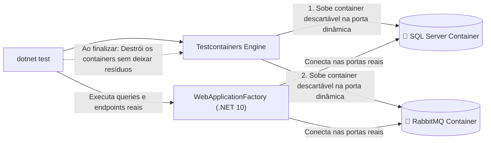
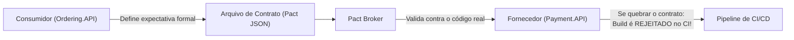

# 🐳 Testcontainers para .NET 10, WebApplicationFactory e Testes de Contrato

> "Mocks de banco de dados e de brokers são mentirosos diplomáticos: eles dizem exatamente o que você quer ouvir nos testes locais, mas o cliente em produção descobre a verdade amarga de uma incompatibilidade de SQL ou constraint violada."

Para ter certeza absoluta de que sua aplicação funciona, seus testes de integração devem executar contra o **mesmo motor de banco de dados (SQL Server)** e o **mesmo message broker (RabbitMQ)** que rodam em produção. O **Testcontainers para .NET** tornou isso rápido, isolado e 100% automatizado.

---

## 🧭 A Revolução do Testcontainers



---

## 💻 Configuração da Fixture Compartilhada com Testcontainers

### 1. Pacotes Necessários:
```bash
dotnet add package Testcontainers.MsSql
dotnet add package Testcontainers.RabbitMq
dotnet add package Microsoft.AspNetCore.Mvc.Testing
```

### 2. A Classe Base de Teste: `IntegrationTestWebAppFactory.cs`

```csharp
namespace EShop.Api.IntegrationTests;

using Microsoft.AspNetCore.Hosting;
using Microsoft.AspNetCore.Mvc.Testing;
using Microsoft.AspNetCore.TestHost;
using Microsoft.EntityFrameworkCore;
using Microsoft.Extensions.DependencyInjection;
using Testcontainers.MsSql;
using Testcontainers.RabbitMq;
using Xunit;

public sealed class IntegrationTestWebAppFactory : WebApplicationFactory<Program>, IAsyncLifetime
{
    // Containers descartáveis gerenciados pelo Testcontainers
    private readonly MsSqlContainer _dbContainer = new MsSqlBuilder()
        .WithImage("mcr.microsoft.com/mssql/server:2022-latest")
        .Build();

    private readonly RabbitMqContainer _rabbitMqContainer = new RabbitMqBuilder()
        .WithImage("rabbitmq:3-alpine")
        .Build();

    public async Task InitializeAsync()
    {
        // Inicia ambos os contêineres em paralelo antes dos testes começarem
        await Task.WhenAll(_dbContainer.StartAsync(), _rabbitMqContainer.StartAsync());
    }

    protected override void ConfigureWebHost(IWebHostBuilder builder)
    {
        builder.ConfigureTestServices(services =>
        {
            // Remove a configuração de banco de dados original
            var descriptor = services.SingleOrDefault(d => d.ServiceType == typeof(DbContextOptions<OrderingDbContext>));
            if (descriptor != null) services.Remove(descriptor);

            // Redireciona para o SQL Server efêmero do Testcontainers
            services.AddDbContext<OrderingDbContext>(options =>
            {
                options.UseSqlServer(_dbContainer.GetConnectionString());
            });

            // Aplica as migrations reais no banco efêmero
            using var scope = services.BuildServiceProvider().CreateScope();
            var context = scope.ServiceProvider.GetRequiredService<OrderingDbContext>();
            context.Database.Migrate();
        });
    }

    public new async Task DisposeAsync()
    {
        await Task.WhenAll(_dbContainer.StopAsync(), _rabbitMqContainer.StopAsync());
    }
}
```

---

## 🧪 Testando o Endpoint Real da API de Ponta a Ponta

```csharp
namespace EShop.Api.IntegrationTests.Orders;

using System.Net;
using System.Net.Http.Json;
using EShop.Application.Orders.CreateOrder;
using FluentAssertions;
using Xunit;

public sealed class CreateOrderEndpointTests(IntegrationTestWebAppFactory factory) 
    : IClassFixture<IntegrationTestWebAppFactory>
{
    private readonly HttpClient _client = factory.CreateClient();

    [Fact]
    public async Task PostOrder_WithValidPayload_ShouldPersistInRealSqlAndReturnCreated()
    {
        // Arrange
        var request = new CreateOrderCommand(Guid.NewGuid(), 350.00m);

        // Act: Envia requisição HTTP real pelo pipeline do ASP.NET Core
        var response = await _client.PostAsJsonAsync("/api/v1/orders", request);

        // Assert
        response.StatusCode.Should().Be(HttpStatusCode.Created);
        response.Headers.Location.Should().NotBeNull();

        var body = await response.Content.ReadFromJsonAsync<CreateOrderResponse>();
        body.Should().NotBeNull();
        body!.OrderId.Should().NotBeEmpty();
        body.Status.Should().Be("PendingPayment");
    }

    [Fact]
    public async Task PostOrder_WithNegativeAmount_ShouldReturn422UnprocessableEntityWithProblemDetails()
    {
        // Arrange
        var request = new CreateOrderCommand(Guid.NewGuid(), -10.00m);

        // Act
        var response = await _client.PostAsJsonAsync("/api/v1/orders", request);

        // Assert
        response.StatusCode.Should().Be(HttpStatusCode.UnprocessableEntity);
        var problem = await response.Content.ReadFromJsonAsync<CustomProblemDetails>();
        problem!.Title.Should().Be("Falha de Validação");
    }
}
```

---

## 📜 Testes de Contrato com Pact: Blindando APIs entre Squads

Em ecossistemas com 20 microsserviços mantidos por times diferentes, como garantir que o time de Pagamentos não altere um campo na API que quebre o time de Pedidos?



Com **Consumer-Driven Contract Testing (Pact)**:
1. O time consumidor (`Ordering.API`) escreve um teste definindo exatamente o que espera receber do `Payment.API`.
2. O Pact gera um arquivo de contrato `.json`.
3. O pipeline de CI do `Payment.API` executa esse contrato contra a sua própria API. Se alguém renomear um campo, o build do fornecedor quebra **antes** de ir para homologação!

---

## 🎙️ Perguntas de Entrevista Sênior

### 1. "Por que o Testcontainers é considerado o padrão moderno de testes de integração em relação ao Docker Compose tradicional executado antes dos testes?"
**Resposta Esperada**: *Porque o Testcontainers é gerenciado pelo próprio código do teste (`IAsyncLifetime`), eliminando a necessidade de scripts de shell externos (`docker-compose up`). Ele sorteia **portas TCP dinâmicas e aleatórias** para cada contêiner, permitindo que múltiplos desenvolvedores ou múltiplos pipelines de CI rodem suítes de testes em paralelo na mesma máquina sem colisão de portas. Além disso, ele possui o componente Ryuk, que garante que nenhum contêiner zumbi fique rodando se o teste for abortado bruscamente.*

### 2. "O que é Consumer-Driven Contract Testing e qual problema ele resolve que testes de integração tradicionais não resolvem?"
**Resposta Esperada**: *Ele resolve o problema de incompatibilidade de contratos entre serviços mantidos por times diferentes sem exigir que ambos os serviços estejam rodando juntos em um ambiente integrado frágil. O time que consome a API define o contrato formal (quais campos e status espera). O provedor valida esse contrato de forma isolada no seu próprio pipeline. Isso garante que o provedor não faça breaking changes inadvertidas, dispensando ambientes compartilhados lentos e instáveis.*

---

## 🔗 Conexões do Grafo (Obsidian)
- [A Pirâmide de Testes e Testes Unitários](01-piramide-de-testes.md)
- [EF Core 10 e SQL Server](../03-dados-persistencia/01-ef-core-e-sql-server.md)
- [Minimal APIs e ProblemDetails](../04-apis-e-http/03-padronizacao-erros-problemdetails.md)
- [Docker e Containers](../09-containerizacao/01-docker-e-docker-compose.md)
- [Pipelines de CI/CD](../11-cicd-devops/01-pipelines-ci-cd-e-deploy.md)
