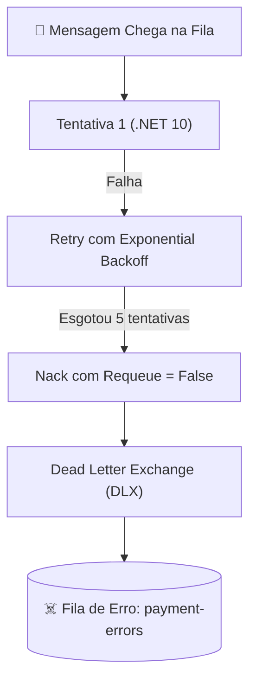

# 📨 RabbitMQ Avançado: Topologia, Exchanges, Filas e MassTransit no .NET 10

> "Mensagens não são enviadas diretamente para filas no RabbitMQ. O coração do RabbitMQ são os Exchanges e suas regras de roteamento. Compreender essa topologia é o que permite construir sistemas orientados a eventos flexíveis e desacoplados."

O **RabbitMQ** é o message broker open-source mais consolidado do mercado. Ele implementa o protocolo **AMQP 0-9-1**, oferecendo garantias robustas de persistência, roteamento inteligente e confirmação de entrega (*Acks/Nacks*).

---

## 🧭 Topologia Básica do AMQP no RabbitMQ

```mermaid
flowchart LR
    Prod["Produtor (.NET 10)"] -->|Publica mensagem com RoutingKey| Ex["Exchange"]
    
    Ex -->|Binding: orders.created| Q1["Fila: ordering-service"]
    Ex -->|Binding: orders.*| Q2["Fila: email-notifications"]
    Ex -->|Binding: # (tudo)| Q3["Fila: audit-lake"]

    Q1 --> Cons1["Consumidor: Ordering"]
    Q2 --> Cons2["Consumidor: Notifications"]
    Q3 --> Cons3["Consumidor: Data Lake"]
```

---

## 🔀 Os 4 Tipos Principais de Exchanges

| Tipo de Exchange | Mecânica de Roteamento | Cenário de Uso Típico |
| :--- | :--- | :--- |
| **Fanout (Broadcast)** | Roteia a mensagem para **todas as filas vinculadas**, ignorando completamente a routing key. | Notificações broadcast em tempo real (ex: "Sistema entrará em manutenção em 5 min"). |
| **Direct** | Entrega a mensagem para a fila cuja binding key seja **exatamente idêntica** à routing key da mensagem. | Comandos diretos de trabalho (ex: `process-payment`). |
| **Topic (Multicast Inteligente)** | Roteia com base em padrões de palavras separadas por pontos: `*` substitui uma palavra e `#` substitui zero ou mais palavras. | **O padrão mais comum em microsserviços**: eventos categorizados como `order.v1.created`, `order.v1.cancelled`. |
| **Headers** | Usa atributos do header HTTP/AMQP em vez da routing key. | Roteamento baseado em metadados complexos ou tipos MIME. |

---

## ⚡ Otimização Crítica: Prefetch Count e Concorrência

Por padrão, se não configurado, o RabbitMQ pode empurrar milhares de mensagens de uma vez para o consumidor (*Round-Robin ilimitado*).
- Se uma mensagem for demorada (ex: gerar PDF de nota fiscal em 3 segundos), o consumidor fica sobrecarregado com 5.000 mensagens presas na sua memória RAM local, enquanto outros consumidores vizinhos ficam ociosos de braços cruzados!

### A Regra do `PrefetchCount`:
O **`PrefetchCount`** define quantas mensagens o RabbitMQ pode entregar para a instância antes de receber um `ACK`:

```csharp
cfg.ReceiveEndpoint("payment-processing-queue", e =>
{
    // Define que cada pod só segura 16 mensagens não confirmadas simultâneas
    e.PrefetchCount = 16;
    
    // Concorrência máxima de processamento de threads
    e.ConcurrentMessageLimit = 8;
});
```

---

## 🔄 Retries Avançados com Dead Letter Exchange (DLX)

Quando uma mensagem falha repetidamente:
1. O MassTransit executa **Immediate Retries** (ex: 3 tentativas com jitter).
2. Se persistir o erro, a mensagem é movida para uma fila de espera temporária com TTL (*Delayed Retry*).
3. Se todas as tentativas falharem, o RabbitMQ encaminha a mensagem para o **Dead Letter Exchange (DLX)**, que a armazena na fila morta (`_error`) para auditoria humana.



---

## 💻 Configuração Profissional com MassTransit no .NET 10

```csharp
builder.Services.AddMassTransit(x =>
{
    x.AddConsumer<PaymentOrderConsumer>();

    x.UsingRabbitMq((context, cfg) =>
    {
        cfg.Host(builder.Configuration.GetConnectionString("RabbitMq"));

        // Configuração de Dead Letter e Retry
        cfg.UseMessageRetry(r =>
        {
            r.Incremental(
                retryLimit: 4, 
                initialInterval: TimeSpan.FromSeconds(1), 
                intervalIncrement: TimeSpan.FromSeconds(2));
        });

        // Configura automaticamente os endpoints com as convenções de Topic Exchange
        cfg.ConfigureEndpoints(context);
    });
});
```

---

## 🎙️ Perguntas de Entrevista Sênior

### 1. "Qual a diferença entre uma Exchange do tipo Direct e uma do tipo Topic no RabbitMQ?"
**Resposta Esperada**: *A Exchange Direct exige uma correspondência exata de igualdade entre a Routing Key da mensagem e a Binding Key da fila. A Exchange Topic permite roteamento baseado em padrões com curingas: o asterisco (`*`) substitui exatamente uma palavra e a cerquilha (`#`) substitui zero ou mais palavras (ex: um binding `orders.*.completed` captura `orders.brazil.completed`, e `orders.#` captura qualquer evento que comece com `orders`). Topic Exchanges são muito mais flexíveis para permitir que múltiplos microsserviços filtrem apenas os eventos de seu interesse sem reconfigurar produtores.*

### 2. "O que acontece se uma fila do RabbitMQ atingir milhões de mensagens represadas (Backlog gigante)?"
**Resposta Esperada**: *O RabbitMQ começa a mover as mensagens da memória RAM para o disco rígido (*Paging to disk*), o que derruba drasticamente a taxa de transferência (*throughput* de I/O). Além disso, pode acionar o mecanismo de alarme de memória (*Memory Alarm*), bloqueando temporariamente todos os produtores de enviar novas mensagens (*Connection Blocked*). Para mitigar isso, deve-se usar Quorum Queues (baseadas em Raft) ou Lazy Queues (que gravam direto em disco de forma otimizada), além de autoscaling dos consumidores via KEDA.*

---

## 🔗 Conexões do Grafo (Obsidian)
- [Comunicação Assíncrona e Eventos](../05-comunicacao-microsservicos/02-comunicacao-assincrona-eventos.md)
- [Outbox e Inbox Patterns](../05-comunicacao-microsservicos/03-outbox-inbox-patterns.md)
- [Sagas: Coreografia vs Orquestração](02-sagas-coreografia-vs-orquestracao.md)
- [Escalabilidade com KEDA](../10-escalabilidade/01-escalabilidade-horizontal-e-gargalos.md)
