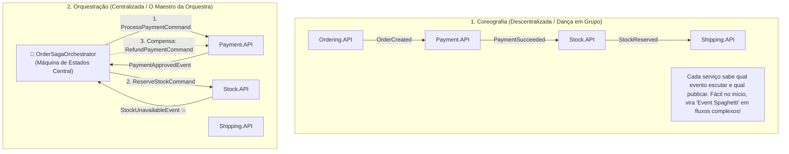

# 🎭 Sagas Distribuídas: Coreografia vs Orquestração e Transações Compensatórias

> "Em um monólito, se algo dá errado na terceira etapa do pedido, o banco de dados executa um ROLLBACK atômico. Em microsserviços, como você faz 'rollback' de um e-mail já enviado ou de um pagamento já debitado na operadora de cartão? A resposta é o padrão Saga e suas Transações de Compensação."

Uma **Saga** é uma sequência de transações locais onde cada transação atualiza dados em um único serviço e publica um evento. Se uma etapa intermediária falhar, a Saga executa uma série de **transações compensatórias** que desfazem os efeitos das etapas anteriores.

---

## 🧭 As Duas Abordagens de Saga: Coreografia vs Orquestração



### Comparativo Arquitetural:

| Critério | Coreografia (Choreography) | Orquestração (Orchestration) |
| :--- | :--- | :--- |
| **Complexidade Inicial** | Baixa (não exige orquestrador dedicado). | Média (exige definir uma máquina de estados). |
| **Visibilidade do Fluxo** | Difusa (o fluxo está espalhado em 5 repositórios). | **Cristalina** (todo o fluxo está documentado no orquestrador). |
| **Risco de Dependências Cíclicas** | Alto (serviços escutando eventos uns dos outros). | Praticamente nulo. |
| **Transações Compensatórias** | Difíceis de rastrear e coordenar. | **Extremamente simples e controladas**. |
| **Recomendação da Indústria** | Ideal para fluxos curtos (2 a 3 passos). | **Obrigatório para fluxos críticos de negócio (Checkout/Financeiro)**. |

---

## ↩️ Transações Compensatórias: Desfazendo sem Rollback Físico

Como você não pode simplesmente "desfazer" uma transação de banco já commitada no outro microsserviço, você executa uma **ação semântica reversa**:

| Ação de Ida (Transação) | Ação de Volta (Compensação) |
| :--- | :--- |
| `DebitCustomerAccount(R$ 200)` | `RefundCustomerAccount(R$ 200)` (Estorno) |
| `ReserveStockItem(1 unidade)` | `ReleaseStockItem(1 unidade)` (Devolução ao estoque) |
| `CreateDraftOrder()` | `MarkOrderAsCancelled("Estoque indisponível")` |

---

## 💻 Implementando uma Saga Orquestrada com MassTransit no .NET 10

O **MassTransit** oferece suporte nativo de altíssima performance para máquinas de estado de Sagas (`MassTransitStateMachine`):

### 1. O Estado Persistido da Saga:

```csharp
namespace EShop.Ordering.Sagas;

using MassTransit;

public sealed class OrderStateData : SagaStateMachineInstance
{
    public Guid CorrelationId { get; set; } // O OrderId
    public string CurrentState { get; set; } = string.Empty;
    public Guid CustomerId { get; set; }
    public decimal TotalAmount { get; set; }
    public DateTime CreatedAtUtc { get; set; }
}
```

### 2. A Máquina de Estados da Saga (`OrderStateMachine.cs`):

```csharp
namespace EShop.Ordering.Sagas;

using EShop.Contracts.Events;
using MassTransit;

public sealed class OrderStateMachine : MassTransitStateMachine<OrderStateData>
{
    // Estados possíveis
    public State AwaitingPayment { get; private set; } = null!;
    public State Completed { get; private set; } = null!;
    public State Cancelled { get; private set; } = null!;

    // Eventos que a Saga escuta
    public Event<OrderSubmittedIntegrationEvent> OrderSubmitted { get; private set; } = null!;
    public Event<PaymentAuthorizedIntegrationEvent> PaymentAuthorized { get; private set; } = null!;
    public Event<PaymentFailedIntegrationEvent> PaymentFailed { get; private set; } = null!;

    public OrderStateMachine()
    {
        InstanceState(x => x.CurrentState);

        // Correlaciona mensagens recebidas com o CorrelationId da instância
        Event(() => OrderSubmitted, x => x.CorrelateById(m => m.Message.OrderId));
        Event(() => PaymentAuthorized, x => x.CorrelateById(m => m.Message.OrderId));
        Event(() => PaymentFailed, x => x.CorrelateById(m => m.Message.OrderId));

        // 1. Início do Fluxo
        Initially(
            When(OrderSubmitted)
                .Then(context =>
                {
                    context.Saga.CustomerId = context.Message.CustomerId;
                    context.Saga.TotalAmount = context.Message.TotalAmount;
                    context.Saga.CreatedAtUtc = DateTime.UtcNow;
                })
                .Publish(context => new AuthorizePaymentCommand(context.Saga.CorrelationId, context.Saga.TotalAmount))
                .TransitionTo(AwaitingPayment)
        );

        // 2. Pagamento Aprovado -> Finaliza com sucesso
        During(AwaitingPayment,
            When(PaymentAuthorized)
                .Publish(context => new ShipOrderCommand(context.Saga.CorrelationId))
                .TransitionTo(Completed),

            // 3. Pagamento Falhou -> Executa a Compensação!
            When(PaymentFailed)
                .Publish(context => new CancelOrderCommand(context.Saga.CorrelationId, context.Message.Reason))
                .TransitionTo(Cancelled)
        );
    }
}
```

---

## 🎙️ Perguntas de Entrevista Sênior

### 1. "Qual a diferença entre uma transação ACID tradicional e uma Saga com Transações Compensatórias?"
**Resposta Esperada**: *Transações ACID oferecem a garantia de Isolamento (I), ou seja, alterações parciais ficam invisíveis para outros usuários até o commit final. Em uma Saga, cada etapa commita sua alteração de forma independente em seu próprio banco local; portanto, **o isolamento é perdido** e outros serviços podem enxergar o estado intermediário do sistema (ex: o cliente vê o pedido como 'Aguardando Pagamento'). Se a etapa seguinte falhar, a Saga não faz um rollback no nível do motor SQL, mas executa uma nova transação explícita de compensação (ex: estorno financeiro).*

### 2. "Quando a Coreografia de eventos deixa de ser vantajosa e a Orquestração passa a ser indispensável?"
**Resposta Esperada**: *A Coreografia funciona bem para fluxos simples e lineares com 2 ou 3 participantes. No entanto, à medida que o número de serviços cresce para 4 ou mais, a Coreografia vira o antipadrão 'Event Spaghetti': nenhum desenvolvedor consegue entender o fluxo completo sem abrir 6 repositórios diferentes, detectar falhas no meio do caminho se torna complexo e evitar loops infinitos de eventos é quase impossível. A Orquestração centraliza a lógica do fluxo, os tempos de timeout e as compensações em uma única máquina de estados visível e testável.*

---

## 🔗 Conexões do Grafo (Obsidian)
- [RabbitMQ Avançado e Filas](01-rabbitmq-avancado.md)
- [Consistência Eventual e Idempotência](../05-comunicacao-microsservicos/04-consistencia-eventual-e-idempotencia.md)
- [Outbox Pattern e Transações](../05-comunicacao-microsservicos/03-outbox-inbox-patterns.md)
- [Transações Distribuídas e Teorema CAP](../18-arquitetura-distribuida/01-teorema-cap-e-falhas-rede.md)
