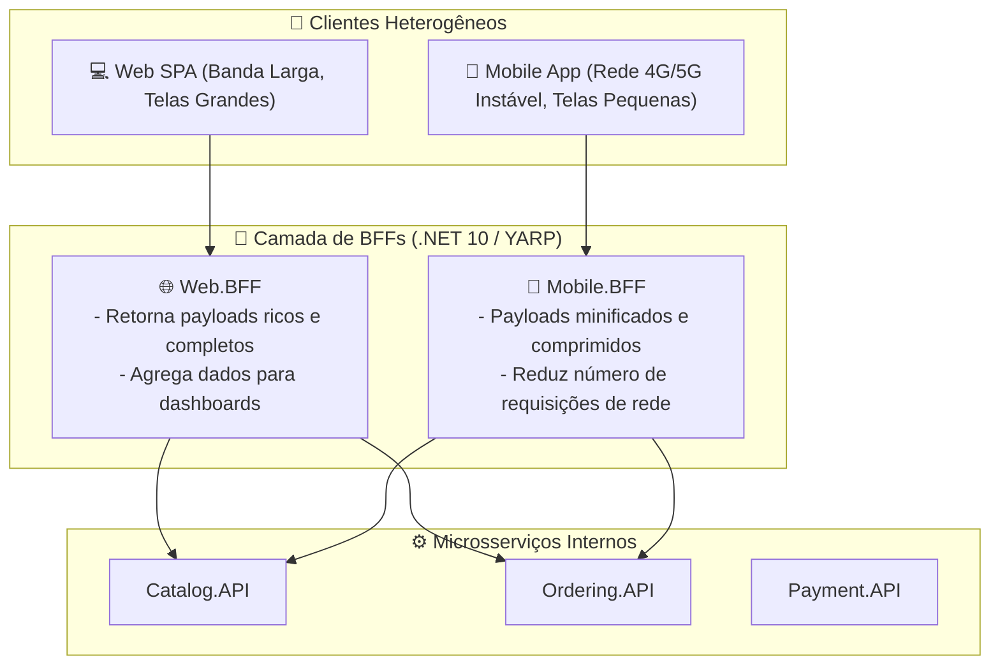

# 🔀 API Gateway com YARP e o Padrão BFF (Backend for Frontend) no .NET 10

> "Expor dezenas de microsserviços diretamente para clientes da internet (Mobile e SPA) é um convite ao caos: obriga os clientes a fazerem dezenas de chamadas lentas pela rede celular, expõe a topologia interna de rede e espalha regras de segurança."

O **API Gateway** atua como a porta de entrada única do ecossistema. No .NET 10, o **YARP (Yet Another Reverse Proxy)** — mantido pela Microsoft — é o proxy reverso de altíssimo desempenho padrão da indústria.

---

## 🧭 O Padrão BFF (Backend for Frontend)

Em vez de um único API Gateway genérico e monolítico para todos os tipos de cliente, o padrão **BFF** cria gateways especializados para cada experiência de usuário:



---

## ⚡ YARP: O Proxy Reverso Oficial da Microsoft no .NET 10

O YARP é construído sobre as mesmas abstrações de alta performance do Kestrel e `SocketsHttpHandler`, processando centenas de milhares de requisições por segundo com alocação mínima de memória.

### Configuração no `appsettings.json`:

```json
{
  "ReverseProxy": {
    "Routes": {
      "catalog-route": {
        "ClusterId": "catalog-cluster",
        "Match": {
          "Path": "/catalog-api/{**catch-all}"
        },
        "Transforms": [
          { "PathPattern": "{**catch-all}" } // Remove o prefixo '/catalog-api/' antes de enviar
        ],
        "RateLimiterPolicy": "fixed-gateway-policy"
      },
      "ordering-route": {
        "ClusterId": "ordering-cluster",
        "AuthorizationPolicy": "RequireAuthenticatedUser", // Valida JWT na borda!
        "Match": {
          "Path": "/ordering-api/{**catch-all}"
        },
        "Transforms": [
          { "PathPattern": "{**catch-all}" }
        ]
      }
    },
    "Clusters": {
      "catalog-cluster": {
        "Destinations": {
          "catalog-node-1": {
            "Address": "http://catalog-api:8080"
          }
        }
      },
      "ordering-cluster": {
        "Destinations": {
          "ordering-node-1": {
            "Address": "http://ordering-api:8080"
          }
        }
      }
    }
  }
}
```

### Inicialização no `Program.cs` (.NET 10):

```csharp
var builder = WebApplication.CreateBuilder(args);

// Configuração de Autenticação JWT no Gateway
builder.Services.AddAuthentication()
    .AddJwtBearer("Bearer", options => { /* Validação do token */ });

builder.Services.AddAuthorizationBuilder()
    .AddPolicy("RequireAuthenticatedUser", p => p.RequireAuthenticatedUser());

// Registra o YARP lendo a configuração do appsettings
builder.Services.AddReverseProxy()
    .LoadFromConfig(builder.Configuration.GetSection("ReverseProxy"));

var app = builder.Build();

app.UseAuthentication();
app.UseAuthorization();

// Ativa o roteamento reverso do YARP
app.MapReverseProxy();

app.Run();
```

---

## 🧩 Agregação de Respostas no BFF (Scatter-Gather)

Para carregar a tela inicial do aplicativo mobile, o app precisaria fazer 3 requisições separadas via rede móvel:
1. `GET /catalog/products`
2. `GET /orders/recent`
3. `GET /notifications/unread`

No BFF, consolidamos isso em **um único endpoint agregado**, buscando os dados dos microsserviços internos em **paralelo na rede local de baixa latência**:

```csharp
app.MapGet("/api/mobile/home-summary", async (
    Guid customerId,
    CatalogServiceClient catalogClient,
    OrderingServiceClient orderingClient,
    CancellationToken ct) =>
{
    // Executa as consultas internas em paralelo na rede interna
    var productsTask = catalogClient.GetFeaturedProductsAsync(ct);
    var recentOrdersTask = orderingClient.GetRecentOrdersByCustomerAsync(customerId, ct);

    await Task.WhenAll(productsTask, recentOrdersTask);

    // Retorna um payload consolidado sob medida para o Mobile
    return Results.Ok(new MobileHomeSummaryResponse(
        FeaturedProducts: await productsTask,
        RecentOrders: await recentOrdersTask
    ));
});
```

---

## 🎙️ Perguntas de Entrevista Sênior

### 1. "Por que autenticar e validar o token JWT na borda (no API Gateway / BFF) em vez de deixar cada microsserviço validar isoladamente?"
**Resposta Esperada**: *Centralizar a validação na borda impede que requisições maliciosas ou com tokens expirados cheguem à rede interna, economizando banda e processamento de CPU dos microsserviços. Além disso, o Gateway pode decodificar as claims principais (como `UserId` e `Roles`) e propagá-las como headers HTTP limpos (`X-User-Id`, `X-User-Role`) para os serviços internos, simplificando os microsserviços que não precisam depender de bibliotecas de validação criptográfica de chaves de assinatura.*

### 2. "Qual o risco de colocar regras de negócio complexas dentro da camada de API Gateway / BFF?"
**Resposta Esperada**: *Violar o princípio da responsabilidade única e transformar o Gateway em um **Monólito de Borda (Gateway Monolith)**. O papel do Gateway/BFF deve se restringir a roteamento, rate limiting, transformação de headers, agregação simples de respostas (Scatter-Gather) e autenticação de borda. Se regras de negócio e validações de domínio forem colocadas no BFF, o código fica duplicado entre múltiplos BFFs e as equipes perdem a autonomia sobre suas regras.*

---

## 🔗 Conexões do Grafo (Obsidian)
- [Fundamentos de REST e HTTP](../04-apis-e-http/01-fundamentos-rest-e-http.md)
- [Pipeline HTTP e Rate Limiting](../04-apis-e-http/04-middlewares-e-filtros.md)
- [Autenticação JWT e Segurança](../07-seguranca/01-autenticacao-jwt-e-identity.md)
- [Observabilidade e Distributed Tracing](../08-observabilidade/02-opentelemetry-tracing-e-metricas.md)
