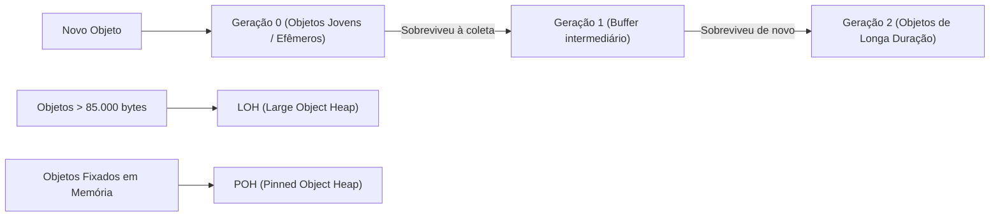

# ⚡ Performance Extrema, Profiling e Otimizações de Memória no .NET 10

> "A otimização prematura é a raiz de todo o mal na computação. Mas ignorar a alocação de memória e a arquitetura do Garbage Collector em sistemas de altíssimo throughput é a garantia de que seu sistema entrará em colapso." — Donald Knuth (adaptado)

O runtime do **.NET 10** é um dos mais velozes do planeta. No entanto, para atingir centenas de milhares de requisições por segundo com baixa latência (P99 < 10ms), precisamos dominar **zero-allocation programming**, **`Span<T>`**, **`ArrayPool<T>`** e **`BenchmarkDotNet`**.

---

## 🔬 Medição Rigorosa com BenchmarkDotNet

Nunca otimize código com base em intuição ou `Stopwatch` ingênuo. O **BenchmarkDotNet** executa o código sob isolamento rigoroso, realizando warmup do JIT e medindo alocações na Heap:

```csharp
using BenchmarkDotNet.Attributes;
using BenchmarkDotNet.Running;

[MemoryDiagnoser] // 🚀 Mede bytes alocados na memória gerenciada!
public class ParsingBenchmarks
{
    private const string Payload = "ORDER-2026-09-11-CUSTOMER-998822";

    [Benchmark(Baseline = true)]
    public string SubstringTraditional()
    {
        // Aloca novas strings desnecessárias na Heap a cada chamada
        var parts = Payload.Split('-');
        return parts[4];
    }

    [Benchmark]
    public ReadOnlySpan<char> SpanZeroAllocation()
    {
        // 🚀 ZERO Alocações: opera diretamente sobre a memória existente (ponteiro + tamanho)
        var span = Payload.AsSpan();
        var index = span.LastIndexOf('-');
        return span.Slice(index + 1);
    }
}
```

### Resultados Típicos do Benchmark:

| Método | Média (Tempo) | Alocação de Memória |
| :--- | :--- | :--- |
| **SubstringTraditional (Split)** | 48.2 ns | **160 B** |
| **SpanZeroAllocation (`ReadOnlySpan<char>`)** | **1.8 ns (26x mais rápido!)** | **0 B (Zero Alocação)** |

---

## 🧠 A Anatomia do Garbage Collector (GC) no .NET 10

O Garbage Collector gerencia a Heap através de gerações baseadas na hipótese de que a maioria dos objetos morre jovem:



- **Gen 0 / Gen 1**: Coletas ultrarrápidas em microssegundos; não impactam a aplicação.
- **Gen 2 (Full GC)**: Escaneia toda a memória da aplicação. Se sua API alocar muitos objetos que sobrevivem temporariamente, a Gen 2 disparará pausas perceptíveis nos tempos de resposta (*Jitter de latência*).
- **LOH (Large Object Heap)**: Objetos com mais de 85 KB (ex: grandes buffers de download ou imagens) vão direto para o LOH. O LOH não é compactado por padrão, gerando fragmentação de memória.

---

## 🛠️ Ferramentas de Alta Performance no C# Moderno

### 1. `ArrayPool<T>.Shared`: Reutilizando Buffers de Memória
Em vez de instanciar `new byte[65536]` a cada leitura de upload ou mensagem de fila, alugue do pool:

```csharp
public async Task ProcessDataStreamAsync(Stream inputStream, CancellationToken ct)
{
    // Aluga um buffer do pool compartilhado em vez de alocar na Heap
    var buffer = ArrayPool<byte>.Shared.Rent(4096);
    try
    {
        int bytesRead;
        while ((bytesRead = await inputStream.ReadAsync(buffer.AsMemory(0, 4096), ct)) > 0)
        {
            // Processa os dados
        }
    }
    finally
    {
        // ⚠️ Obrigatório devolver o buffer ao pool!
        ArrayPool<byte>.Shared.Return(buffer);
    }
}
```

### 2. `ValueTask<T>` vs `Task<T>`: Quando Usar?
- **`Task<T>`**: É uma classe (alocada na Heap). Se um método assíncrono retorna quase sempre de forma síncrona (ex: um valor já em cache), instanciar uma `Task` gera alocação inútil.
- **`ValueTask<T>`**: É uma `struct` (alocada na stack). Se o resultado estiver disponível de imediato (em cache), **alocação é ZERO**!

```csharp
public ValueTask<ProductResponse?> GetProductAsync(Guid id, CancellationToken ct)
{
    // Caminho quente (Hot-Path): Se estiver no cache local, retorna SEM alocação de Task!
    if (_memoryCache.TryGetValue(id, out ProductResponse? cached))
    {
        return ValueTask.FromResult(cached);
    }

    // Caminho frio: Executa I/O assíncrono real do banco
    return new ValueTask<ProductResponse?>(FetchFromDatabaseAsync(id, ct));
}
```

---

## 🎙️ Perguntas de Entrevista Sênior

### 1. "O que é `Span<T>` e por que ele só pode existir na Stack (ref struct)?"
**Resposta Esperada**: *`Span<T>` é uma representação contígua de memória arbitrária (memória gerenciada da Heap, memória da Stack com `stackalloc` ou memória não-gerenciada nativa). Ele é declarado como uma `ref struct`, o que significa que o compilador proíbe rigorosamente que ele seja colocado na Heap (não pode ser campo de uma classe comum, não pode ser capturado em lambdas nem usado em métodos com `async/await`). Essa restrição garante que ele nunca cause alocações de GC e opere com a velocidade máxima de ponteiros de memória em baixo nível sem riscos de memory safety.*

### 2. "Por que você NÃO deve usar `ValueTask<T>` em todos os métodos assíncronos da aplicação?"
**Resposta Esperada**: *Porque `ValueTask<T>` é uma struct maior que uma referência de `Task` (ocupa 16 a 24 bytes vs 8 bytes de ponteiro) e possui restrições severas de uso: uma `ValueTask` **nunca pode sofrer múltiplos awaits** e **não pode ser consumida com `Task.WhenAll()`** sem conversão via `.AsTask()`. Se a operação for sempre assíncrona com I/O real (como 90% das queries de banco e chamadas HTTP), o custo de cópia da struct anula os benefícios. O `ValueTask` deve ser reservado para **caminhos quentes (Hot-Paths)** onde o resultado frequentemente já está disponível de forma síncrona (como buffers ou caches).*

---

## 🔗 Conexões do Grafo (Obsidian)
- [Cache Distribuído e HybridCache](../03-dados-persistencia/04-cache-distribuido-redis-e-hybridcache.md)
- [Performance de Queries no EF Core](../03-dados-persistencia/03-performance-e-otimizacao-queries.md)
- [Async/Await e Internals no C#](../16-csharp-dotnet-entrevistas/01-async-await-cancellation-token.md)
- [Garbage Collector e Recursos](../16-csharp-dotnet-entrevistas/02-memory-e-recursos.md)
