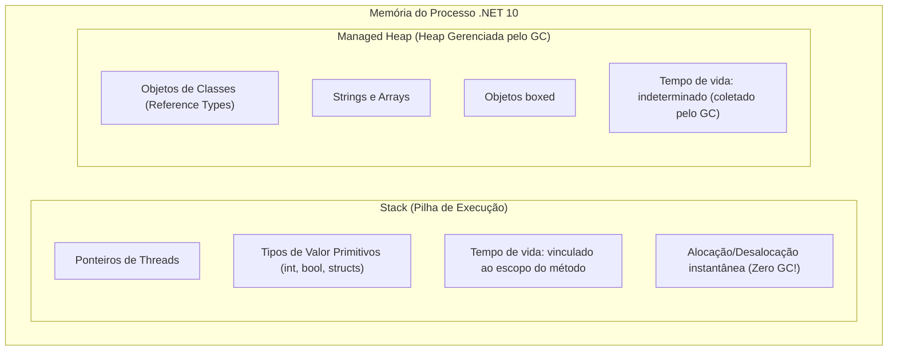

# 🧠 Gestão de Memória, Boxing/Unboxing, IAsyncDisposable e BackgroundServices

> "Entender onde os bytes residem (Stack ou Heap) e como liberar recursos não-gerenciados de forma assíncrona é a fronteira entre quem apenas escreve código e quem realmente entende o runtime do .NET."

Neste módulo técnico, dissecamos como a BCL do **.NET 10** gerencia a memória, o impacto silencioso de *Boxing*, o descarte assíncrono moderno com **`IAsyncDisposable`** e a implementação sem vazamentos de memória de **`BackgroundService`**.

---

## 🧭 Stack vs Heap e Value Types vs Reference Types



---

## 📦 Boxing e Unboxing: O Assassino Oculto de Performance

- **Boxing**: O ato de converter um tipo de valor (Value Type, ex: `int`, `DateTime`, `struct`) para o tipo `object` ou uma interface. O runtime aloca um novo objeto na **Heap**, copia o valor da Stack para dentro dele e retorna um ponteiro.
- **Unboxing**: O processo inverso, extraindo o valor da Heap de volta para a Stack.

```csharp
int numero = 42; // Stack puro

// ❌ BOXING SILENCIOSO: Aloca memória na Heap desnecessariamente!
object obj = numero; 
string texto = string.Format("O valor é: {0}", numero); // Em C# antigo, causava boxing!

// ✅ ZERO BOXING: Tipos genéricos evitam boxing completamente
List<int> lista = [1, 2, 3]; // Não aloca objetos individuais!
```

---

## 🧹 O Padrão `IDisposable` vs `IAsyncDisposable` no .NET 10

Quando uma classe segura recursos de I/O não gerenciados (conexões de banco, streams de rede, arquivos em disco, pipes de mensageria), fechá-los de forma síncrona bloqueia threads.
O **`IAsyncDisposable`** permite que o descarte seja 100% não-bloqueante via **`await using`**:

```csharp
namespace EShop.Infrastructure.Storage;

public sealed class AsyncFileReader : IAsyncDisposable
{
    private FileStream? _fileStream;

    public async Task OpenAsync(string path)
    {
        _fileStream = new FileStream(path, FileMode.Open, FileAccess.Read, FileShare.Read, 4096, useAsync: true);
    }

    // 🚀 Descarte assíncrono: não bloqueia threads ao fazer o flush de buffers no disco!
    public async ValueTask DisposeAsync()
    {
        if (_fileStream is not null)
        {
            await _fileStream.DisposeAsync();
            _fileStream = null;
        }

        // Suprime a finalização pelo Garbage Collector
        GC.SuppressFinalize(this);
    }
}
```

### Consumo Limpo com `await using`:

```csharp
await using (var reader = new AsyncFileReader())
{
    await reader.OpenAsync("/data/orders.csv");
    // Processa o arquivo
} // O compilador chama DisposeAsync() automaticamente no fechamento do bloco!
```

---

## ⚙️ `BackgroundService` Profissional e Resolução de Escopos

O `BackgroundService` do .NET 10 é registrado como **Singleton**. Como vimos no [Capítulo 1](../01-fundamentos-arquitetura/02-injecao-dependencia-e-ioc.md), injetar serviços Scoped (como `DbContext`) diretamente nele gera **Captive Dependency** e **Memory Leak**.

### O Padrão Correto com `IServiceScopeFactory`:

```csharp
namespace EShop.Ordering.Workers;

public sealed class ExpiredOrdersCleanupWorker(
    IServiceScopeFactory scopeFactory, 
    ILogger<ExpiredOrdersCleanupWorker> logger) 
    : BackgroundService
{
    protected override async Task ExecuteAsync(CancellationToken stoppingToken)
    {
        logger.LogInformation("Worker de limpeza de pedidos iniciado.");

        // PeriodicTimer do .NET 10: muito superior a Task.Delay() e Threading.Timer
        using var timer = new PeriodicTimer(TimeSpan.FromMinutes(10));

        while (!stoppingToken.IsCancellationRequested && await timer.WaitForNextTickAsync(stoppingToken))
        {
            try
            {
                // 1. Cria um escopo isolado sob demanda
                await using var scope = scopeFactory.CreateAsyncScope();
                
                // 2. Resolve o DbContext com ciclo de vida Scoped saudável
                var dbContext = scope.ServiceProvider.GetRequiredService<OrderingDbContext>();

                var expiredTime = DateTime.UtcNow.AddHours(-24);
                var expiredOrders = await dbContext.Orders
                    .Where(o => o.Status == OrderStatus.PendingPayment && o.CreatedAtUtc < expiredTime)
                    .ToListAsync(stoppingToken);

                foreach (var order in expiredOrders)
                {
                    order.Cancel("Cancelado automaticamente por expiração de tempo.");
                }

                await dbContext.SaveChangesAsync(stoppingToken);
                logger.LogInformation("Cancelados {Count} pedidos expirados.", expiredOrders.Count);
            }
            catch (Exception ex) when (ex is not OperationCanceledException)
            {
                logger.LogError(ex, "Erro ao processar limpeza de pedidos expirados.");
            }
        }
    }
}
```

---

## 🎙️ Perguntas de Entrevista Sênior

### 1. "O que é Boxing e qual seu impacto na performance de um loop com 1 milhão de iterações?"
**Resposta Esperada**: *Boxing é o processo de empacotar um tipo de valor dentro de uma instância de objeto na Heap gerenciada. Em um loop de 1 milhão de iterações, converter números para `object` (por exemplo, adicionando a um `ArrayList` não genérico ou invocando métodos com parâmetros `object`) alocará 1.000.000 de objetos distintos na Heap (cerca de 24 a 32 MB de memória desperdiçada). Isso forçará coletas contínuas de Geração 0 e 1 do Garbage Collector, causando picos de CPU, congelamentos parciais de threads e degradação brutal do tempo de resposta da aplicação.*

### 2. "Por que devemos chamar `GC.SuppressFinalize(this)` dentro do método `Dispose()`?"
**Resposta Esperada**: *Para informar ao Garbage Collector que o objeto já liberou seus recursos não-gerenciados manualmente e, portanto, **não precisa ser adicionado à Fila de Finalização (Finalization Queue)**. Objetos que possuem finalizadores (`~Classe()`) e não chamam `SuppressFinalize` sobrevivem à coleta inicial de Geração 0, sendo promovidos para a Geração 1 ou 2 até que a thread de finalização (`Finalizer Thread`) rode, aumentando a pressão sobre a memória e atrasando a liberação dos recursos.*

---

## 🔗 Conexões do Grafo (Obsidian)
- [Injeção de Dependência e Captive Dependencies](../01-fundamentos-arquitetura/02-injecao-dependencia-e-ioc.md)
- [Mecânica Interna do Async/Await](01-async-await-cancellation-token.md)
- [Perguntas Quentes de Entrevista Sênior](03-perguntas-entrevistas-senior.md)
- [Garbage Collector e Profiling](../15-performance/01-profiling-e-otimizacoes-dotnet.md)
