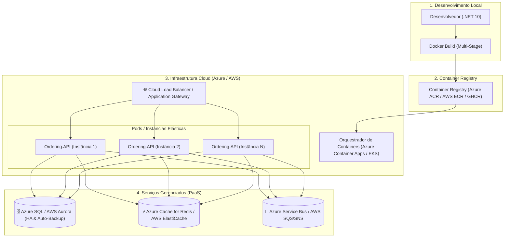

# ☁️ Fundamentos de Cloud, Serviços Gerenciados e Design Patterns de Nuvem

> "Não precisamos nos tornar especialistas certificados em três nuvens diferentes ao mesmo tempo. Mas precisamos entender a mecânica universal de como uma aplicação containerizada em .NET 10 chega à nuvem, escala sob demanda e consome serviços gerenciados com segurança e baixo custo."

Quer você implante no **Microsoft Azure**, na **AWS (Amazon Web Services)** ou na **Google Cloud (GCP)**, os conceitos fundamentais de computação elástica, balanceamento de carga e persistência gerenciada seguem os mesmos pilares arquiteturais.

---

## 🧭 O Cenário de Produção: Do Código Local às Múltiplas Instâncias

---

## ⚖️ Comparativo de Nomenclaturas: Azure vs AWS

| Capacidade Arquitetural | No Microsoft Azure | Na Amazon Web Services (AWS) |
| :--- | :--- | :--- |
| **Orquestração de Containers Serverless** | **Azure Container Apps (ACA)** | **AWS Fargate / ECS** |
| **Kubernetes Gerenciado Completo** | **AKS (Azure Kubernetes Service)** | **EKS (Elastic Kubernetes Service)** |
| **Registro de Imagens Docker** | **Azure Container Registry (ACR)** | **Amazon ECR** |
| **Banco de Dados Relacional Gerenciado** | **Azure SQL Database** | **Amazon RDS / Aurora Serverless** |
| **Cache Distribuído Gerenciado** | **Azure Cache for Redis** | **Amazon ElastiCache** |
| **Message Broker Corporativo** | **Azure Service Bus** | **Amazon SQS / SNS / EventBridge** |
| **Gestão de Segredos e Chaves** | **Azure Key Vault** | **AWS Secrets Manager / KMS** |

---

## 🏛️ Design Patterns Essenciais para a Nuvem

### 1. External Configuration Store Pattern
Em nuvem, configurações nunca ficam dentro do container. Utilizamos o **Azure App Configuration** ou **AWS Systems Manager Parameter Store**:
- As alterações de parâmetros refletem em tempo real em todas as 50 instâncias sem exigir rebuild da imagem nem restart dos pods.

### 2. Valet Key Pattern
Em vez de sobrecarregar a API intermediando o upload de arquivos gigantescos (como fotos de produtos ou PDFs):
- O cliente solicita uma **URL pré-assinada (SAS Token no Azure Blob ou Pre-Signed URL no AWS S3)** com validade de 5 minutos.
- O cliente faz o upload direto para o Storage da nuvem, economizando banda e CPU da API!

### 3. Sidecar Pattern
Anexar um processo auxiliar ao mesmo pod do container da aplicação (muito usado por ferramentas de observabilidade como Datadog Agent, OTel Collector ou proxies Envoy de Service Mesh).

---

## 🎙️ Perguntas de Entrevista Sênior

### 1. "Por que escolher Azure Container Apps (ACA) ou AWS Fargate em vez de subir um cluster Kubernetes (AKS/EKS) tradicional para uma empresa de médio porte?"
**Resposta Esperada**: *Pela redução radical de complexidade operacional (*Day-2 Operations*). Um cluster Kubernetes puro (AKS/EKS) exige engenheiros dedicados para gerenciar atualizações de nós (*Node Pool Upgrades*), ingress controllers, cert-managers, dimensionamento de control plane e segurança de rede. O Azure Container Apps e o AWS Fargate são soluções serverless baseadas em containers que fornecem autoscaling elástico até zero (scale-to-zero), KEDA nativo e HTTPS automático sem que a equipe precise operar servidores ou clusters.*

### 2. "Qual a diferença entre usar bancos de dados em containers (ex: SQL Server em pod) versus usar serviços gerenciados de banco (Azure SQL / AWS Aurora) em produção?"
**Resposta Esperada**: *Rodar bancos de dados stateful em containers no Kubernetes exige gerenciar Persistent Volumes de alta performance, replicação mútua, failover manual, estratégias de disaster recovery e patches de segurança do sistema operacional. Serviços gerenciados (Azure SQL / Aurora) fornecem Alta Disponibilidade nativa de 99.99% com failover automático em segundos, backups contínuos com Point-in-Time Restore, réplicas de leitura automáticas e criptografia transparente em repouso com zero sobrecarga para a equipe de desenvolvimento.*

---

## 🔗 Conexões do Grafo (Obsidian)
- [Docker e Containers](../09-containerizacao/01-docker-e-docker-compose.md)
- [Pipelines de CI/CD](../11-cicd-devops/01-pipelines-ci-cd-e-deploy.md)
- [Escalabilidade Horizontal e KEDA](../10-escalabilidade/01-escalabilidade-horizontal-e-gargalos.md)
- [Arquitetura Distribuída e Teorema CAP](../18-arquitetura-distribuida/01-teorema-cap-e-falhas-rede.md)
