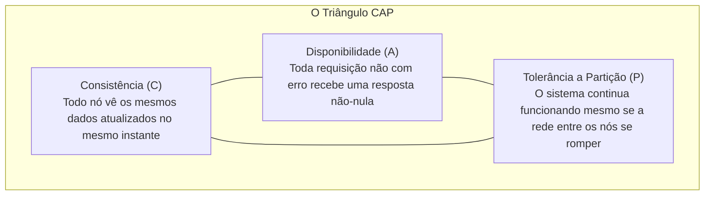

# 🏗️ Teorema CAP, PACELC e as 8 Falácias da Computação Distribuída

> "A rede não é confiável, a latência não é zero e a largura de banda não é infinita. Tratar chamadas remotas através da rede como se fossem chamadas locais de métodos C# na memória é a causa primária de desastres em microsserviços." — L. Peter Deutsch (As 8 Falácias)

Ao cruzar a fronteira de um único processo para um sistema distribuído, as leis da física entram em ação: cabos de rede rompem, switches sofrem jitter e máquinas virtuais sofrem pausas por Garbage Collector.

---

## 🚫 As 8 Falácias da Computação Distribuída

Todo arquiteto sênior deve ter essas 8 premissas falsas gravadas na mente:

1. **A rede é confiável**: Conexões caem a todo momento.
2. **A latência é zero**: Uma chamada em memória leva 10 nanossegundos; uma chamada de rede local leva 1 a 5 milissegundos (500.000 vezes mais lenta!).
3. **A largura de banda é infinita**: Trafegar payloads JSON gigantescos satura a placa de rede.
4. **A rede é segura**: Qualquer tráfego não criptografado pode ser interceptado.
5. **A topologia da rede não muda**: Containers morrem e novos sobem com IPs diferentes a cada minuto.
6. **Existe apenas um administrador**: Múltiplos times e nuvens alteram configurações de firewall concorrentemente.
7. **O custo de transporte é zero**: Serializar, desserializar e criptografar gasta ciclos preciosos de CPU.
8. **A rede é homogênea**: Roteadores, switches e firewalls possuem comportamentos e buffers distintos.

---

## 🔺 O Teorema CAP (Eric Brewer)

Em qualquer sistema de armazenamento de dados distribuído, você só pode escolher **2 de 3 propriedades**:

> [!IMPORTANT]
> **A Regra Inegociável da Nuvem:**
> Em redes do mundo real, a **Partição de Rede (P)** é inevitável (cabos quebram, pacotes se perdem). Portanto, a escolha real nunca é "C vs A vs P", mas sim:
> **Quando ocorrer uma partição de rede, você escolhe Consistência (CP) ou Disponibilidade (AP)?**

### 1. Sistemas CP (Consistência + Tolerância a Partição):
- Se o nó A não conseguir falar com o nó B para confirmar a replicação, **ele rejeita a operação com erro**.
- *Exemplo*: SQL Server AlwaysOn síncrono, etcd, Consul. Priorizam a verdade dos dados sobre a disponibilidade.

### 2. Sistemas AP (Disponibilidade + Tolerância a Partição):
- Ambos os nós continuam aceitando gravações e leituras, mesmo desconectados um do outro, e sincronizam as diferenças mais tarde (*Consistência Eventual*).
- *Exemplo*: Amazon DynamoDB, Apache Cassandra, Cosmos DB com replicação multi-região.

---

## 📐 O Teorema PACELC (Extensão Moderna do CAP)

O Teorema CAP só fala o que acontece durante uma falha de partição. O **PACELC** descreve o sistema o tempo todo:

$$\text{Se houver Partição (P): escolha entre Disponibilidade (A) ou Consistência (C);}$$
$$\text{Else (E) - em operação normal: escolha entre Latência (L) ou Consistência (C).}$$

Mesmo quando a rede está 100% perfeita, **se você quiser Consistência absoluta (C), terá que pagar com Latência mais alta (L)**, pois precisará esperar a confirmação síncrona de múltiplos nós antes de responder ao cliente!

---

## 🎙️ Perguntas de Entrevista Sênior

### 1. "Por que dizer que um sistema é 'CA' (Consistente e Disponível) é uma contradição em sistemas distribuídos modernos?"
**Resposta Esperada**: *Porque declarar um sistema como 'CA' significa dizer que ele não tolera falhas de partição de rede (P). No entanto, falhas de rede em sistemas distribuídos não são opcionais; elas ocorrem inevitavelmente devido a instabilidades de infraestrutura, quedas de switches ou delays de roteamento na nuvem. Se uma partição ocorrer em um sistema hipotético 'CA', ele será forçado a escolher entre parar de responder (perdendo A) ou responder com dados desatualizados (perdendo C). Portanto, na nuvem, a partição é uma premissa, e a escolha real é estritamente entre CP e AP.*

### 2. "Como a latência de rede impacta a consistência de dados sob a ótica do Teorema PACELC?"
**Resposta Esperada**: *O PACELC demonstra que mesmo em condições normais sem partições de rede (*Else*), existe um trade-off permanente entre Latência (L) e Consistência (C). Se o sistema exige consistência estrita (*Strong Consistency*), cada escrita precisa esperar o round-trip de rede para ser confirmada pela maioria dos nós do cluster (*Quorum Write*), aumentando a latência percebida pelo usuário final. Se o negócio priorizar baixa latência (ex: redes sociais ou carrinhos de compras), deve-se aceitar consistência eventual (*Eventual Consistency*), respondendo imediatamente após a gravação no nó local.*

---

## 🔗 Conexões do Grafo (Obsidian)
- [Transações Distribuídas e Locks](02-transacoes-distribuidas-e-locks.md)
- [Consistência Eventual e Idempotência](../05-comunicacao-microsservicos/04-consistencia-eventual-e-idempotencia.md)
- [Padrões de Resiliência](../06-resiliencia/01-padroes-resiliencia-retry-circuit-breaker.md)
- [Decisões Arquiteturais e Trade-offs](../19-arquitetura-decisoes/01-adrs-e-tradeoffs.md)
