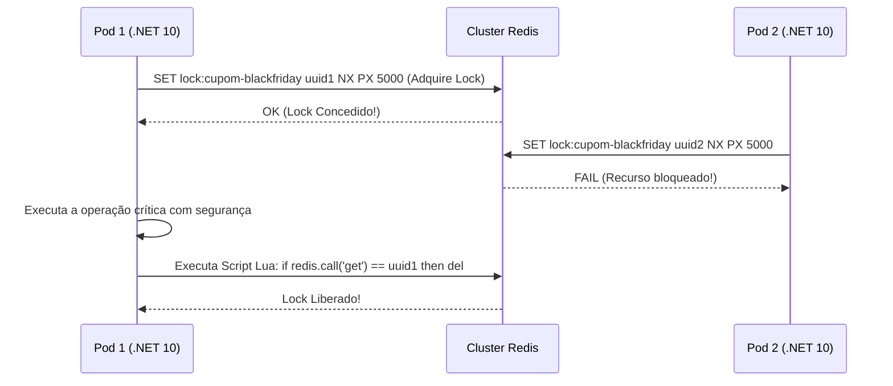

# 🔒 Locks Distribuídos com Redis (RedLock) e Transações Distribuídas no .NET 10

> "Usar `lock(_obj)` em C# funciona brilhantemente dentro de um único processo. Mas quando seu microsserviço roda em 10 pods escalados no Kubernetes, cada container tem sua própria memória isolada. Um lock local é completamente invisível para os outros 9 pods!"

Quando múltiplos nós concorrentes precisam sincronizar o acesso a um recurso compartilhado crítico (ex: gerar o fechamento contábil mensal ou garantir que um cupom promocional limitado a 10 usos não seja consumido 15 vezes por milissegundos de diferença), precisamos de um **Lock Distribuído**.

---

## 🧭 O Problema do Lock Local em Múltiplas Instâncias

```mermaid
flowchart TD
    subgraph Pod1 ["Pod 1 (Kubernetes)"]
        L1["lock(_syncObj)"] --> Exec1["Atualiza Cupom (Saldo Restante = 1)"]
    end

    subgraph Pod2 ["Pod 2 (Kubernetes)"]
        L2["lock(_syncObj)"] --> Exec2["Atualiza Cupom (Saldo Restante = 1)"]
    end

    Exec1 --> SharedDB[("🗄️ SQL Server Central")]
    Exec2 --> SharedDB
    
    Note over SharedDB: 💥 Condição de Corrida! Ambos leram e debitaram concorrentemente!
```

---

## ⚡ A Solução: Lock Distribuído com o Algoritmo RedLock (Redis)

O algoritmo **RedLock** utiliza instâncias do Redis para adquirir locks com tempo de expiração estrito (*Lease Time*):
1. O Pod solicita a criação de uma chave com valor aleatório único (`SET lock_key uuid NX PX 5000`).
2. Apenas um Pod consegue criar a chave com sucesso.
3. Ao finalizar, o Pod executa um script Lua que verifica se o UUID ainda é o seu antes de deletar a chave (evitando deletar o lock de outro pod caso o seu tempo de lease tenha expirado).



---

## 💻 Implementação Prática com RedLock.net no .NET 10

### 1. Pacote NuGet:
```bash
dotnet add package RedLock.net
```

### 2. Configuração e Uso no Caso de Uso:

```csharp
namespace EShop.Ordering.Services;

using RedLockNet.SERedis;
using RedLockNet.SERedis.Configuration;
using StackExchange.Redis;

public sealed class PromotionalCouponService(IConnectionMultiplexer redisConnection, ILogger<PromotionalCouponService> logger)
{
    private readonly RedLockFactory _redLockFactory = RedLockFactory.Create(new List<RedLockMultiplexer>
    {
        new(redisConnection)
    });

    public async Task<bool> TryApplyCouponAsync(string couponCode, Guid customerId, CancellationToken ct)
    {
        var resource = $"locks:coupon:{couponCode}";
        var expiryTime = TimeSpan.FromSeconds(10); // Tempo máximo de retenção do lock
        var waitTime = TimeSpan.FromSeconds(3);     // Tempo que aguarda na fila tentando adquirir
        var retryTime = TimeSpan.FromMilliseconds(200);

        // 🚀 Adquire o lock distribuído entre todos os pods do Kubernetes
        await using var redLock = await _redLockFactory.CreateLockAsync(resource, expiryTime, waitTime, retryTime, ct);

        if (!redLock.IsAcquired)
        {
            logger.LogWarning("Não foi possível adquirir o lock para o cupom {CouponCode}. Alta concorrência.", couponCode);
            return false;
        }

        logger.LogInformation("Lock adquirido com sucesso pelo pod! Processando cupom {CouponCode}...", couponCode);

        // Executa a regra de negócio com proteção absoluta de concorrência
        await ProcessCouponValidationAsync(couponCode, customerId);

        return true;
    }

    private Task ProcessCouponValidationAsync(string couponCode, Guid customerId)
    {
        // Regra de débito de cota de cupom
        return Task.CompletedTask;
    }
}
```

---

## ⚠️ A Armadilha do Clock Drift e Pausas de Garbage Collector

> [!CAUTION]
> **O que Martin Kleppmann alertou sobre Distributed Locks:**
> Se o Pod 1 adquirir um lock com validade de 5 segundos, mas sofrer uma pausa pesada de Full GC (Gen 2) de 6 segundos:
> 1. O Redis expirará o lock por TTL.
> 2. O Pod 2 adquirirá o lock que expirou.
> 3. O Pod 1 acorda da pausa do GC achando que ainda é o dono do lock e escreve no banco.
> 4. **Resultado**: O Pod 1 e o Pod 2 escrevem concorrentemente!
> 
> **A Blindagem**: Sempre combine locks distribuídos com **Tokens de Concorrência Otimista (RowVersion)** ou **Fencing Tokens** (números incrementais monotônicos validados no banco de dados relacional).

---

## 🎙️ Perguntas de Entrevista Sênior

### 1. "O que é um Fencing Token e por que ele é essencial para garantir a segurança de um Lock Distribuído?"
**Resposta Esperada**: *Um Fencing Token é um número sequencial estritamente crescente gerado pelo serviço de lock a cada concessão (ex: Token 101, Token 102). Ele é enviado junto com a escrita para o banco de dados final. Se o cliente sofrer uma pausa longa de GC e seu lock expirar no Redis, outro pod assumirá recebendo o Token 102. Quando o primeiro pod acordar e tentar gravar com o Token 101, o banco de dados rejeita a operação porque já processou uma transação com número superior (102). Isso blinda o sistema contra o problema de expiração de lease por pausas de processo.*

### 2. "Quando você deve preferir o Padrão Saga em vez de tentar implementar Transações Distribuídas com Two-Phase Commit (2PC)?"
**Resposta Esperada**: *Em praticamente 100% das arquiteturas modernas de microsserviços na nuvem. O 2PC é um protocolo síncrono e bloqueante que exige que todos os bancos e serviços mantenham locks abertos até a confirmação de um coordenador central, criando um ponto único de falha e aumentando a latência a níveis intoleráveis sob partições de rede. As Sagas dividem a operação em transações locais assíncronas coordenadas por eventos com compensações semânticas, respeitando o princípio de isolamento dos microsserviços e garantindo alta disponibilidade e escalabilidade horizontal.*

---

## 🔗 Conexões do Grafo (Obsidian)
- [Teorema CAP e Falhas de Rede](01-teorema-cap-e-falhas-rede.md)
- [Concorrência Otimista e Transações no EF Core](../03-dados-persistencia/02-transacoes-e-concorrencia.md)
- [Sagas e Coreografia vs Orquestração](../13-mensageria-eventos/02-sagas-coreografia-vs-orquestracao.md)
- [Cache Distribuído com Redis](../03-dados-persistencia/04-cache-distribuido-redis-e-hybridcache.md)
