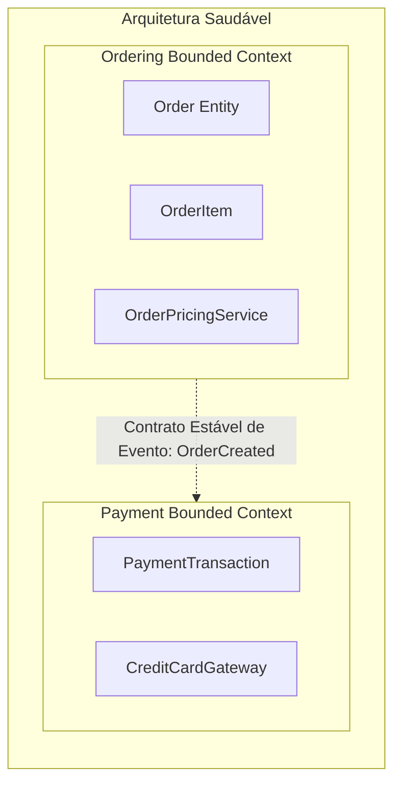

# 🧠 Decisões Arquiteturais, Matriz de Trade-offs e Antipadrões Críticos

> "Não existem soluções perfeitas em arquitetura de software; existem apenas trade-offs. Um bom arquiteto não é aquele que conhece todas as tecnologias, mas aquele que sabe exatamente o que está sacrificando ao escolher uma em detrimento de outra." — Mark Richards & Neal Ford

Cada decisão arquitetural impõe um custo de complexidade cognitiva, latência ou custo de nuvem. Saber ponderar essas escolhas e comunicá-las com clareza para o negócio é a essência do papel sênior.

---

## ⚖️ A Matriz Universal de Avaliação de Trade-offs

Ao decidir entre duas alternativas (ex: Comunicação Síncrona HTTP vs Mensageria Assíncrona via RabbitMQ), pondere sobre os **5 Pilares de Trade-off**:

```mermaid
radar
    title Matriz de Decisão: HTTP Síncrono vs RabbitMQ Assíncrono
    "Simplicidade Cognitiva": [8, 4]
    "Escalabilidade Máxima": [4, 9]
    "Tolerância a Falhas": [3, 9]
    "Facilidade de Debugging": [9, 5]
    "Latência Imediata": [9, 6]
```

1. **Complexidade Operacional**: Quantos novos serviços, contêineres e rotinas de manutenção este padrão exige?
2. **Consistência de Dados**: O negócio tolera consistência eventual de alguns segundos ou exige ACID imediato?
3. **Custo Financeiro de Nuvem**: Quantas instâncias, licenças de banco de dados e tráfego de rede entre zonas isso consumirá?
4. **Acoplamento Temporal**: Se o destino estiver temporariamente lento ou fora do ar, a origem continua funcionando?
5. **Produtividade do Time**: A equipe domina o padrão ou passará meses tropeçando em armadilhas de novidade (*Resume-Driven Development*)?

---

## 🚫 Os 4 Antipadrões Arquiteturais Mais Destrutivos

### 1. O Monólito Distribuído (Distributed Monolith)
- **Sintoma**: O time dividiu o código em 15 microsserviços, mas para fazer o deploy do serviço A, é obrigatório compilar e subir o serviço B e C juntos, ou todos os serviços compartilham o mesmo banco de dados relacional.
- **Consequência**: Você herdou todas as desvantagens dos microsserviços (latência de rede, falhas de conexão) sem nenhum dos benefícios de escalabilidade independente e autonomia.

### 2. Banco de Dados como Mensageria (Database-as-IPC)
- **Sintoma**: Um microsserviço escreve diretamente no banco do outro microsserviço ou usa uma tabela SQL com status `Pendente/Processado` com loops de polling a cada 500ms para disparar processos.
- **Consequência**: Tabela sofre lock contention, deadlocks e acopla os esquemas de dados de dois serviços que deveriam ser independentes. **Use um Message Broker real (RabbitMQ)!**

### 3. Entity Services (Microsserviços CRUD Anêmicos)
- **Sintoma**: Criar um microsserviço para cada tabela do banco (`CustomerService`, `OrderService`, `ProductService`, `AddressService`).
- **Consequência**: Um caso de uso simples de checkout exige 8 chamadas HTTP encadeadas entre serviços para montar uma tela, gerando latência insuportável e acoplamento extremo. Microsserviços devem ser delimitados por **Bounded Contexts de Negócio**, e não por tabelas do banco!

### 4. A Bala de Prata (Silver Bullet / Resume-Driven Development)
- **Sintoma**: Adotar Kafka, Kubernetes, Event Sourcing e Micro-Frontends para um sistema interno com 20 usuários e 100 requisições por dia.
- **Consequência**: O projeto morre soterrado pela complexidade de infraestrutura antes de entregar o primeiro valor de negócio.

---

## 🧭 Acoplamento vs Coesão: Connascence

- **Alta Coesão**: Elementos que mudam juntos pelas mesmas razões devem residir no mesmo módulo/microsserviço.
- **Baixo Acoplamento**: Módulos devem desconhecer detalhes de implementação uns dos outros.



---

## 🎙️ Perguntas de Entrevista Sênior

### 1. "Como você justifica para os diretores e para a equipe a decisão de NÃO adotar microsserviços e continuar em um Monólito Modular?"
**Resposta Esperada**: *Apresentando uma matriz de trade-offs objetiva: 1) Volume de requisições atual da empresa (que pode ser confortavelmente atendido por uma única instância escalada verticalmente); 2) Tamanho do time de desenvolvimento (se temos apenas 5 desenvolvedores, a sobrecarga de gerenciar 15 repositórios, pipelines, redes de containers e observabilidade consumirá 60% do tempo do time); 3) Fluidez do modelo de negócio (em produtos novos, os limites do domínio mudam semanalmente; refatorar código dentro de um monólito modular leva horas, enquanto refatorar bancos separados e contratos de mensageria em microsserviços leva semanas). Adotamos o monólito modular com fronteiras estritas agora e extraímos microsserviços cirurgicamente quando a dor da escala organizacional justificar.*

### 2. "O que é o dilema Build vs Buy (Construir ou Comprar) e qual critério você usa para decidir?"
**Resposta Esperada**: *O critério é: **Isso é o diferencial competitivo direto do negócio da empresa (*Core Domain*)?** Se a resposta for SIM (ex: o motor algorítmico de recomendação ou as regras de crédito proprietárias), nós devemos CONSTRUIR internamente (*Build*), pois nenhum software pronto atenderá aos diferenciais competitivos da empresa. Se for uma funcionalidade de suporte genérica (como autenticação de usuários, gateway de pagamentos, envio de e-mails ou message broker), nós devemos COMPRAR ou adotar soluções prontas (*Buy/SaaS* como Keycloak, Auth0, Stripe, SendGrid, RabbitMQ), pois reinventar essas ferramentas consome anos de engenharia sem agregar valor direto ao cliente final.*

---

## 🔗 Conexões do Grafo (Obsidian)
- [Monólito vs Modular vs Microsserviços](../01-fundamentos-arquitetura/06-monolito-vs-modular-vs-microsservicos.md)
- [Versionamento e ADRs no Capítulo 1](../01-fundamentos-arquitetura/05-versionamento-e-adrs.md)
- [Teorema CAP e Arquitetura Distribuída](../18-arquitetura-distribuida/01-teorema-cap-e-falhas-rede.md)
- [Strangler Fig Pattern e Migração de Legado](../20-evolucao-legado/01-strangler-fig-e-migracao-legado.md)
