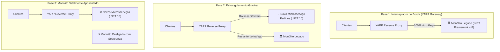
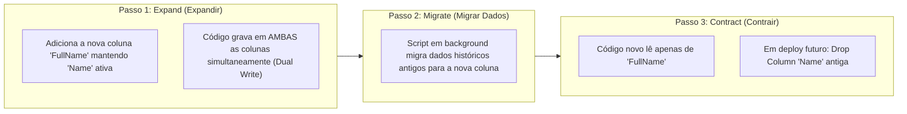

# 🔄 O Padrão Estrangulador (Strangler Fig), Migração de Banco e Feature Flags

> "A reescrita do zero ('The Big Bang Rewrite') é o cemitério de projetos de software mais previsível da indústria. O sistema legado levou 10 anos acumulando regras de negócio e casos extremos; achar que seu time vai reescrever tudo em 6 meses é uma ilusão fatal." — Martin Fowler

A evolução responsável de sistemas legados é feita de forma **incremental e contínua**, interceptando tráfego aos poucos através do **Padrão Estrangulador (Strangler Fig Pattern)**, migrações de banco **Expand and Contract** e **Feature Flags**.

---

## 🌳 O Padrão Estrangulador (Strangler Fig Pattern)

Inspirado na figueira estranguladora (uma planta que cresce ao redor de uma árvore hospedeira até que a árvore original morre e apenas a nova estrutura permanece):



### Como executar o Estrangulamento:
1. Coloque o **YARP** na frente do monólito legado como proxy reverso transparente.
2. Identifique um Bounded Context coeso (ex: `Catálogo` ou `Pedidos`).
3. Construa o novo microsserviço em **.NET 10** com Clean Architecture e banco próprio.
4. Altere a rota no YARP (`/api/catalog/*`) para direcionar o tráfego para o novo microsserviço.
5. Repita o processo módulo a módulo até que o monólito fique vazio e possa ser desligado com risco zero!

---

## 🗄️ Migração de Banco sem Downtime: Padrão Expand and Contract

Nunca faça alterações destrutivas de banco em produção (como renomear ou deletar uma coluna). Aplique o padrão **Expand and Contract**:



---

## 🚩 Feature Flags com `Microsoft.FeatureManagement` no .NET 10

Feature Flags desacoplam o **Deploy de Código** da **Liberação da Funcionalidade**:
- Você pode fazer o deploy da nova versão do checkout na quarta-feira à tarde com a flag desligada (`false`).
- O time de produto valida em produção usando uma flag por usuário.
- Na quinta-feira, a flag é ativada (`true`) para todos os clientes sem necessidade de novo deploy!

### 1. Configuração no `appsettings.json`:

```json
{
  "FeatureManagement": {
    "NewCheckoutExperience": {
      "EnabledFor": [
        {
          "Name": "Percentage",
          "Parameters": {
            "Value": 25 // 🚀 Habilita para 25% dos usuários gradualmente!
          }
        }
      ]
    }
  }
}
```

### 2. Uso no Endpoint Minimal API:

```csharp
using Microsoft.FeatureManagement;

var builder = WebApplication.CreateBuilder(args);
builder.Services.AddFeatureManagement();

var app = builder.Build();

app.MapPost("/api/v1/checkout", async (
    CheckoutRequest request, 
    IFeatureManager featureManager, 
    OldCheckoutService oldService, 
    NewCheckoutService newService, 
    CancellationToken ct) =>
{
    if (await featureManager.IsEnabledAsync("NewCheckoutExperience"))
    {
        // Rota nova (.NET 10)
        return Results.Ok(await newService.ProcessAsync(request, ct));
    }

    // Rota legada de contingência
    return Results.Ok(await oldService.ProcessAsync(request, ct));
});
```

---

## 🎙️ Perguntas de Entrevista Sênior

### 1. "Por que a estratégia 'Big Bang Rewrite' (reescrever tudo do zero em uma nova base de código) quase sempre fracassa?"
**Resposta Esperada**: *Porque enquanto o time passa 12 a 18 meses reescrevendo o sistema do zero, o sistema legado continua operando em produção e recebendo novas regras de negócio e correções urgentes, tornando o novo sistema obsoleto antes mesmo de nascer. Além disso, o Big Bang acumula um risco catastrófico no 'Dia D': se algo quebrar na virada, é impossível isolar qual das 5.000 alterações causou a falha, forçando um rollback desastroso. A modernização incremental com o Strangler Fig Pattern entrega valor real em semanas, valida hipóteses sob tráfego real e mantém o risco próximo de zero.*

### 2. "Como evitar que Feature Flags se transformem em uma dívida técnica incontrolável (*Flag Debt*)?"
**Resposta Esperada**: *Tratando cada Feature Flag com ciclo de vida rigoroso: 1) Definir uma data de expiração (*TTL*) para a flag no momento da criação; 2) Documentar o dono responsável pela flag; 3) Criar automaticamente um card no backlog de dívida técnica para remover o código antigo e o bloco `if (IsEnabled)` assim que a funcionalidade atingir 100% de rollout em produção; 4) Monitorar flags obsoletas que estão ativas há mais de 30 dias.*

---

## 🔗 Conexões do Grafo (Obsidian)
- [Monólito vs Modular vs Microsserviços](../01-fundamentos-arquitetura/06-monolito-vs-modular-vs-microsservicos.md)
- [API Gateway com YARP](../14-gateway-bff/01-api-gateway-yarp-e-bff.md)
- [Pipelines de CI/CD e Blue/Green](../11-cicd-devops/01-pipelines-ci-cd-e-deploy.md)
- [Decisões Arquiteturais e ADRs](../19-arquitetura-decisoes/01-adrs-e-tradeoffs.md)
