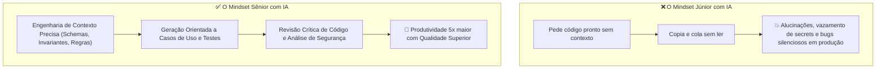

# 🤖 Inteligência Artificial como Aceleradora de Engenharia de Software (.NET 10)

> "A inteligência artificial não vai substituir os engenheiros de software; mas engenheiros de software que dominam IA substituirão aqueles que se recusam a usá-la. O papel do sênior mudou: de simples digitador de sintaxe para avaliador crítico, arquiteto de contexto e guardião de qualidade."

O uso de assistentes de IA (como GitHub Copilot, modelos LLM avançados e agentes de desenvolvimento) tornou-se parte integrante da rotina técnica e uma **pauta frequente em entrevistas de emprego para cargos Sênior e Especialista**.

---

## 🧭 O Paradoxo da IA: Acelerador vs Substituição



---

## 🔬 Engenharia de Contexto (Context Engineering)

Modelos de IA são tão bons quanto o contexto que você fornece. O erro mais comum é pedir: *"Crie um microsserviço de pedidos em C#"*. O modelo alucinará padrões legados do .NET Framework ou abstrações inúteis.

### O Template Sênior de Prompt com Contexto Rico:
```markdown
Atue como Engenheiro de Software Principal em .NET 10 e C# 14.
Contexto do Projeto:
- Arquitetura: Clean Architecture com Minimal APIs e DDD.
- Persistência: EF Core 10 com SQL Server (usar Fluent API, sem data annotations no domínio).
- Modelo: Criar a Raiz de Agregado 'Order' com encapsulamento estrito (setters privados, IReadOnlyCollection para itens).
- Regra de Negócio: Não permitir adicionar itens se o status for diferente de 'Draft'.
- Requisito de Resposta: Gere a classe da Entidade com métodos de negócio ricos e o teste unitário correspondente usando xUnit e FluentAssertions.
```

---

## 🚨 Riscos Críticos e Alucinações de IA

Ao utilizar IA no ciclo de vida de desenvolvimento, você deve auditar ativamente três riscos de segurança graves:

| Vetor de Risco | O que acontece | Como o Engenheiro Sênior Mitiga |
| :--- | :--- | :--- |
| **Package Hallucination (Alucinação de Pacotes)** | A IA inventa um nome de pacote NuGet que não existe (ex: `Microsoft.Extensions.Resilience.ExtraHelpers`). Invasores criam esse pacote com código malicioso (*Supply Chain Attack*). | Auditar todo `dotnet add package` verificando o autor oficial no `nuget.org`. |
| **Vazamento de Segredos (Secret Leakage)** | O desenvolvedor envia connection strings com senhas reais ou chaves de API nos prompts para a IA. | Usar `.gitignore`, variáveis de ambiente, mascaramento de segredos e `user-secrets`. |
| **Bugs Sutis de Concorrência** | A IA gera código que parece perfeito sintaticamente, mas faz `sync-over-async` (`.Result`) ou causa *Captive Dependency* no container de DI. | Análise estática com Linters, Code Reviews rigorosos e testes de estresse de concorrência. |

---

## 🛠️ Casos de Uso de Alto Valor para IA na Engenharia

### 1. Geração de Casos Extremos de Teste (Edge Cases)
A IA é excepcional em encontrar cenários que o cérebro humano costuma ignorar:
- *"Gere 10 casos de teste com cenários de borda para esta função de cálculo de impostos (valores nulos, overflow de decimal, anos bissextos, fuso horário UTC vs Local, moedas com 3 casas decimais)."*

### 2. Revisão Crítica de Código (Code Review Automatizado)
- *"Aponte possíveis problemas de vazamento de memória (closures, eventos não cancelados, IDisposable ausente) ou violações de concorrência neste trecho de C#."*

### 3. Refatoração de Código Legado
- *"Refatore este método de 200 linhas com 8 if-elses aninhados para Pattern Matching moderno do C# 14 e Clean Code."*

---

## 🎙️ Perguntas de Entrevista Sênior

### 1. "Como você utiliza ferramentas de Inteligência Artificial no seu dia a dia de engenharia sem comprometer a segurança e a qualidade do código?"
**Resposta Esperada**: *Utilizo IA como um copiloto e acelerador de tarefas mecânicas (geração de DTOs, boilerplate de testes unitários com múltiplos cenários de borda, documentação e refatoração de código com pattern matching), e nunca como tomador de decisões arquiteturais. Eu pratico Engenharia de Contexto rigorosa, fornecendo os limites e convenções do projeto. Todo código gerado por IA passa pela mesma esteira de validação humana e automatizada: Code Review minucioso, execução de testes unitários determinísticos, validação de pacotes contra o nuget.org oficial e escaneamento de vulnerabilidades no pipeline de CI com Trivy e SonarQube.*

### 2. "O que é o risco de 'Alucinação de Pacotes' (Package Hallucination / Dependency Confusion) induzido por IA e como protegemos a empresa contra isso?"
**Resposta Esperada**: *Ocorre quando uma LLM alucina o nome de uma dependência ou pacote NuGet plausível que na realidade não existe. Atacantes monitoram alucinações frequentes de IA, registram pacotes maliciosos públicos com esses mesmos nomes exatos no nuget.org e aguardam que desenvolvedores desatentos rodem `dotnet add package` e executem código malicioso em seus ambientes e servidores de build. Para mitigar, a empresa deve: 1) Proibir a instalação cega de pacotes sugeridos por IA sem verificação de autoria; 2) Utilizar Package Source Mapping no `NuGet.config` para restringir de onde cada pacote pode ser baixado; 3) Manter um repositório interno de artefatos privados (Azure Artifacts / Nexus) com proxy verificado.*

---

## 🔗 Conexões do Grafo (Obsidian)
- [O Motor Universal: Construindo Qualquer Microsserviço](../00-MOTOR-GERADOR-UNIVERSAL.md)
- [A Pirâmide de Testes e Testes Unitários](../12-testes/01-piramide-de-testes.md)
- [Pipelines de CI/CD e Quality Gates](../11-cicd-devops/01-pipelines-ci-cd-e-deploy.md)
- [Segurança Service-to-Service e OWASP](../07-seguranca/02-service-to-service-e-owasp.md)
- [Decisões Arquiteturais e ADRs](../19-arquitetura-decisoes/01-adrs-e-tradeoffs.md)
