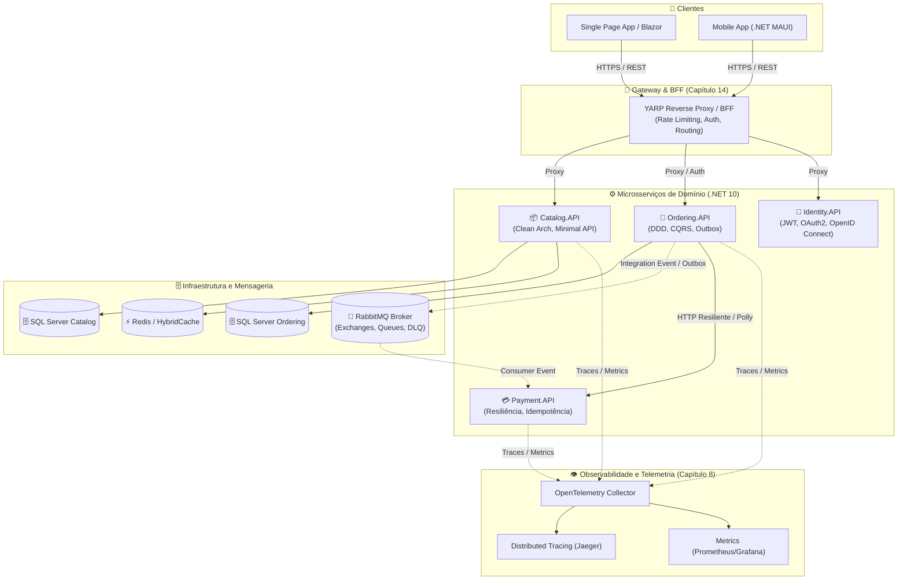

# 📘 Guia Definitivo de Microsserviços com .NET 10
### *Do Monólito ao Ecossistema Distribuído Resiliente, Escalável e Observável*

> [!NOTE]
> **Bem-vindo ao Livro Interativo de Microsserviços em .NET 10.**
> Este repositório foi arquitetado para funcionar simultaneamente como:
> 1. Um **Livro / Documentação Completa** no GitHub com sumário interativo e navegação direta.
> 2. Uma **Vault do Obsidian** de segunda geração, onde cada capítulo e conceito conecta-se a outros via links bidirecionais, gerando um mapa mental completo no **Graph View**.

---

## 🏛️ Arquitetura de Referência do Livro

Inspirado no consagrado ecossistema **eShop**, porém reformulado e potencializado para **.NET 10**, C# 14, **YARP** (Yet Another Reverse Proxy), **HybridCache**, **MassTransit com RabbitMQ**, **Polly v8 Resilience Pipelines**, **EF Core 10** e **OpenTelemetry**.

---

## 🧭 Como Usar no Obsidian

1. Abra o **Obsidian**.
2. Clique em **"Open folder as vault"** e selecione a pasta raiz deste repositório.
3. Pressione `Ctrl + G` para abrir o **Graph View**: você verá a malha de conhecimento interconectada!
4. Ao clicar em qualquer link Markdown no formato `[Título](pasta/arquivo.md)`, o Obsidian abrirá a nota correspondente preservando o histórico de navegação.

---

## 🏭 O Motor Universal: Construa Qualquer Microsserviço com Este Livro e IA

> [!TIP]
> **Você não precisa começar do zero para nenhum segmento de mercado.**
> Este livro foi projetado não apenas como leitura, mas como um **Motor Gerador de Arquitetura**. Com o nosso blueprint de Engenharia de Contexto e meta-prompts prontos, você pode instruir qualquer Inteligência Artificial (Antigravity, Copilot, ChatGPT, Claude) a gerar microsserviços prontos para produção em **Fintech (Pix/Saldos)**, **Healthtech (Telemedicina)**, **Logística (Rastreamento)**, **E-commerce** ou **qualquer outra indústria**:
> 👉 **[Acessar o Guia do Motor Universal com IA (Prompts Mestres)](00-MOTOR-GERADOR-UNIVERSAL.md)**

---

## 📚 Sumário Interativo Mestre

Clique em qualquer tópico para ir direto ao capítulo e à aula correspondente:

---

### [1. 🧱 Fundamentos de Software e Arquitetura](01-fundamentos-arquitetura/README.md)
*Fundamentos sólidos e decisões que definem se seu sistema será sustentável ou um legado doloroso.*
- [x] [Clean Architecture em Camadas Modernas](01-fundamentos-arquitetura/01-clean-architecture.md)
- [x] [Domain vs Application vs Infrastructure vs API](01-fundamentos-arquitetura/01-clean-architecture.md#divisao-das-camadas)
- [x] [Injeção de Dependência e Inversão de Controle (IoC)](01-fundamentos-arquitetura/02-injecao-dependencia-e-ioc.md)
- [x] [SOLID e Princípios de POO em C# Moderno](01-fundamentos-arquitetura/03-solid-e-oop-moderno.md)
- [x] [Encapsulamento, Abstrações e Interfaces](01-fundamentos-arquitetura/03-solid-e-oop-moderno.md#encapsulamento-e-abstracoes)
- [x] [Composition over Inheritance](01-fundamentos-arquitetura/03-solid-e-oop-moderno.md#composicao-vs-heranca)
- [x] [Configuration, Options Pattern e Validação](01-fundamentos-arquitetura/04-configuracao-options-e-contratos.md)
- [x] [Contratos, DTOs, Request/Response e Mapeamento](01-fundamentos-arquitetura/04-configuracao-options-e-contratos.md#contratos-e-dtos)
- [x] [API Versioning e Compatibilidade Retroativa](01-fundamentos-arquitetura/05-versionamento-e-adrs.md)
- [x] [Architecture Decision Records (ADR) e Trade-offs](01-fundamentos-arquitetura/05-versionamento-e-adrs.md#adrs)
- [x] [Monólito vs Monólito Modular vs Microsserviços](01-fundamentos-arquitetura/06-monolito-vs-modular-vs-microsservicos.md)
- [x] [Bounded Context, Service Boundaries e Database per Service](01-fundamentos-arquitetura/06-monolito-vs-modular-vs-microsservicos.md#fronteiras-e-dados)
- [x] [Serviços Stateless e Princípios dos Twelve-Factor Apps](01-fundamentos-arquitetura/06-monolito-vs-modular-vs-microsservicos.md#twelve-factor-e-stateless)

---

### [2. 🧩 Domínio e DDD Prático](02-dominio-ddd-pratico/README.md)
*Aplicando Domain-Driven Design com bom senso, foco no negócio e sem dogmas religiosos.*
- [x] [Entidades e Identidade de Entidade](02-dominio-ddd-pratico/01-entidades-e-regras-de-dominio.md)
- [x] [Encapsulamento e Regras de Negócio Invioláveis](02-dominio-ddd-pratico/01-entidades-e-regras-de-dominio.md#regras-inviolaveis)
- [x] [Value Objects e Imutabilidade com C# 14 Records](02-dominio-ddd-pratico/02-value-objects-e-imutabilidade.md)
- [x] [Agregados, Aggregate Roots e Invariantes](02-dominio-ddd-pratico/03-agregados-e-aggregate-roots.md)
- [x] [Domain Services vs Application Services](02-dominio-ddd-pratico/04-domain-services-e-events.md)
- [x] [Domain Events: Notificando o Domínio sem Acoplamento](02-dominio-ddd-pratico/04-domain-services-e-events.md#domain-events)
- [x] [Abstração de Repositório: Quando Usar e Quando Evitar](02-dominio-ddd-pratico/04-domain-services-e-events.md#repositorio-abstracao)
- [x] [DDD Estratégico vs Tático: Linguagem Ubíqua e Context Mapping](02-dominio-ddd-pratico/05-ddd-estrategico-vs-tatico.md)

---

### [3. 🗄️ Dados e Persistência](03-dados-persistencia/README.md)
*Do modelo relacional ao cache distribuído de alto rendimento.*
- [x] [EF Core 10 e SQL Server: Configuração Fluente](03-dados-persistencia/01-ef-core-e-sql-server.md)
- [x] [DbContext, Mapeamento, Relacionamentos e Chaves Estrangeiras](03-dados-persistencia/01-ef-core-e-sql-server.md#relacionamentos)
- [x] [Migrations, Scripts Idempotentes e Seed Data](03-dados-persistencia/01-ef-core-e-sql-server.md#migrations-e-seed)
- [x] [Transações, Limites Transacionais e Isolamento](03-dados-persistencia/02-transacoes-e-concorrencia.md)
- [x] [Concorrência Otimista (RowVersion) vs Pessimista](03-dados-persistencia/02-transacoes-e-concorrencia.md#concorrencia-otimista-vs-pessimista)
- [x] [Performance de Queries: Problema do N+1 e AsNoTracking](03-dados-persistencia/03-performance-e-otimizacao-queries.md)
- [x] [Índices, Projeção, Paginação Eficiente (Keyset) e Split Queries](03-dados-persistencia/03-performance-e-otimizacao-queries.md#indices-e-paginacao)
- [x] [Separação de Leitura e Escrita (CQRS no Banco)](03-dados-persistencia/03-performance-e-otimizacao-queries.md#cqrs-dados)
- [x] [Cache em Camadas: Redis e HybridCache (.NET 10)](03-dados-persistencia/04-cache-distribuido-redis-e-hybridcache.md)

---

### [4. 🌐 APIs e HTTP](04-apis-e-http/README.md)
*Engenharia de APIs HTTP resilientes, previsíveis e de alta velocidade.*
- [x] [Fundamentos do HTTP, Verbos, Status Codes e Content Negotiation](04-apis-e-http/01-fundamentos-rest-e-http.md)
- [x] [Minimal APIs vs Controllers no .NET 10: Benchmarks e Decisões](04-apis-e-http/02-minimal-apis-vs-controllers.md)
- [x] [Roteamento, Model Binding, Validação com FluentValidation](04-apis-e-http/02-minimal-apis-vs-controllers.md#validacao)
- [x] [Padronização de Erros com ProblemDetails (RFC 7807)](04-apis-e-http/03-padronizacao-erros-problemdetails.md)
- [x] [Pipeline HTTP: Middlewares vs Endpoint Filters](04-apis-e-http/04-middlewares-e-filtros.md)
- [x] [OpenAPI / Swagger, CORS, Compressão e Rate Limiting](04-apis-e-http/04-middlewares-e-filtros.md#openapi-e-rate-limiting)

---

### [5. 🔄 Comunicação entre Microsserviços](05-comunicacao-microsservicos/README.md)
*Como orquestrar conversas distribuídas sem criar um castelo de cartas.*
- [x] [Comunicação Síncrona (HTTP/REST) com IHttpClientFactory e DNS Safe](05-comunicacao-microsservicos/01-comunicacao-sincrona-http.md)
- [x] [Comunicação Assíncrona baseada em Eventos de Integração](05-comunicacao-microsservicos/02-comunicacao-assincrona-eventos.md)
- [x] [O Padrão Transacional: Outbox Pattern e Inbox Pattern](05-comunicacao-microsservicos/03-outbox-inbox-patterns.md)
- [x] [Consistência Eventual, Idempotência e Entrega At-Least-Once](05-comunicacao-microsservicos/04-consistencia-eventual-e-idempotencia.md)

---

### [6. 🛡️ Resiliência](06-resiliencia/README.md)
*Projetando para o inevitável: tolerância a falhas parciais e caos controlado.*
- [x] [Padrões Essenciais: Timeout, Retry, Exponential Backoff e Jitter](06-resiliencia/01-padroes-resiliencia-retry-circuit-breaker.md)
- [x] [Circuit Breaker, Fallback, Bulkhead e Graceful Degradation](06-resiliencia/01-padroes-resiliencia-retry-circuit-breaker.md#circuit-breaker)
- [x] [Polly v8: Pipelines Modernos com `ResiliencePipelineBuilder`](06-resiliencia/02-polly-v8-pipelines-na-pratica.md)
- [x] [Simulação de Falhas e Testes de Caos em Ambientes Distribuídos](06-resiliencia/02-polly-v8-pipelines-na-pratica.md#simulacao-caos)

---

### [7. 🔐 Segurança](07-seguranca/README.md)
*Autenticação, autorização granular e blindagem contra ataques modernos.*
- [x] [Autenticação e Autorização com JWT, Claims, Roles e Policies](07-seguranca/01-autenticacao-jwt-e-identity.md)
- [x] [OAuth 2.0 e OpenID Connect no ecossistema .NET](07-seguranca/01-autenticacao-jwt-e-identity.md#oauth2)
- [x] [Segurança Service-to-Service: mTLS e Client Credentials](07-seguranca/02-service-to-service-e-owasp.md)
- [x] [OWASP Top 10 para Microsserviços e Gestão Segura de Secrets](07-seguranca/02-service-to-service-e-owasp.md#owasp)

---

### [8. 👁️ Observabilidade](08-observabilidade/README.md)
*Encontrando agulhas em palheiros: respondendo com precisão "onde a requisição morreu?".*
- [x] [Structured Logging, Serilog, Log Levels e Correlation ID](08-observabilidade/01-structured-logging-e-correlation-id.md)
- [x] [Distributed Tracing com OpenTelemetry (TraceId, SpanId)](08-observabilidade/02-opentelemetry-tracing-e-metricas.md)
- [x] [Métricas de Aplicação, Health Checks (Liveness/Readiness)](08-observabilidade/02-opentelemetry-tracing-e-metricas.md#metricas-healthchecks)
- [x] [Diagnóstico Distribuído: Da UI ao Banco e à Fila](08-observabilidade/02-opentelemetry-tracing-e-metricas.md#diagnostico-distribuido)

---

### [9. 🐳 Containerização](09-containerizacao/README.md)
*Empacotamento reproduzível e infraestrutura como código local.*
- [x] [Dockerfiles Multi-stage Otimizados para .NET 10](09-containerizacao/01-docker-e-docker-compose.md)
- [x] [Docker Compose: Orquestrando Microsserviços, SQL, Redis e RabbitMQ](09-containerizacao/01-docker-e-docker-compose.md#compose)
- [x] [Otimização de Imagens, Chiseled Images e Segurança de Containers](09-containerizacao/01-docker-e-docker-compose.md#seguranca-imagens)

---

### [10. 📈 Escalabilidade](10-escalabilidade/README.md)
*Crescendo de 100 para 100.000 requisições por segundo.*
- [x] [Escalabilidade Horizontal vs Vertical e Arquitetura Stateless](10-escalabilidade/01-escalabilidade-horizontal-e-gargalos.md)
- [x] [Gargalos Críticos: Pool de Conexões, CPU, Memória e I/O](10-escalabilidade/01-escalabilidade-horizontal-e-gargalos.md#gargalos)
- [x] [Backpressure e Escalonamento Baseado em Filas (KEDA / Worker)](10-escalabilidade/01-escalabilidade-horizontal-e-gargalos.md#filas-keda)

---

### [11. 🚀 CI/CD e DevOps](11-cicd-devops/README.md)
*Automação de ponta a ponta com entrega contínua sem medo.*
- [x] [Estratégias de Branching, Pull Requests e Quality Gates](11-cicd-devops/01-pipelines-ci-cd-e-deploy.md)
- [x] [Pipeline de CI com Testes, Lint e Build de Containers](11-cicd-devops/01-pipelines-ci-cd-e-deploy.md#ci-pipeline)
- [x] [Deploys Modernos: Blue/Green, Canary e Zero Downtime](11-cicd-devops/01-pipelines-ci-cd-e-deploy.md#deploys-avancados)

---

### [12. 🧪 Testes](12-testes/README.md)
*Confiança inabalável da unidade aos testes distribuídos.*
- [x] [Testes Unitários de Domínio e Aplicação com xUnit e FluentAssertions](12-testes/01-piramide-de-testes.md)
- [x] [Testes de Integração Reais com Testcontainers e WebApplicationFactory](12-testes/02-testcontainers-e-testes-integracao.md)
- [x] [Testes de Contrato e Testes de Resiliência](12-testes/02-testcontainers-e-testes-integracao.md#testes-resiliencia)

---

### [13. 📨 Mensageria e Eventos](13-mensageria-eventos/README.md)
*Dominando o coração assíncrono dos sistemas modernos.*
- [x] [RabbitMQ: Exchanges (Direct, Topic, Fanout), Queues e Routing Keys](13-mensageria-eventos/01-rabbitmq-avancado.md)
- [x] [MassTransit no .NET 10: Publishers, Consumers e Configuração](13-mensageria-eventos/01-rabbitmq-avancado.md#masstransit)
- [x] [Dead Letter Queues (DLQ), Poison Messages e Retry Estratégico](13-mensageria-eventos/01-rabbitmq-avancado.md#dlq)
- [x] [Sagas Distribuídas: Coreografia vs Orquestração](13-mensageria-eventos/02-sagas-coreografia-vs-orquestracao.md)

---

### [14. 🔀 Gateway e BFF (Backend for Frontend)](14-gateway-bff/README.md)
*A porta de entrada segura e inteligente do seu ecossistema.*
- [x] [Reverse Proxy com YARP (Yet Another Reverse Proxy)](14-gateway-bff/01-api-gateway-yarp-e-bff.md)
- [x] [Padrão BFF (Backend for Frontend): Web vs Mobile](14-gateway-bff/01-api-gateway-yarp-e-bff.md#bff)
- [x] [Agregação de Respostas, Roteamento Dinâmico e Rate Limiting](14-gateway-bff/01-api-gateway-yarp-e-bff.md#agregacao)

---

### [15. ⚡ Performance](15-performance/README.md)
*Escrevendo C# de altíssimo rendimento e baixa alocação.*
- [x] [Benchmarking com BenchmarkDotNet e Profiling de Memória](15-performance/01-profiling-e-otimizacoes-dotnet.md)
- [x] [Alocação Zero: `Span<T>`, `ReadOnlySpan<T>` e `Memory<T>`](15-performance/01-profiling-e-otimizacoes-dotnet.md#span-memory)
- [x] [Garbage Collector Internals (Gen0, Gen1, Gen2, LOH, POH)](15-performance/01-profiling-e-otimizacoes-dotnet.md#gc)

---

### [16. 🧵 C# / .NET para Entrevistas Sênior](16-csharp-dotnet-entrevistas/README.md)
*O que separa um desenvolvedor sênior de um especialista.*
- [x] [Mecânica Interna do `async/await` e a State Machine](16-csharp-dotnet-entrevistas/01-async-await-cancellation-token.md)
- [x] [Task vs ValueTask: Quando Usar cada um](16-csharp-dotnet-entrevistas/01-async-await-cancellation-token.md#task-vs-valuetask)
- [x] [`CancellationToken` Propagado de Ponta a Ponta](16-csharp-dotnet-entrevistas/01-async-await-cancellation-token.md#cancellation-token)
- [x] [`IDisposable` e `IAsyncDisposable` em Serviços Assíncronos](16-csharp-dotnet-entrevistas/02-memory-e-recursos.md)
- [x] [Perguntas de Alto Nível de Entrevistas Sênior e Respostas Defensivas](16-csharp-dotnet-entrevistas/03-perguntas-entrevistas-senior.md)

---

### [17. ☁️ Cloud e Arquitetura em Nuvem](17-cloud/README.md)
*Conectando sua aplicação ao mundo real gerenciado.*
- [x] [Fundamentos de Computação Cloud, Managed Services e Contêineres](17-cloud/01-cloud-fundamentals-e-patterns.md)
- [x] [Arquitetura de Referência: Load Balancers, Instâncias Múltiplas e Banco Cloud](17-cloud/01-cloud-fundamentals-e-patterns.md#referencia)
- [x] [Design Patterns de Nuvem: External Configuration, Health Endpoint Monitoring](17-cloud/01-cloud-fundamentals-e-patterns.md#patterns)

---

### [18. 🏗️ Arquitetura Distribuída](18-arquitetura-distribuida/README.md)
*Dominando a física dos sistemas que não compartilham memória.*
- [x] [Teorema CAP e o Trilema PACELC na Prática](18-arquitetura-distribuida/01-teorema-cap-e-falhas-rede.md)
- [x] [Falhas de Rede, Latência e Falhas Parciais](18-arquitetura-distribuida/01-teorema-cap-e-falhas-rede.md#falhas-parciais)
- [x] [Distributed Locking com Redis (RedLock) e Conflitos](18-arquitetura-distribuida/02-transacoes-distribuidas-e-locks.md)

---

### [19. 🧠 Arquitetura e Decisões Técnicas](19-arquitetura-decisoes/README.md)
*A arte de justificar escolhas e documentar a evolução sistêmica.*
- [x] [Architecture Decision Records (ADR): Estrutura e Prática](19-arquitetura-decisoes/01-adrs-e-tradeoffs.md)
- [x] [Matriz de Trade-offs: Complexidade vs Custo vs Performance](19-arquitetura-decisoes/01-adrs-e-tradeoffs.md#matriz-tradeoffs)
- [x] [Antipadrões Arquiteturais: Como Identificar e Corrigir](19-arquitetura-decisoes/01-adrs-e-tradeoffs.md#antipatterns)

---

### [20. 🔄 Evolução e Legado](20-evolucao-legado/README.md)
*Engenharia de migração para sistemas legados em produção.*
- [x] [O Padrão Estrangulador (Strangler Fig Pattern)](20-evolucao-legado/01-strangler-fig-e-migracao-legado.md)
- [x] [Migrações de Banco de Dados sem Downtime (Expand and Contract)](20-evolucao-legado/01-strangler-fig-e-migracao-legado.md#expand-and-contract)
- [x] [Feature Flags como Ferramenta de Release Seguro](20-evolucao-legado/01-strangler-fig-e-migracao-legado.md#feature-flags)

---

### [21. 🤖 IA como Ferramenta de Engenharia](21-ia-engenharia/README.md)
- [x] [IA no Ciclo de Vida: Geração de Código, Revisão e Testes](21-ia-engenharia/01-ia-como-ferramenta-de-engenharia.md)
- [x] [Engenharia de Contexto para Arquitetura de Software](21-ia-engenharia/01-ia-como-ferramenta-de-engenharia.md#engenharia-contexto)
- [x] [Riscos de Segurança, Governança e Controle de Alucinações](21-ia-engenharia/01-ia-como-ferramenta-de-engenharia.md#governanca)

---

## 🔗 Navegação Rápida entre Capítulos
Para explorar a obra de forma sequencial ou navegar como um curso contínuo, siga a ordem numérica ou explore os links internos recomendados no rodapé de cada capítulo.
